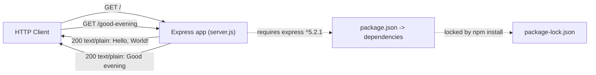

# Technical Specification

# 0. Agent Action Plan

## 0.1 Intent Clarification

This section translates the user's request into a precise, unambiguous technical interpretation for the Blitzy platform. The request targets an existing, intentionally minimal Node.js HTTP server and asks for the introduction of the Express.js framework plus one additional HTTP endpoint.

The user's request, preserved verbatim:

> "this is a tutorial of node js server hosting one endpoint that returns the response 'Hello world'. Could you add expressjs into the project and add another endpoint that return the response of 'Good evening'?"

### 0.1.1 Core Feature Objective

Based on the prompt, the Blitzy platform understands that the new feature requirement is to **adopt the Express.js web framework in the existing single-file Node.js server and expose a second HTTP GET endpoint that returns the plain-text response `Good evening`, while preserving the existing `Hello, World!` greeting**.

The existing server is implemented exclusively with Node's built-in `http` module, binds to `127.0.0.1:3000`, and replies to every request with the body `Hello, World!\n` regardless of path or method [server.js:L1-L14]. There is no routing layer today — a single catch-all handler answers all requests [server.js:L6-L10].

The request decomposes into the following explicit and implicit requirements:

| ID | Requirement | Type | Source |
|----|-------------|------|--------|
| R1 | Add Express.js as a project dependency | Explicit | User prompt |
| R2 | Re-platform the server bootstrap from native `http` onto Express | Implicit | "add expressjs into the project" |
| R3 | Preserve the existing `Hello, World!` response (backward compatibility) | Implicit | "tutorial ... hosting one endpoint that returns ... 'Hello world'" |
| R4 | Add a new endpoint returning `Good evening` | Explicit | User prompt |

- **R1 — Introduce Express.js.** Declare `express` in `package.json` (no `dependencies` block exists today [package.json:L1-L11]) and install it into `node_modules`, regenerating `package-lock.json` [package-lock.json:L1-L13].
- **R2 — Re-platform onto Express.** Replace `http.createServer(...)` [server.js:L6] with an Express application instance (`const app = express()`) and `app.listen(...)`, retaining the existing host `127.0.0.1` [server.js:L3] and port `3000` [server.js:L4] and the startup log message [server.js:L12-L14].
- **R3 — Preserve the existing greeting.** Re-express the current behavior as an explicit Express route `GET /` returning the exact original body `Hello, World!\n` with `Content-Type: text/plain` [server.js:L7-L9].
- **R4 — Add the new endpoint.** Register a new Express route returning the exact body `Good evening`.

**Implicit requirements and prerequisites surfaced:**

- The current handler answers all paths identically [server.js:L6-L10]. Moving to Express introduces genuine path-based routing, which is a deliberate behavior change: requests to unmatched paths will now receive Express's default `404 Not Found` rather than the `Hello, World!` body. This is the correct and expected outcome of adding routed endpoints and is documented here so it is not mistaken for a regression.
- Adding Express makes the project carry its first third-party runtime dependency. This intentionally reverses the project's previously documented "zero external dependencies" posture and the corresponding success metric.
- A runnable invocation path is a prerequisite: `package.json` currently declares `"main": "index.js"` even though `index.js` does not exist [package.json:L5], and provides only a placeholder `test` script [package.json:L6-L8]. A `start` script and/or a corrected `main` improves runnability once Express is added.

### 0.1.2 Special Instructions and Constraints

- **Comment every line of code (mandatory user rule "04-june-rules").** The user rule states, verbatim: "please Follow add Comment each of line of code". Every line of executable code that is created or modified — primarily the contents of `server.js` — must carry an explanatory inline comment. (See §0.7 for the precedence nuance regarding JSON manifest files, which cannot legally contain comments.)
- **Preserve exact response strings.** The new endpoint must return precisely `Good evening`, and the existing endpoint must continue to return the exact literal `Hello, World!\n` already present in the code [server.js:L9]. Note the existing literal differs in punctuation/casing from the prompt's informal phrasing "Hello world"; the in-code literal is authoritative for backward compatibility.
- **Maintain backward compatibility.** The pre-existing greeting behavior must remain reachable after the migration.
- **Respect the repository "Do not touch" directive on documentation.** `README.md` declares the repository a "test project for backprop integration. Do not touch!" Because the user did not request documentation changes, `README.md` is treated as out of scope (see §0.6.2).
- **Architectural convention.** Retain CommonJS (`require`) module syntax to match the existing file [server.js:L1]; no migration to ES modules is requested or warranted.
- **User Example:** The user provided no code example or attachment; the only literal examples are the two response strings preserved above.
- **Web search requirements.** Confirm the current stable Express major version, its Node.js runtime floor, and the canonical minimal routing pattern (documented in §0.2.2).

### 0.1.3 Technical Interpretation

These feature requirements translate to the following technical implementation strategy:

- To **introduce Express (R1)**, we will modify `package.json` to add a `dependencies` block declaring `express` at version `^5.2.1`, and run `npm install express` to populate `node_modules` and regenerate `package-lock.json`.
- To **re-platform the server (R2)**, we will modify `server.js` to replace `const http = require('http')` [server.js:L1] with `const express = require('express')`, instantiate `const app = express()`, and replace `server.listen(...)` [server.js:L12-L14] with `app.listen(port, hostname, callback)` preserving the `127.0.0.1:3000` bind and startup log.
- To **preserve the existing greeting (R3)**, we will extend `server.js` with an explicit route `app.get('/', ...)` that returns `Hello, World!\n` as `text/plain`, reproducing the current observable behavior at the root path [server.js:L7-L9].
- To **add the new endpoint (R4)**, we will extend `server.js` with `app.get('/good-evening', ...)` returning `Good evening` as `text/plain`.

The new endpoint's route path is not specified by the user. The Blitzy platform selects `/good-evening` as a clear, descriptive default; this assumption is documented for downstream agents and is trivially adjustable.

## 0.2 Repository Scope Discovery

This section inventories every file in the repository, classifies its relevance to the feature, and maps the integration points the feature touches. The repository is a flat directory with no subfolders; all files reside at the root.

### 0.2.1 Comprehensive File Analysis

The complete repository inventory and its relevance to this feature:

| File | Description | Relevance | Disposition |
|------|-------------|-----------|-------------|
| `server.js` | Native `http` server binding `127.0.0.1:3000`, single catch-all handler returning `Hello, World!\n` [server.js:L1-L14] | Primary target | UPDATE |
| `package.json` | npm manifest `hello_world` v1.0.0; no `dependencies` block; placeholder `test` script; `"main": "index.js"` [package.json:L1-L11] | Manifest target | UPDATE |
| `package-lock.json` | Minimal lockfile (lockfileVersion 3), only the root package, no dependency tree [package-lock.json:L1-L13] | Lockfile target | UPDATE (tooling-regenerated) |
| `node_modules/` | Not present today; created by `npm install` | Install artifact | CREATE (by tooling) |
| `server - Copy.js` | Backup duplicate of `server.js` | Not the running entry | OUT OF SCOPE |
| `README.md` | "hao-backprop-test"; "test project for backprop integration. Do not touch!" | Documentation, marked do-not-touch | OUT OF SCOPE |
| `LoginTest.java`, `LoginTest - Copy.java` | Java stubs (package `com.blitzyTest`), non-compilable | Unrelated language | OUT OF SCOPE |
| `industry.csv`, `industry - Copy.csv` | Single-column industry-category data | Unrelated data | OUT OF SCOPE |
| `test.py.txt`, `test.py - Copy.txt`, `test.txt.txt` | Empty zero-length placeholder files | No content | OUT OF SCOPE |

**Integration point discovery.** Because the application is a single self-contained file, all code integration occurs inside `server.js`, with a supporting manifest change in `package.json`:

- **API endpoints connecting to the feature** — defined inline in `server.js`. Today there are none in the routed sense (one catch-all handler [server.js:L6-L10]); the feature adds `GET /` and `GET /good-evening`.
- **Database models / migrations affected** — none. The project has no persistence layer.
- **Service classes requiring updates** — none. No service layer exists.
- **Controllers / handlers to modify** — the single request handler in `server.js` [server.js:L6-L10] is replaced by Express route handlers.
- **Middleware / interceptors impacted** — none exist, and none are required for two static text responses.



### 0.2.2 Web Search Research Conducted

Research was performed to ground the dependency choice and implementation pattern in the current Express ecosystem:

- **Current stable Express version and default tag.** Express 5.0 was published on October 15, 2024 and is now the default release served by `npm install express`. The exact current `latest` version was verified directly against the npm registry as **5.2.1** (`npm view express version`), with `latest-4` reported as `4.22.2`. The platform therefore pins `express` at `^5.2.1` — a verified, non-placeholder version. Sources: the official Express v5 release announcement (expressjs.com) and the npm registry.
- **Runtime floor.** Express 5 requires Node.js **>= 18**. This is satisfied by the environment's Node.js v22.22.2; the constraint is also exposed by the installed package's `engines` field.
- **Canonical minimal routing pattern.** The framework's documented minimal usage — `const express = require('express'); const app = express(); app.get('/', (req, res) => res.send(...)); app.listen(3000)` — is exactly the pattern this feature applies. This pattern was validated locally end-to-end (see §0.5.2).
- **Applicability of Express 5 breaking changes.** Express 5's routing changes (path-to-regexp 8.x, named wildcards, revised optional-parameter syntax, new reserved characters) do **not** affect this feature, because both routes use plain literal paths (`/` and `/good-evening`) with no parameters, wildcards, or regular expressions.
- **Security and middleware footprint.** For two static `GET` text responses, no body parsers or additional middleware (e.g., `express.json()`, `cookie-parser`) are needed. The literal route paths carry no ReDoS exposure; version `5.2.1` already incorporates the revert of an erroneous query-parser change introduced in `5.2.0`, making it the safe current pick.

### 0.2.3 New File Requirements

No new source, test, or configuration files are strictly required. The feature is fully satisfiable by updating the two existing in-scope files plus the tooling-regenerated lockfile:

- **New source files:** None. Both routes are added to the existing `server.js`. Splitting routes into a dedicated module (e.g., `routes/`) would add unnecessary structure for two static endpoints and is intentionally not pursued.
- **New test files:** None requested. The repository has no test framework configured — only a placeholder `test` script that exits with an error [package.json:L6-L8]. Test scaffolding is out of scope (see §0.6.2).
- **New configuration files:** None. No feature-specific configuration, environment variables, or settings files are required for static responses on the existing host/port.
- **Tooling-generated artifacts:** `npm install express` creates the `node_modules/` tree and rewrites `package-lock.json` [package-lock.json:L1-L13]. These are install artifacts rather than hand-authored files.
- **Rule-mandated files:** None. The user rule "04-june-rules" governs code commenting style and mandates no additional files.

## 0.3 Dependency Inventory

This feature introduces the project's first third-party runtime dependency. This section enumerates the package change, the single import change it implies, and the manifest files that record it. All other repository files require no dependency-related edits.

### 0.3.1 Package Registry

A single public package is added. No packages are updated or removed (the native `http` module is a Node.js built-in, not an npm package, and simply ceases to be required in `server.js` [server.js:L1]). No development dependencies are introduced, since no test or build tooling was requested.

| Package | Registry | Version | Purpose |
|---------|----------|---------|---------|
| `express` | npm (npmjs.com) | `^5.2.1` | HTTP server framework providing path-based routing (`app.get`) and response helpers (`res.type`, `res.send`); replaces the native `http` bootstrap in `server.js` |

- The version `^5.2.1` is the exact `latest` release verified against the npm registry; it is not a placeholder. The caret allows compatible 5.x patch/minor updates.
- Installing `express` transitively brings in approximately 65 additional packages (e.g., its router and body-parser sub-dependencies). These are managed automatically by npm and recorded in `package-lock.json`; they are not declared by hand and are not enumerated individually here.
- Express 5.2.1 declares `engines.node` of `>= 18`, satisfied by the project's runtime.

### 0.3.2 Dependency and Import Updates

**Import updates.** Because the application is a single source file, no repository-wide wildcard import sweep is needed. Exactly one import statement changes:

- `server.js` [server.js:L1]
  - Old: `const http = require('http');`
  - New: `const express = require('express');`

No other file imports the server module — `server.js` exports nothing [server.js:L1-L14] — so there are no downstream import ripples. The backup file `server - Copy.js` is intentionally not modified.

**External reference updates.** The dependency declaration is recorded in the package manifests:

- `package.json` — add a new `dependencies` object declaring `express` (no such block exists today [package.json:L1-L11]).

```json
"dependencies": { "express": "^5.2.1" }
```

- `package-lock.json` — regenerated by `npm install express` to lock `express@5.2.1` and its transitive tree; `lockfileVersion` remains 3 [package-lock.json:L1-L13].

No other categories of external reference are affected: there are no additional build files, CI/CD workflows, or documentation files in scope for dependency edits (`README.md` is out of scope per §0.6.2).

## 0.4 Integration Analysis

This section documents exactly where the feature integrates with existing code. Because the application is a single self-contained file with no service, persistence, or middleware layers, the integration surface is small and fully enumerated below.

### 0.4.1 Existing Code Touchpoints

**Direct modifications required:**

- `server.js` [server.js:L1] — replace the native `http` import with `const express = require('express')` and instantiate the application: `const app = express();`.
- `server.js` [server.js:L6-L10] — replace the single catch-all `http.createServer` handler with two explicit Express routes: `app.get('/', ...)` returning `Hello, World!\n` (backward compatibility) and `app.get('/good-evening', ...)` returning `Good evening`.
- `server.js` [server.js:L12-L14] — replace `server.listen(port, hostname, callback)` with `app.listen(port, hostname, callback)`, preserving the existing host `127.0.0.1` [server.js:L3], port `3000` [server.js:L4], and the `Server running at ...` startup log.
- `package.json` [package.json:L1-L11] — add the `dependencies` block so that `node server.js` (and an optional `npm start`) can resolve `express` from `node_modules`.

**Dependency injections:**

- None. There is no dependency-injection container, service registry, or wiring module in this repository; Express is consumed directly via `require` inside `server.js`.

**Database / schema updates:**

- None. The project has no database, migrations, or schema files; per the System Overview, there is no data-persistence layer and no outbound API integration.

**Manifest-level alignment (optional, low-risk):**

- `package.json` [package.json:L5] declares `"main": "index.js"`, but no `index.js` exists; aligning `main` to `"server.js"` and/or adding `"scripts": { "start": "node server.js" }` [package.json:L6-L8] improves runnability. These are optional refinements that do not change runtime behavior.

The integration is therefore entirely contained within `server.js` plus the `package.json` manifest. No external integration points (databases, third-party APIs, CI/CD pipelines, message queues, or middleware pipelines) are involved.

## 0.5 Technical Implementation

This section provides the concrete, file-by-file execution plan, the implementation approach per file, and a note on user interface applicability.

### 0.5.1 File-by-File Execution Plan

Every file listed below must be created, updated, or referenced exactly as specified. The modes are CREATE, UPDATE, DELETE, and REFERENCE (read-only).

- **Group 1 — Core Application**
  - UPDATE `server.js` — re-platform from native `http` to Express; instantiate `app`, register `app.get('/', ...)` (preserve `Hello, World!\n`) and `app.get('/good-evening', ...)` (return `Good evening`), and bind via `app.listen(3000, '127.0.0.1', ...)` preserving the startup log [server.js:L1-L14].
- **Group 2 — Dependency Manifests**
  - UPDATE `package.json` — add `"dependencies": { "express": "^5.2.1" }`; optionally add `"scripts": { "start": "node server.js" }` and align `"main"` to `"server.js"` [package.json:L1-L11].
  - UPDATE `package-lock.json` — regenerated by `npm install express` (tooling, not hand-edited) to lock `express@5.2.1` and its transitive tree [package-lock.json:L1-L13].
  - CREATE (by tooling) `node_modules/**` — populated by `npm install express`.
- **Group 3 — References (read-only, not modified)**
  - REFERENCE `server.js` (current contents) — authoritative source of the exact `/` response body and host/port for backward compatibility.
  - REFERENCE `README.md` — repository "Do not touch!" notice; consulted for scope, never edited.
- **No deletions.** No file is removed; the backup `server - Copy.js` and all unrelated artifacts are left untouched.

### 0.5.2 Implementation Approach per File

The implementation proceeds in the following order:

- **Establish the dependency.** Run `npm install express`, which writes the `express` entry into `package.json`, regenerates `package-lock.json`, and creates `node_modules/`.
- **Re-platform `server.js`.** Replace the `http` import and `http.createServer` handler with an Express `app`, preserving the `127.0.0.1:3000` bind and the startup log [server.js:L3-L4,L12-L14]. Reproduce the existing greeting at `GET /` returning the exact literal `Hello, World!\n` as `text/plain` [server.js:L7-L9].
- **Add the new route.** Register `GET /good-evening` returning the exact literal `Good evening` as `text/plain`.
- **Apply the comment rule.** Per user rule "04-june-rules", every line of `server.js` carries an explanatory inline comment. A representative, commented snippet of the target shape:

```js
const express = require('express');                 // import the Express framework
const app = express();                              // create the application instance
app.get('/good-evening', (req, res) => res.type('text/plain').send('Good evening')); // new endpoint -> "Good evening"
```

- **Validate.** Start the server and confirm both routes. This approach was validated end-to-end in a sandbox before planning: with `express@5.2.1` installed on Node v22.22.2, a two-route app started on `127.0.0.1:3000`, an HTTP `GET /good-evening` returned exactly `Good evening`, and `GET /` returned `Hello, World!\n`.

There are no Figma URLs or design references to highlight for any file in this feature.

### 0.5.3 User Interface Design

Not applicable. This feature is entirely server-side: it returns `text/plain` HTTP responses over `127.0.0.1:3000` and renders no user interface. There are no screens, components, design system, or Figma assets associated with the request.

## 0.6 Scope Boundaries

This section defines the exhaustive set of files the feature may touch and explicitly delineates what is excluded.

### 0.6.1 Exhaustively In Scope

- **Application source**
  - `server.js` — UPDATE: Express re-platform plus the two routes [server.js:L1-L14].
- **Dependency manifests and install artifacts**
  - `package.json` — UPDATE: add the `express` dependency (and optional `start` script / `main` alignment) [package.json:L1-L11].
  - `package-lock.json` — UPDATE: tooling-regenerated lock of `express@5.2.1` and transitive deps [package-lock.json:L1-L13].
  - `node_modules/**` — CREATE: install artifact produced by `npm install express`.

All four requirements (R1–R4 in §0.1.1) are covered by this in-scope set; no requirement is left unaddressed.

### 0.6.2 Explicitly Out of Scope

- `README.md` — excluded; it bears a "Do not touch!" directive and no documentation change was requested.
- `server - Copy.js` — excluded; a backup duplicate, not the running entry point. Editing it would create divergence.
- `LoginTest.java`, `LoginTest - Copy.java` — excluded; unrelated Java stubs (package `com.blitzyTest`), not part of the Node.js application.
- `industry.csv`, `industry - Copy.csv` — excluded; unrelated single-column data files.
- `test.py.txt`, `test.py - Copy.txt`, `test.txt.txt` — excluded; empty placeholder files with no code.
- **Express 4 (`4.22.2`)** — not selected; Express `5.2.1` is the current npm default and is validated for this feature.
- **New router/controller/model/service/middleware/migration/config modules** — not created; two static `GET` routes do not warrant additional structure.
- **Test suites, CI/CD pipelines, and container/build tooling** — not in scope; none exist today (only a failing placeholder `test` script [package.json:L6-L8]) and none were requested.
- **Unrelated refactoring or performance optimization** — excluded; only the changes required to integrate Express and add the new endpoint are performed.

## 0.7 Rules for Feature Addition

The following rules and conventions, emphasized by the user or imposed by the repository, govern this feature's implementation:

- **Comment every line of code (user rule "04-june-rules").** Verbatim: "please Follow add Comment each of line of code". Every created or modified line of executable code — primarily all lines of `server.js` (the `require`, the app instantiation, each route handler, and the `app.listen` call) — must carry a clear explanatory inline comment.
  - **JSON nuance (critical for downstream agents).** This rule applies to JavaScript source. It cannot be applied literally to `package.json` or `package-lock.json`, because the JSON format does not permit comments; adding comments to these files would make them invalid JSON and break `npm`. The per-line-comment mandate is therefore fully satisfied within `server.js` and is not applied to the JSON manifests.
- **Preserve exact response strings.** The existing endpoint must keep returning the literal `Hello, World!\n` [server.js:L9], and the new endpoint must return exactly `Good evening`. These strings must not be paraphrased or reformatted.
- **Maintain backward compatibility.** The existing greeting behavior must remain reachable after the Express migration; it is re-expressed as the `GET /` route.
- **Follow existing repository conventions.** Retain CommonJS (`require`) module syntax to match the current file [server.js:L1]; preserve the established host/port (`127.0.0.1:3000`) and the startup log message [server.js:L3-L4,L12-L14]. No ES-module migration.
- **Respect the "Do not touch" documentation directive.** `README.md` is not modified.
- **Use the verified dependency version.** Declare `express` at `^5.2.1` (the verified current npm `latest`); do not substitute a placeholder version or downgrade to Express 4.
- **Keep the footprint minimal.** Do not add middleware, body parsers, additional routes, persistence, or configuration beyond what the two static text endpoints require.

No performance, scalability, or security requirements beyond these were specified; the literal route paths introduce no regular-expression or ReDoS exposure, and the local-only `127.0.0.1` bind is preserved.

## 0.8 Attachments

No attachments were provided with this request.

- **File attachments:** None. No PDFs, images, documents, or data files were supplied.
- **Figma screens:** None. No Figma frames or URLs were provided, and no design system was specified; consequently no design-to-component mapping or token analysis applies to this backend feature.

All implementation guidance is derived from the user prompt, the user rule "04-june-rules", and direct inspection of the existing repository (`server.js`, `package.json`, `package-lock.json`).

