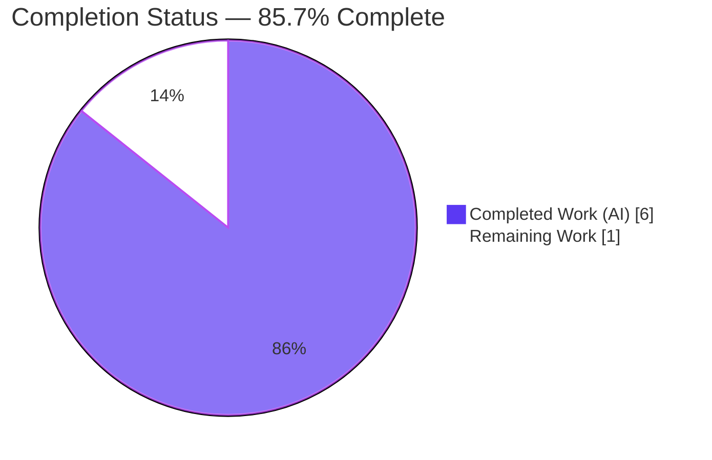
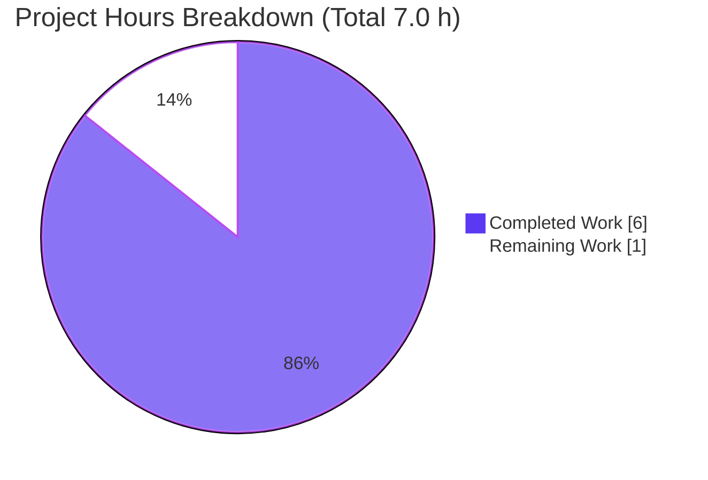
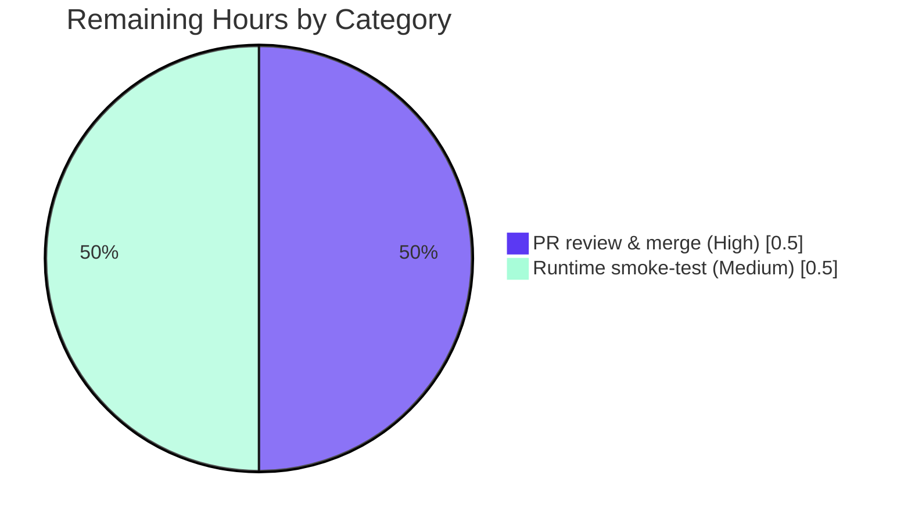

# Blitzy Project Guide — Express.js Adoption & `GET /good-evening` Endpoint

> Project: `hello_world` v1.0.0 — minimal Node.js HTTP server tutorial
> Branch: `blitzy-9bf7ff39-f8b8-4fe1-a349-f130295c801a` · HEAD `5b13599`
> Brand legend: <span style="color:#5B39F3">**Completed / AI Work = Dark Blue `#5B39F3`**</span> · Remaining / Not Completed = White `#FFFFFF`

---

## 1. Executive Summary

### 1.1 Project Overview

This project adopts the **Express.js** web framework inside an intentionally minimal, single-file Node.js tutorial server and adds a second HTTP endpoint. The server previously used Node's native `http` module to answer every request with `Hello, World!\n`. The work re-platforms the bootstrap onto Express, preserves the original greeting at `GET /` for backward compatibility, and introduces a new `GET /good-evening` route returning the plain-text body `Good evening`. The target audience is developers following the tutorial; the bind remains local-only at `127.0.0.1:3000`. Technical scope is narrow: one source file (`server.js`) plus two dependency manifests. There is no database, no UI, and no external service integration.

### 1.2 Completion Status



| Metric | Hours |
|--------|-------|
| **Total Project Hours** | **7.0** |
| Completed Hours (AI + Manual) | 6.0 (AI 6.0 + Manual 0.0) |
| Remaining Hours | 1.0 |
| **Percent Complete** | **85.7%** |

> Completion is computed with the AAP-scoped, hours-based PA1 method: `6.0 / (6.0 + 1.0) = 85.7%`. All four AAP feature requirements (R1–R4) are 100% delivered and validated; the remaining 1.0 h is the mandatory **human review + smoke-test gate**, which cannot be performed autonomously (per policy, autonomous completion is never reported as 100%).

### 1.3 Key Accomplishments

- ✅ **R1 — Express.js dependency added**: `express ^5.2.1` declared in `package.json`, locked at exactly `5.2.1` in `package-lock.json` (lockfileVersion 3), installed into `node_modules` (66 packages, **0 vulnerabilities**).
- ✅ **R2 — Re-platformed to Express**: native `http.createServer` replaced by `const app = express()` + `app.listen(...)`; runtime header `X-Powered-By: Express` confirms a genuine Express stack; host `127.0.0.1`, port `3000`, and startup log preserved.
- ✅ **R3 — Backward compatibility preserved**: `GET /` returns the byte-exact original body `Hello, World!\n` (14 bytes, `text/plain; charset=utf-8`).
- ✅ **R4 — New endpoint added**: `GET /good-evening` returns the byte-exact body `Good evening` (12 bytes, `text/plain; charset=utf-8`).
- ✅ **User rule "04-june-rules" honored**: every executable line of `server.js` carries an inline explanatory comment (correctly not applied to JSON manifests).
- ✅ **Scope discipline**: only the 3 in-scope files changed; `README.md` "Do not touch!" honored; a stray out-of-scope `.gitignore` was self-corrected (introduced then removed in commit `8e489fb`).
- ✅ **Runnability refinements**: `main` corrected `index.js → server.js`; `npm start` script added.
- ✅ **Independently re-validated**: all 5 production-readiness gates re-run and confirmed green during this assessment.

### 1.4 Critical Unresolved Issues

| Issue | Impact | Owner | ETA |
|-------|--------|-------|-----|
| _None_ — zero blocking issues identified across all in-scope files | No impact on release | — | — |

> No compilation errors, no failing functional checks, no out-of-scope drift, and no security vulnerabilities were found. The only outstanding items are the routine human review/verification tasks in §1.6 and §2.2.

### 1.5 Access Issues

**No access issues identified.** The repository, branch, and HEAD commit are fully accessible; the npm registry (or its mirror) successfully resolved all dependencies during `npm ci`/`npm install --dry-run`; no service credentials, API keys, or third-party access are required for this local-only tutorial server.

| System/Resource | Type of Access | Issue Description | Resolution Status | Owner |
|-----------------|----------------|-------------------|-------------------|-------|
| Git repository / branch | Read/Write | None | ✅ No issue | — |
| npm registry | Dependency resolution | None (install reproducible from lockfile) | ✅ No issue | — |

### 1.6 Recommended Next Steps

1. **[High]** Review the pull request — inspect the 3-file diff (`server.js`, `package.json`, `package-lock.json`); confirm R1–R4, the per-line comment rule, and zero out-of-scope drift; approve and merge. _(0.5 h)_
2. **[Medium]** Run the runtime smoke test — `npm ci` → `npm start`; `curl` both endpoints and confirm byte-exact responses and the startup log. _(0.5 h)_
3. **[Low]** _(Optional, outside AAP scope)_ If the project graduates beyond a tutorial, consider adding an automated test suite (Jest + supertest), security hardening (helmet, disable `X-Powered-By`), a process manager, and a `/health` endpoint. These do **not** affect the completion percentage.

---

## 2. Project Hours Breakdown

### 2.1 Completed Work Detail

All completed work was performed autonomously by Blitzy agents (AI = 6.0 h, Manual = 0.0 h). Each component traces to a specific AAP requirement.

| Component | Hours | Description |
|-----------|-------|-------------|
| **[R1] Express dependency introduction** | 1.0 | Declared `express ^5.2.1`; ran `npm install`; regenerated 831-line `package-lock.json` (lockfileVersion 3); audited — 0 vulnerabilities across 66 packages. |
| **[R2] Express re-platform of `server.js`** | 1.5 | Replaced native `http` with `express`; `const app = express()`; `app.listen(port, hostname, cb)`; preserved `127.0.0.1:3000` bind and startup log; included Express 5 version/runtime-floor/breaking-change research. |
| **[R3] Preserve `GET /` greeting** | 0.5 | Explicit `app.get('/')` returning byte-exact `Hello, World!\n` as `text/plain` (backward compatibility). |
| **[R4] New `GET /good-evening` route** | 0.5 | `app.get('/good-evening')` returning byte-exact `Good evening` as `text/plain`. |
| **[Rule 04-june-rules] Per-line comments** | 0.5 | Inline explanatory comment on every executable line of `server.js`. |
| **[§0.5.1] Manifest runnability refinements** | 0.5 | `main` `index.js → server.js`; added `scripts.start = "node server.js"`. |
| **Autonomous 5-gate validation + scope self-correction** | 1.5 | Dependencies, compile (`node --check`), runtime, functional (7/7), and scope/commit-integrity gates; byte-exact `od -c` checks; `.gitignore` introduce-then-remove scope fix (commit `8e489fb`). |
| **TOTAL COMPLETED** | **6.0** | |

### 2.2 Remaining Work Detail

Remaining work is exclusively the mandatory human review/verification gate. The AAP (§0.6.2) **explicitly scopes out** test suites, CI/CD, and container/build tooling, so those are **not** counted here.

| Category | Hours | Priority |
|----------|-------|----------|
| Human PR review & merge approval | 0.5 | High |
| Human runtime smoke-test verification | 0.5 | Medium |
| **TOTAL REMAINING** | **1.0** | |

### 2.3 Hours Reconciliation & Completion Calculation

| Check | Value | Status |
|-------|-------|--------|
| Section 2.1 completed total | 6.0 h | ✅ |
| Section 2.2 remaining total | 1.0 h | ✅ |
| 2.1 + 2.2 = Total (§1.2) | 6.0 + 1.0 = 7.0 h | ✅ matches §1.2 |
| Completion % = 6.0 / 7.0 | **85.7%** | ✅ matches §1.2, §7, §8 |
| §1.2 ↔ §2.2 ↔ §7 remaining hours | 1.0 = 1.0 = 1.0 | ✅ identical |

---

## 3. Test Results

All entries below originate from Blitzy's autonomous validation logs (GATE 2 and GATE 4) and were independently re-executed during this assessment. The repository has **no unit-test framework** — test suites are explicitly out of scope per AAP §0.6.2 — so functional HTTP verification served as the autonomous test substitute (the same method the AAP author used).

| Test Category | Framework | Total Tests | Passed | Failed | Coverage % | Notes |
|---------------|-----------|-------------|--------|--------|-----------|-------|
| Functional HTTP verification | `curl` + `od -c` (Blitzy functional harness) | 7 | 7 | 0 | N/A | Byte-exact body, status, content-type, header, and bind checks (GATE 4) |
| Compilation / syntax gate | `node --check` | 1 | 1 | 0 | N/A | `server.js` → exit 0 (GATE 2) |
| Dependency integrity & audit | `npm ci` / `npm ls` / `npm audit` | 3 | 3 | 0 | N/A | Reproducible install, clean tree, 0 vulnerabilities (GATE 1) |
| Unit tests | _(none configured)_ | 0 | 0 | 0 | 0% | No framework; out of scope per AAP §0.6.2 |
| Integration / End-to-End | _(none configured)_ | 0 | 0 | 0 | N/A | Not applicable — single-file static-response server |

**Functional verification detail (7/7):** `GET /` body byte-exact `Hello, World!\n` (14 bytes); `GET /` → 200 + `text/plain; charset=utf-8`; `GET /good-evening` body byte-exact `Good evening` (12 bytes); `GET /good-evening` → 200 + `text/plain; charset=utf-8`; `GET /nonexistent-path` → 404 (Express default); `X-Powered-By: Express` header present; startup log exact + bind `127.0.0.1:3000`.

> The `npm test` script (`echo "Error: no test specified" && exit 1`) is an intentional npm sentinel placeholder, **not** a failing test.

---

## 4. Runtime Validation & UI Verification

**Runtime health**
- ✅ **Operational** — server starts via both `node server.js` and `npm start`.
- ✅ **Operational** — startup log printed exactly: `Server running at http://127.0.0.1:3000/`.
- ✅ **Operational** — bound to `127.0.0.1:3000`; clean shutdown verified (0 listeners on port after stop).

**API endpoint verification**
- ✅ **Operational** — `GET /` → `200`, `text/plain; charset=utf-8`, body `Hello, World!\n` (14 bytes).
- ✅ **Operational** — `GET /good-evening` → `200`, `text/plain; charset=utf-8`, body `Good evening` (12 bytes).
- ✅ **Operational** — `GET /<unmatched>` → `404` (Express default; documented expected behavior change, not a regression).
- ✅ **Operational** — `X-Powered-By: Express` confirms a genuine Express platform.

**UI verification**
- ⚠ **Not applicable** — this is a server-side `text/plain` API with no user interface, screens, components, or Figma assets. No UI verification is required.

---

## 5. Compliance & Quality Review

AAP deliverables and user/repository rules cross-mapped to outcomes. All fixes were applied within the autonomous run; no items remain open.

| AAP Item / Rule | Benchmark | Status | Progress | Notes |
|-----------------|-----------|--------|----------|-------|
| R1 — Add Express dependency | `express ^5.2.1` installed & locked | ✅ Pass | ██████████ 100% | Locked `5.2.1`, 0 vulns |
| R2 — Re-platform to Express | `app=express()` + `app.listen` | ✅ Pass | ██████████ 100% | `X-Powered-By: Express` verified |
| R3 — Preserve `Hello, World!\n` | Byte-exact at `GET /` | ✅ Pass | ██████████ 100% | 14 bytes, `text/plain` |
| R4 — Add `GET /good-evening` | Byte-exact `Good evening` | ✅ Pass | ██████████ 100% | 12 bytes, `text/plain` |
| Rule — Comment every code line | Inline comment per executable line | ✅ Pass | ██████████ 100% | `server.js` fully commented; JSON excluded (forbidden) |
| Rule — Exact response strings | No paraphrase/reformat | ✅ Pass | ██████████ 100% | Verified via `od -c` |
| Rule — CommonJS retained | `require` syntax | ✅ Pass | ██████████ 100% | No ESM migration |
| Rule — Host/port/log preserved | `127.0.0.1:3000` + startup log | ✅ Pass | ██████████ 100% | Unchanged |
| Rule — Express 5 (not 4) | `^5.2.1` | ✅ Pass | ██████████ 100% | `latest`, not `4.22.2` |
| Rule — `README.md` "Do not touch" | Unchanged | ✅ Pass | ██████████ 100% | Diff confirms unchanged |
| Rule — Minimal footprint | No extra middleware/routes/config | ✅ Pass | ██████████ 100% | Only 2 routes, no middleware |
| Scope/commit integrity | Only in-scope files changed | ✅ Pass | ██████████ 100% | 3 files; stray `.gitignore` self-corrected |
| JSON manifest validity | Parseable JSON | ✅ Pass | ██████████ 100% | Both manifests valid |

---

## 6. Risk Assessment

All identified risks are **Low** severity and proportionate to a local tutorial server. No High or Critical risks exist; none are blocking.

| Risk | Category | Severity | Probability | Mitigation | Status |
|------|----------|----------|-------------|------------|--------|
| New transitive dependency surface (~65 transitive pkgs, was 0) | Technical | Low | Low | Lockfile pins exact versions + integrity hashes; `npm audit` clean; `^5.2.1` caret | Mitigated |
| No automated test suite (placeholder `npm test` only) | Technical | Low | Medium (if extended) | Functional HTTP verification documented; tests out of AAP scope; add if project grows | Accepted (per AAP) |
| 404 for unmatched paths (was catch-all greeting) | Technical | Low | N/A | Documented expected behavior in AAP §0.1.1 | By-design |
| `X-Powered-By: Express` header (info disclosure) | Security | Low | Low | Optional `app.disable('x-powered-by')` / helmet; minimal footprint keeps default | Accepted |
| No security middleware (helmet/CORS/rate-limit) | Security | Low | Low | `127.0.0.1`-only bind limits exposure; add if exposed publicly | Accepted (local-only) |
| Transitive dependency CVEs over time | Security | Low–Med | Medium (over time) | Periodic `npm audit`; lockfile pinning | Monitor |
| No process manager / restart-on-crash | Operational | Low | Low | Use pm2/systemd/Docker restart policy if deployed | Accepted (out of scope) |
| No dedicated `/health` endpoint | Operational | Low | Low | `GET /` serves as liveness; add `/health` if monitoring needed | Accepted |
| No request logging (startup log only) | Operational | Low | Low | Add `morgan` if observability needed | Accepted |
| npm registry required for `npm ci` reproduction | Integration | Low | Low | Lockfile pins resolved URLs + integrity; vendor `node_modules` if needed | Mitigated |
| No external API/DB/queue integrations | Integration | Low | Low | None exist — nothing to fail | N/A |

---

## 7. Visual Project Status

**Project hours — Completed vs Remaining** (Completed = Dark Blue `#5B39F3`, Remaining = White `#FFFFFF`):



**Remaining hours by category** (from §2.2 — total 1.0 h):



> Integrity: Section 7 "Remaining Work" (1.0 h) = Section 1.2 Remaining Hours (1.0 h) = Section 2.2 total (1.0 h). ✅

---

## 8. Summary & Recommendations

**Achievements.** All four AAP requirements are fully delivered and independently validated: Express.js (`^5.2.1`) is added and locked with zero vulnerabilities; `server.js` is re-platformed onto Express; the original `Hello, World!\n` greeting is preserved byte-exact at `GET /`; and the new `GET /good-evening` endpoint returns the exact body `Good evening`. Every user/repository rule was honored — per-line comments, exact response strings, CommonJS syntax, preserved bind/log, Express 5, the `README.md` "Do not touch!" directive, and a minimal footprint. Scope discipline was clean, including a self-corrected stray `.gitignore`.

**Remaining gaps & critical path.** The project is **85.7% complete** (6.0 of 7.0 hours). The remaining **1.0 hour** is purely the human review/verification gate: (1) review and merge the pull request, and (2) run a runtime smoke test. There is no outstanding feature, bug, or compilation work. Test suites, CI/CD, and deployment tooling are intentionally out of AAP scope and are therefore excluded from the completion math; they are noted only as optional future enhancements.

**Success metrics.** Functional verification 7/7 passing; compile gate exit 0; `npm audit` 0 vulnerabilities; byte-exact responses (14 bytes / 12 bytes); zero out-of-scope drift.

**Production-readiness assessment.** The autonomous deliverables are **production-ready for their tutorial scope**. Confidence is **High** — the scope is small, fully specified, and end-to-end validated. After the 1.0 hour human gate, the change is ready to merge.

| Metric | Value |
|--------|-------|
| AAP requirements delivered | 4 / 4 (R1–R4) |
| Completion | 85.7% |
| Remaining (human gate) | 1.0 h |
| Blocking issues | 0 |
| Confidence | High |

---

## 9. Development Guide

All commands below were executed live on **Node v20.20.2 / npm 11.1.0** during this assessment and are copy-pasteable.

### 9.1 System Prerequisites
- **Node.js ≥ 18** (Express 5 runtime floor; validated on v20.20.2)
- **npm** (validated on 11.1.0)
- **git** (to clone/checkout the branch)
- OS: any Linux/macOS/Windows host that runs Node 18+. No special hardware.

### 9.2 Environment Setup
- **No environment variables** are required.
- **No `.env` or config files** — the host (`127.0.0.1`) and port (`3000`) are defined in `server.js`.
- **No external services** (no database, cache, or message queue).

### 9.3 Dependency Installation
```bash
# From the repository root
npm ci          # reproducible install from package-lock.json (preferred) — 66 packages, 0 vulnerabilities
# or
npm install     # installs express ^5.2.1
```
Expected: `added 66 packages, and audited 67 packages ... found 0 vulnerabilities`.

### 9.4 Application Startup
```bash
npm start       # runs "node server.js"
# or
node server.js
```
Expected stdout:
```
Server running at http://127.0.0.1:3000/
```

### 9.5 Verification Steps
```bash
# Syntax / compile gate (no build step for interpreted Node)
node --check server.js            # exit 0 == OK

# Endpoint checks (run while the server is up)
curl -s http://127.0.0.1:3000/                 # -> Hello, World!
curl -s http://127.0.0.1:3000/good-evening     # -> Good evening

# Status + header checks
curl -s -o /dev/null -w '%{http_code}\n' http://127.0.0.1:3000/             # -> 200
curl -s -o /dev/null -w '%{http_code}\n' http://127.0.0.1:3000/good-evening # -> 200
curl -s -o /dev/null -w '%{http_code}\n' http://127.0.0.1:3000/missing      # -> 404
curl -sI http://127.0.0.1:3000/ | grep -i x-powered-by                      # -> X-Powered-By: Express
```

### 9.6 Example Usage
```bash
# Terminal A
npm start
# Terminal B
curl http://127.0.0.1:3000/             # Hello, World!
curl http://127.0.0.1:3000/good-evening # Good evening
# Or open the URLs in a browser.
```

### 9.7 Troubleshooting
- **`EADDRINUSE: :3000`** — another process holds the port. Find and stop it: `lsof -ti :3000` then `kill <pid>` (kill only that exact PID), or change the port in `server.js`.
- **`Error: Cannot find module 'express'`** — dependencies not installed. Run `npm ci` (or `npm install`).
- **`node_modules/` missing** — expected before install; recreate with `npm ci`.
- **`npm test` exits 1** — intentional placeholder sentinel (no test suite by design per AAP §0.6.2), **not** a failure.

---

## 10. Appendices

### A. Command Reference
| Command | Purpose |
|---------|---------|
| `npm ci` | Reproducible dependency install from `package-lock.json` |
| `npm install` | Install/refresh dependencies (`express ^5.2.1`) |
| `npm start` | Start the server (`node server.js`) |
| `node server.js` | Start the server directly |
| `node --check server.js` | Syntax/compile gate (exit 0 = OK) |
| `npm ls` | Show resolved dependency tree |
| `npm audit` | Report dependency vulnerabilities |
| `curl -s http://127.0.0.1:3000/` | Verify the root greeting |
| `curl -s http://127.0.0.1:3000/good-evening` | Verify the new endpoint |

### B. Port Reference
| Port | Bind | Service | Notes |
|------|------|---------|-------|
| 3000 | 127.0.0.1 (loopback only) | Express HTTP server | Hardcoded in `server.js`; not externally reachable by design |

### C. Key File Locations
| Path | Role | Disposition |
|------|------|-------------|
| `server.js` | Express app: 2 routes + `app.listen` (12 lines, fully commented) | UPDATED |
| `package.json` | Manifest: `express ^5.2.1`, `main: server.js`, `start` script | UPDATED |
| `package-lock.json` | Locked dependency tree (lockfileVersion 3, `express 5.2.1`) | UPDATED (tooling) |
| `node_modules/` | Installed packages (66) | CREATED (install artifact, untracked) |
| `server - Copy.js` | Backup of original native-`http` server | Out of scope (untouched) |
| `README.md` | "Do not touch!" notice | Out of scope (unchanged) |

### D. Technology Versions
| Component | Version |
|-----------|---------|
| Node.js | v20.20.2 (≥ 18 required) |
| npm | 11.1.0 |
| Express | 5.2.1 (declared `^5.2.1`) |
| Lockfile format | lockfileVersion 3 |
| Module system | CommonJS (`require`) |

### E. Environment Variable Reference
| Variable | Required | Default | Notes |
|----------|----------|---------|-------|
| _(none)_ | No | — | The server requires no environment variables; host/port are hardcoded in `server.js`. |

### F. Developer Tools Guide
| Tool | Use |
|------|-----|
| `node --check` | Fast syntax validation without execution |
| `curl` / `curl -i` / `curl -sI` | Inspect endpoint bodies, status codes, and headers |
| `od -c` | Byte-exact response verification (e.g., trailing `\n`) |
| `lsof -ti :3000` | Identify the process bound to port 3000 |
| `git diff cdeb666..HEAD --stat` | Review the in-scope change set |

### G. Glossary
| Term | Definition |
|------|------------|
| AAP | Agent Action Plan — the authoritative requirements specification for this change |
| R1–R4 | The four AAP feature requirements (Express dependency, re-platform, preserve greeting, new endpoint) |
| Re-platform | Migrating the server bootstrap from native `http` to the Express framework |
| Byte-exact | Response body matches the expected bytes including/excluding trailing newline as specified |
| `X-Powered-By` | Express's default response header, used here to confirm a genuine Express stack |
| Functional verification | HTTP-level test substitute used in place of a (deliberately out-of-scope) unit-test suite |
