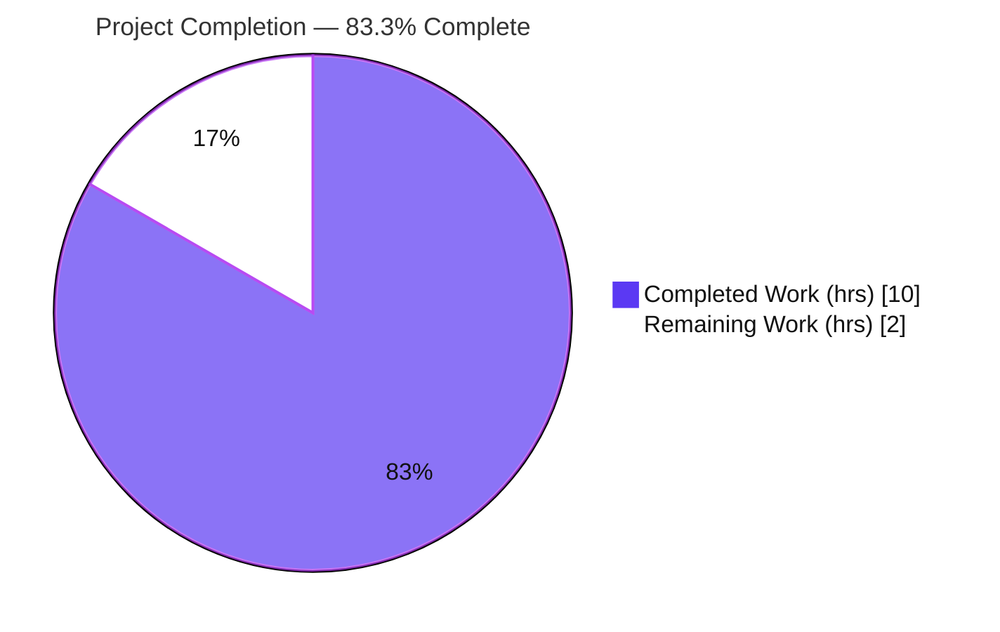
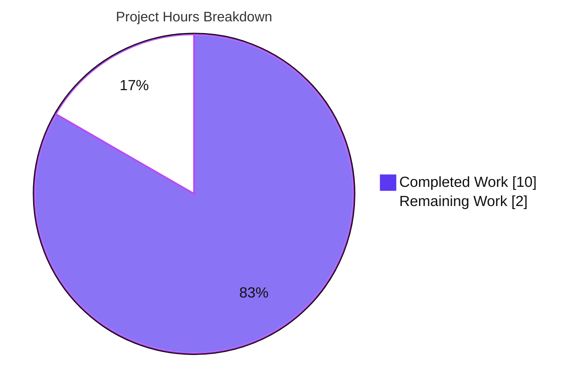

# Blitzy Project Guide — `hello_world` Express.js Re-Platform

> Project: Minimal single-file Node.js HTTP server re-platformed onto Express.js with a new `GET /good-evening` endpoint.
> Branch: `blitzy-9bf7ff39-f8b8-4fe1-a349-f130295c801a` · HEAD `7b5dd39` · Assessment date: 2026-06-11

---

## 1. Executive Summary

### 1.1 Project Overview

This project adopts the **Express.js** web framework inside an existing, intentionally minimal Node.js tutorial server and exposes a **second HTTP endpoint**. The server previously used Node's native `http` module to answer every request with `Hello, World!\n`. The delivered work re-platforms the bootstrap onto Express, preserves the original greeting at `GET /` for backward compatibility, and adds `GET /good-evening` returning the plain-text body `Good evening`. The target users are developers following the tutorial; business impact is educational/reference value. Technical scope is deliberately small: one source file (`server.js`), the npm manifest (`package.json`), and the tooling-generated lockfile. The local-only `127.0.0.1:3000` bind and CommonJS module style are preserved by design.

### 1.2 Completion Status



| Metric | Value |
|--------|-------|
| **Total Hours** | **12** |
| **Completed Hours (AI + Manual)** | **10** (AI: 10 · Manual: 0) |
| **Remaining Hours** | **2** |
| **Percent Complete** | **83.3%** |

> Completion is computed using the AAP-scoped, hours-based methodology: `Completed ÷ (Completed + Remaining) = 10 ÷ 12 = 83.3%`. All four AAP requirements (R1–R4) are implemented and byte-verified; the remaining 2 hours are the human review/merge and acceptance-verification gate (no in-scope code work outstanding).

### 1.3 Key Accomplishments

- ✅ **Express.js introduced (R1):** `express@^5.2.1` declared in `package.json` and locked in `package-lock.json`; `npm ci` installs 66 packages with **0 vulnerabilities**.
- ✅ **Server re-platformed onto Express (R2):** native `http` replaced with `const express = require('express')` / `const app = express()` / `app.listen(port, hostname, cb)`; `127.0.0.1:3000` bind, startup log, and CommonJS style preserved.
- ✅ **Backward compatibility preserved (R3):** `GET /` returns the byte-exact original `Hello, World!\n` (14 bytes, `text/plain`).
- ✅ **New endpoint added (R4):** `GET /good-evening` returns the byte-exact `Good evening` (12 bytes, `text/plain`).
- ✅ **User rule "04-june-rules" satisfied:** every non-blank line of `server.js` carries an explanatory inline comment (0 uncommented code lines).
- ✅ **Runnability improved:** `package.json` `"main"` aligned to `server.js` and a `"start": "node server.js"` script added.
- ✅ **Scope discipline:** all out-of-scope files (`README.md`, `server - Copy.js`, Java/CSV/binary artifacts) left untouched; out-of-scope `.gitignore` removed.

### 1.4 Critical Unresolved Issues

| Issue | Impact | Owner | ETA |
|-------|--------|-------|-----|
| _None_ — all in-scope requirements implemented and byte-verified; zero code defects | None | — | — |

> There are **no critical unresolved issues**. The codebase compiles (`node --check`), installs cleanly (0 vulnerabilities), and both endpoints return their exact required responses (byte-verified). Remaining items are routine human gates, not defects (see §1.6 and §2.2).

### 1.5 Access Issues

| System/Resource | Type of Access | Issue Description | Resolution Status | Owner |
|-----------------|----------------|-------------------|-------------------|-------|
| _None_ | — | No access issues identified | N/A | — |

> **No access issues identified.** The project has no external services, credentials, API keys, databases, or third-party integrations. All dependencies resolve from the public npm registry and installed cleanly during autonomous validation.

### 1.6 Recommended Next Steps

1. **[High]** Review the pull request diff (`server.js`, `package.json`, `package-lock.json`) against AAP requirements R1–R4 and the "comment every line" rule.
2. **[High]** Approve and merge the branch `blitzy-9bf7ff39-f8b8-4fe1-a349-f130295c801a` into the integration/base branch.
3. **[Medium]** Run the local acceptance test: `CI=true npm ci` → `npm start` → `curl` both endpoints (see §9).
4. **[Low]** _(Advisory, out of AAP scope)_ If the server will ever be exposed beyond localhost, plan deployment hardening (bind address, process manager, security middleware) — see §6 and §8.

---

## 2. Project Hours Breakdown

### 2.1 Completed Work Detail

| Component | Hours | Description |
|-----------|-------|-------------|
| R1 — Express.js dependency introduction | 1.5 | Verify current stable Express (`5.2.1`) and Node floor (`>=18`); add `dependencies` block; `npm install`; regenerate `package-lock.json`; confirm 0 vulnerabilities |
| R2 — Server re-platform (`http` → Express) | 2.5 | Replace native `http` with `express`; instantiate `app`; convert catch-all handler to routed app; `app.listen(port, hostname, cb)` preserving `127.0.0.1:3000` and startup log; retain CommonJS |
| R3 — Backward-compatible root greeting route | 1.0 | `app.get('/')` returning byte-exact `Hello, World!\n` as `text/plain`; verify backward compatibility |
| R4 — New `/good-evening` endpoint | 1.0 | `app.get('/good-evening')` returning byte-exact `Good evening` as `text/plain`; select descriptive route path |
| Per-line code commenting (04-june-rules) | 0.5 | Add explanatory inline comment to every line of `server.js` |
| Runnability configuration | 0.5 | Align `"main"` `index.js` → `server.js`; add `"start": "node server.js"` script |
| Autonomous validation & byte-exact runtime testing | 2.5 | `node --check`; `npm ci`; start via `node`/`npm start`; `od -c`/`cmp` byte verification of both endpoints; 404 check; scope-integrity audit; clean shutdown |
| Scope-control remediation | 0.5 | Remove out-of-scope `.gitignore` (CP1 finding); confirm no other out-of-scope edits |
| **Total Completed** | **10.0** | |

### 2.2 Remaining Work Detail

| Category | Hours | Priority |
|----------|-------|----------|
| Human Code Review & Merge Approval | 1.5 | High |
| Runtime Acceptance Verification | 0.5 | Medium |
| **Total Remaining** | **2.0** | |

> **Reconciliation:** Section 2.1 (10.0) + Section 2.2 (2.0) = **12.0 Total Hours** (matches §1.2). Section 2.2 total (2.0) matches §1.2 Remaining Hours and §7 "Remaining Work."

### 2.3 Scope Boundary Note

Items explicitly **outside AAP scope** (AAP §0.6.2) and therefore **not counted** in the hours above: automated test suites, CI/CD pipelines, containerization/build tooling, deployment hardening, and any edits to `README.md` or other unrelated repository artifacts. These appear only as advisory recommendations in §6 and §8.

---

## 3. Test Results

> All checks below originate from Blitzy's autonomous validation logs for this project and were independently re-confirmed during this assessment. No formal unit-test framework is in scope (AAP §0.2.3 / §0.6.2); functional correctness was proven via byte-exact runtime validation.

| Test Category | Framework / Method | Total Tests | Passed | Failed | Coverage % | Notes |
|---------------|--------------------|-------------|--------|--------|------------|-------|
| Unit Tests | None (out of AAP scope) | 0 | 0 | 0 | N/A | No `*.test.js`/`*.spec.js`; placeholder `npm test` correctly left unchanged |
| Runtime / Functional (endpoints) | `curl` + `od -c` byte comparison | 3 | 3 | 0 | N/A | `GET /`→`Hello, World!\n` (14B); `GET /good-evening`→`Good evening` (12B); `GET /<unmatched>`→404 |
| Compilation / Syntax | `node --check` | 1 | 1 | 0 | N/A | `server.js` parses cleanly (exit 0) |
| Dependency Install | `npm ci` | 1 | 1 | 0 | N/A | "added 66 packages, audited 67 packages" |
| Security Audit | `npm audit` | 1 | 1 | 0 | N/A | **0 vulnerabilities** |
| **Total** | | **6** | **6** | **0** | — | **100% pass rate** |

---

## 4. Runtime Validation & UI Verification

**Runtime health** (server started via both `node server.js` and `npm start`):

- ✅ **Operational** — Server boot logs exactly `Server running at http://127.0.0.1:3000/`
- ✅ **Operational** — `GET /` → `200`, `Content-Type: text/plain; charset=utf-8`, `Content-Length: 14`, body `Hello, World!\n` (byte-exact)
- ✅ **Operational** — `GET /good-evening` → `200`, `Content-Type: text/plain; charset=utf-8`, `Content-Length: 12`, body `Good evening` (byte-exact, no trailing newline)
- ✅ **Operational** — `GET /<unmatched>` → `404` (Express default; documented intentional behavior change from the old catch-all handler)
- ✅ **Operational** — `X-Powered-By: Express` header confirms requests are served by Express
- ✅ **Operational** — Clean shutdown via process signal; port `3000` released; no orphan processes

**API integration outcomes:**

- ✅ **Operational** — No external API integrations required or present; integration surface is empty.

**UI verification:**

- ⚠ **Not Applicable** — This is a server-side `text/plain` HTTP service with no user interface (AAP §0.5.3). No screens, components, or design assets exist to verify.

---

## 5. Compliance & Quality Review

| AAP Deliverable / Rule | Benchmark | Status | Evidence |
|------------------------|-----------|--------|----------|
| R1 — Add Express.js dependency | Declared & locked | ✅ Pass | `express ^5.2.1` in `package.json`; locked in `package-lock.json`; 66 pkgs installed |
| R2 — Re-platform onto Express | Native `http` removed | ✅ Pass | `express`/`app`/`app.listen`; `X-Powered-By: Express`; host/port/log preserved |
| R3 — Preserve `Hello, World!\n` | Byte-exact | ✅ Pass | `GET /` → 14 bytes, verified via `od -c` |
| R4 — Add `/good-evening` | Byte-exact | ✅ Pass | `GET /good-evening` → 12 bytes `Good evening` |
| Rule — Comment every line (04-june-rules) | 0 uncommented code lines | ✅ Pass | 9/9 non-blank lines commented |
| Rule — Exact response strings | No paraphrase | ✅ Pass | Both strings byte-verified at runtime |
| Rule — Retain CommonJS | `require()` syntax | ✅ Pass | No ESM migration |
| Rule — `README.md` "Do not touch!" | Unchanged | ✅ Pass | Diff vs baseline: unchanged |
| Rule — Minimal footprint | No extra middleware | ✅ Pass | 0 `app.use`, exactly 2 `app.get`, 0 body parsers |
| Rule — Verified dependency version | Not a placeholder | ✅ Pass | `^5.2.1` = verified npm `latest` |
| Scope control | No out-of-scope edits | ✅ Pass | Out-of-scope `.gitignore` removed; all other artifacts untouched |

**Fixes applied during autonomous validation:** Zero code changes were required — prior agents (commits `dcb3e2c`, `5b13599`) had already implemented the feature correctly. A scope-control fix (`8e489fb`) removed an out-of-scope `.gitignore`. **Outstanding in-scope items:** none.

---

## 6. Risk Assessment

| Risk | Category | Severity | Probability | Mitigation | Status |
|------|----------|----------|-------------|------------|--------|
| T1 — Fresh clone fails if run before install (`Cannot find module 'express'`) | Technical | Low | Medium | Documented run order: `npm ci` before start (§9) | Mitigated |
| T2 — Express 5 routing returns 404 on unmatched paths (was catch-all) | Technical | Low | Low | Documented intentional behavior change (AAP §0.1.1) | Accepted |
| T3 — No automated regression test suite | Technical | Low | Low | Byte-exact runtime validation performed; test scaffolding out of scope | Accepted (out of scope) |
| S1 — Transitive dependency drift (≈65 transitive pkgs) | Security | Low | Low | Periodic `npm audit`; `^5.2.1` permits patch updates; currently 0 vulns | Monitored |
| S2 — No security middleware (helmet/rate-limit/CORS) | Security | Low | Low | Not required for static local GET responses; add only if exposed publicly | Advisory |
| O1 — Local-only `127.0.0.1` bind (not externally reachable) | Operational | Low | Low | By design; change bind + add process manager only for non-local deployment | Accepted (by design) |
| O2 — Minimal observability (startup log only; no `/health`/structured logging) | Operational | Low | Low | Add health endpoint + logging if productionized | Advisory |
| O3 — No graceful shutdown / process supervision | Operational | Low | Low | Add signal handlers + supervisor if productionized | Advisory |
| I1 — External integrations | Integration | None | None | No external APIs/DBs/queues; no credentials needed | N/A |

> **Overall risk posture: LOW.** No High or Critical risks. Nothing blocks merge. All elevated-deployment concerns are explicitly outside AAP scope and flagged advisory only.

---

## 7. Visual Project Status

**Project hours breakdown** (Completed = Dark Blue `#5B39F3`, Remaining = White `#FFFFFF`):



**Remaining work by priority** (2.0 hrs total):

| Priority | Hours | Share |
|----------|-------|-------|
| High (review & merge approval) | 1.5 | 75% |
| Medium (acceptance verification) | 0.5 | 25% |
| Low | 0.0 | 0% |
| **Total** | **2.0** | **100%** |

> **Integrity check:** "Remaining Work" = **2** matches §1.2 Remaining Hours (2) and the §2.2 Hours total (2.0). "Completed Work" = **10** matches §1.2 Completed Hours (10).

---

## 8. Summary & Recommendations

**Achievements.** All four Agent Action Plan requirements are delivered and byte-verified: Express.js is introduced (R1), the server is re-platformed from native `http` onto Express while preserving the `127.0.0.1:3000` bind and startup log (R2), the original `Hello, World!\n` greeting is preserved at `GET /` (R3), and a new `GET /good-evening` endpoint returns `Good evening` (R4). The mandatory "comment every line" rule is satisfied, exact response strings are preserved byte-for-byte, CommonJS is retained, and scope boundaries are fully respected.

**Remaining gaps.** The project is **83.3% complete** (10 of 12 hours). The remaining **2 hours** are human gates, not engineering defects: code review of the pull request, merge approval, and a local runtime acceptance check.

**Critical path to production.** (1) Human PR review → (2) merge → (3) local acceptance verification. There is no CI/CD, container, or external-service dependency on the critical path because the AAP intentionally scopes the deliverable as a local tutorial server.

**Success metrics (all met):** compiles (`node --check` PASS); installs with 0 vulnerabilities; both endpoints return exact byte-verified responses; 0 out-of-scope file modifications; 0 uncommented code lines.

**Production-readiness assessment.** The in-scope code is **production-correct for its defined (local tutorial) scope** and ready to merge pending human review. If the project is later repurposed for non-local deployment — explicitly **outside** the current AAP scope — consider the advisory enhancements: external bind address + process manager, security middleware (helmet, rate limiting), a `/health` endpoint with structured logging and graceful shutdown, and an automated test suite (e.g., `jest` + `supertest`).

| Metric | Result |
|--------|--------|
| AAP requirements delivered | 4 of 4 (R1–R4) |
| Completion | 83.3% (10 / 12 hrs) |
| Critical defects | 0 |
| Security vulnerabilities | 0 |
| Overall risk | Low |

---

## 9. Development Guide

### 9.1 System Prerequisites

- **Node.js ≥ 18** (Express 5 engine floor). Validated on **v20.20.2**.
- **npm** (bundled with Node). Validated on **11.1.0**.
- **OS:** any POSIX-compatible system (Linux/macOS) or Windows; Node is cross-platform.
- **Hardware:** negligible — a single lightweight HTTP process.
- No database, cache, message queue, or external service is required.

```bash
# Verify your toolchain versions
node --version    # expect v18.x or higher (validated: v20.20.2)
npm --version     # validated: 11.1.0
```

### 9.2 Environment Setup

- No environment variables are required. Host (`127.0.0.1`) and port (`3000`) are constants in `server.js`.
- No `.env` file, secrets, or configuration files are needed.

```bash
# Clone / enter the repository root (the directory containing server.js)
cd <repository-root>
```

### 9.3 Dependency Installation

```bash
# Reproducible install from the committed lockfile (preferred)
CI=true npm ci
# Expected: "added 66 packages, audited 67 packages" and "found 0 vulnerabilities"

# Alternative if no lockfile is present:
# npm install
```

```bash
# (Optional) Confirm the dependency tree
npm ls
# Expected:
# hello_world@1.0.0 <path>
# └── express@5.2.1
```

> **Note:** `node_modules/` is intentionally **not** committed. You must run an install step before starting the server.

### 9.4 Application Startup

```bash
# Preferred:
npm start
# Equivalent:
node server.js
# Expected log line:
# Server running at http://127.0.0.1:3000/
```

To run in the background and capture logs:

```bash
node server.js > server.log 2>&1 &
```

### 9.5 Verification Steps

```bash
# (Optional) Syntax check before running
node --check server.js          # no output, exit 0 = OK

# Existing greeting (backward compatibility)
curl http://127.0.0.1:3000/
# Expected body: Hello, World!   (with a trailing newline; HTTP 200; 14 bytes)

# New endpoint
curl http://127.0.0.1:3000/good-evening
# Expected body: Good evening    (no trailing newline; HTTP 200; 12 bytes)

# Unmatched path now returns Express's 404 (expected, intentional)
curl -o /dev/null -w "%{http_code}\n" http://127.0.0.1:3000/missing
# Expected: 404
```

### 9.6 Stopping the Server

```bash
# Foreground: press Ctrl+C
# Background: free port 3000 by killing the listening process
kill $(lsof -ti :3000)
```

### 9.7 Example Usage

```bash
# Headers + body for the new endpoint
curl -i http://127.0.0.1:3000/good-evening
# HTTP/1.1 200 OK
# X-Powered-By: Express
# Content-Type: text/plain; charset=utf-8
# Content-Length: 12
# ...
# Good evening
```

### 9.8 Troubleshooting

| Symptom | Cause | Resolution |
|---------|-------|------------|
| `Error: Cannot find module 'express'` | Dependencies not installed | Run `CI=true npm ci` (or `npm install`) before starting |
| `Error: listen EADDRINUSE: address already in use 127.0.0.1:3000` | Another process holds port 3000 | `kill $(lsof -ti :3000)` then restart, or change the `port` constant in `server.js` |
| Server starts but unmatched path returns 404 | Express path routing (intentional) | Expected behavior — only `/` and `/good-evening` are routed |
| `SyntaxError` / unexpected engine error | Node version below 18 | Upgrade Node to ≥ 18 (`node --version`) |

---

## 10. Appendices

### Appendix A — Command Reference

| Command | Purpose |
|---------|---------|
| `CI=true npm ci` | Reproducible dependency install from `package-lock.json` |
| `npm install` | Install dependencies (regenerates lockfile if needed) |
| `npm ls` | Show the resolved dependency tree |
| `node --check server.js` | Syntax-check the server without running it |
| `npm start` / `node server.js` | Start the server on `127.0.0.1:3000` |
| `npm audit` | Report dependency vulnerabilities (currently 0) |
| `curl http://127.0.0.1:3000/` | Exercise the `/` endpoint |
| `curl http://127.0.0.1:3000/good-evening` | Exercise the `/good-evening` endpoint |
| `kill $(lsof -ti :3000)` | Stop a background server on port 3000 |

### Appendix B — Port Reference

| Port | Bind Address | Service | Notes |
|------|--------------|---------|-------|
| 3000 | 127.0.0.1 (loopback only) | Express HTTP server | Defined as constants in `server.js`; local-only by design |

### Appendix C — Key File Locations

| Path | Role | Disposition |
|------|------|-------------|
| `server.js` | Express application: 2 routes + `app.listen` | UPDATED (in scope) |
| `package.json` | npm manifest: `express` dependency, `start` script, `main` | UPDATED (in scope) |
| `package-lock.json` | Locked dependency tree (`lockfileVersion` 3) | UPDATED (tooling-regenerated) |
| `node_modules/` | Installed dependencies | Install artifact (not committed) |
| `README.md` | "Do not touch!" notice | Out of scope (unchanged) |
| `server - Copy.js` | Native-`http` backup | Out of scope (unchanged) |

### Appendix D — Technology Versions

| Component | Version | Source |
|-----------|---------|--------|
| Node.js | v20.20.2 (engine floor ≥ 18) | Runtime |
| npm | 11.1.0 | Runtime |
| Express | 5.2.1 (declared `^5.2.1`) | `package.json` / lockfile |
| Module system | CommonJS (`require`) | `server.js` |
| Lockfile format | `lockfileVersion` 3 | `package-lock.json` |

### Appendix E — Environment Variable Reference

| Variable | Required | Default | Notes |
|----------|----------|---------|-------|
| _None_ | — | — | No environment variables are used; host/port are in-code constants |

### Appendix F — Developer Tools Guide

| Tool | Use |
|------|-----|
| `node --check <file>` | Static syntax validation without execution |
| `npm ci` | Clean, reproducible installs in CI/local from the lockfile |
| `npm audit` | Security scan of the dependency tree |
| `curl -i` | Inspect HTTP status, headers, and body of each endpoint |
| `od -c` | Byte-exact verification of response bodies (e.g., trailing newline) |
| `lsof -ti :3000` | Identify the process bound to port 3000 |

### Appendix G — Glossary

| Term | Definition |
|------|------------|
| **AAP** | Agent Action Plan — the authoritative specification of project requirements (R1–R4) |
| **Re-platform** | Migrating the server bootstrap from native `http` to the Express framework while preserving observable behavior |
| **Byte-exact** | Response body matches the required string exactly, including/excluding trailing newline as specified |
| **CommonJS** | Node's `require()`-based module system (as opposed to ES modules) |
| **Catch-all handler** | The original single `http` handler that answered every path identically (replaced by routed endpoints) |
| **Path-to-production** | Standard activities (review, merge, acceptance) required to ship the AAP deliverable |

---

_Generated by the Blitzy autonomous project assessment. Completion (83.3%) reflects AAP-scoped and path-to-production work only._