# Technical Specification

# 1. Introduction

This Technical Specification documents the `hao-backprop-test` repository, a minimal Node.js HTTP server designed specifically for Backprop integration testing. The project embodies intentional simplicity to serve as a controlled testing environment, featuring a "Hello World" server with zero external dependencies.

## 1.1 Executive Summary

### 1.1.1 Project Overview

The `hao-backprop-test` project (npm package name: `hello_world`) is a deliberately minimal Node.js application created to validate and test Backprop integration capabilities. Backprop is a tool or service utilized for code analysis, refactoring, or AI-assisted development workflows. This repository provides an isolated, simple codebase that reduces variables when testing Backprop's processing capabilities.

| Attribute | Value |
|-----------|-------|
| Repository Name | `hao-backprop-test` |
| npm Package Name | `hello_world` |
| Version | 1.0.0 |
| License | MIT |

### 1.1.2 Core Problem Statement

Integration testing of code analysis tools like Backprop requires controlled test environments with predictable, minimal codebases. Complex production systems introduce too many variables that can obscure integration issues. This project addresses that need by providing:

- A single-purpose HTTP server with deterministic behavior
- Zero external dependencies to eliminate third-party complexity
- A flat repository structure for straightforward traversal
- Mixed-language file artifacts to test multi-language analysis capabilities

### 1.1.3 Key Stakeholders and Users

| Stakeholder | Role | Interaction |
|-------------|------|-------------|
| hxu | Author/Maintainer | Created and maintains the test repository |
| Backprop Team | Integration Testers | Uses this repository to validate Backprop functionality |
| Development Team | Test Consumers | Observes integration test results; warned not to modify ("Do not touch!") |

### 1.1.4 Value Proposition

The project delivers value through:

- **Isolation**: No external dependencies ensure test failures stem from integration issues, not dependency conflicts
- **Simplicity**: A 15-line server implementation provides a readable, fully understandable target for analysis
- **Reproducibility**: Deterministic "Hello, World!" responses enable consistent test assertions
- **Multi-Language Testing**: Inclusion of Java stubs and Python placeholders allows testing of cross-language analysis features

## 1.2 System Overview

### 1.2.1 Project Context

#### Business Context and Market Positioning

This project exists solely within the Backprop development and testing ecosystem. It is explicitly marked as a test project in `README.md` and is not intended for production deployment or commercial use. The repository serves as a standardized test fixture for validating Backprop's code analysis and integration capabilities.

#### Current System Context

The project was created as a net-new test fixture rather than a replacement for an existing system. Its design reflects common patterns found in minimal Node.js applications while remaining simple enough to serve as a predictable test target.

#### Integration with Existing Landscape

| Integration Point | Status | Description |
|-------------------|--------|-------------|
| Backprop | Primary | Target repository for integration testing |
| External APIs | None | No outbound API calls |
| Databases | None | No data persistence layer |
| CI/CD Pipelines | None | No automated deployment configured |

### 1.2.2 High-Level Description

#### Primary System Capabilities

The system provides a single capability: serving HTTP requests with a static "Hello, World!" response.

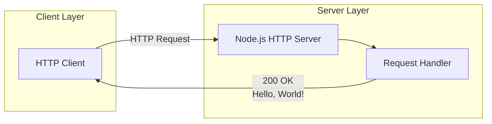

#### Major System Components

| Component | File | Purpose |
|-----------|------|---------|
| HTTP Server | `server.js` | Core application; handles all HTTP requests |
| Package Manifest | `package.json` | Defines npm metadata and project configuration |
| Dependency Lock | `package-lock.json` | Confirms zero external dependencies |
| Documentation | `README.md` | Project description and usage warning |

#### Core Technical Approach

The application leverages Node.js's built-in `http` module using CommonJS module syntax (`require('http')`). This approach eliminates external dependencies while providing robust HTTP server capabilities. The server:

1. Creates an HTTP server instance with a unified request handler
2. Binds to `127.0.0.1:3000` (localhost only)
3. Responds to all incoming requests with:
   - HTTP Status Code: `200`
   - Content-Type: `text/plain`
   - Response Body: `Hello, World!\n`
4. Logs startup confirmation to the console

### 1.2.3 Success Criteria

#### Measurable Objectives

| Objective | Metric | Target |
|-----------|--------|--------|
| Server Availability | HTTP response on localhost:3000 | 100% when running |
| Response Correctness | Response body matches expected output | "Hello, World!\n" |
| Dependency Isolation | External dependency count | Zero |
| Backprop Compatibility | Successful analysis completion | Pass all integration tests |

#### Critical Success Factors

1. **Stability**: Server must run without crashes or memory leaks during test execution
2. **Predictability**: Every request must return identical responses for consistent test assertions
3. **Analyzability**: Codebase must be parseable by Backprop without errors
4. **Isolation**: Local-only binding prevents unintended network exposure during testing

#### Key Performance Indicators (KPIs)

| KPI | Description | Measurement Method |
|-----|-------------|-------------------|
| Startup Time | Time from process start to server listening | Console log timestamp |
| Response Latency | Time to receive "Hello, World!" response | HTTP client timing |
| Memory Footprint | RAM usage during operation | Process monitoring |
| Integration Success Rate | Percentage of successful Backprop runs | Test execution logs |

## 1.3 Scope

### 1.3.1 In-Scope Elements

#### Core Features and Functionalities

**Must-Have Capabilities:**

| Capability | Implementation | Status |
|------------|----------------|--------|
| HTTP Request Handling | `server.js` using `http.createServer()` | Implemented |
| Static Response Delivery | Hardcoded "Hello, World!" message | Implemented |
| Localhost Binding | Server binds to `127.0.0.1:3000` | Implemented |
| Console Logging | Startup message output | Implemented |

**Primary User Workflows:**

1. **Server Execution Flow**
   - User executes `node server.js`
   - Server binds to localhost:3000
   - Console displays: "Server running at http://127.0.0.1:3000/"
   - Server awaits incoming HTTP requests

2. **Request-Response Flow**
   - Client sends HTTP request to localhost:3000
   - Server receives request (any method, any path)
   - Server responds with 200 status and "Hello, World!"
   - Connection closes

**Essential Integrations:**

- Node.js built-in `http` module (sole integration point)

**Key Technical Requirements:**

| Requirement | Specification |
|-------------|---------------|
| Runtime Environment | Node.js (CommonJS module support) |
| Network Interface | IPv4 loopback (127.0.0.1) |
| Port | 3000 |
| Protocol | HTTP/1.1 |

#### Implementation Boundaries

**System Boundaries:**

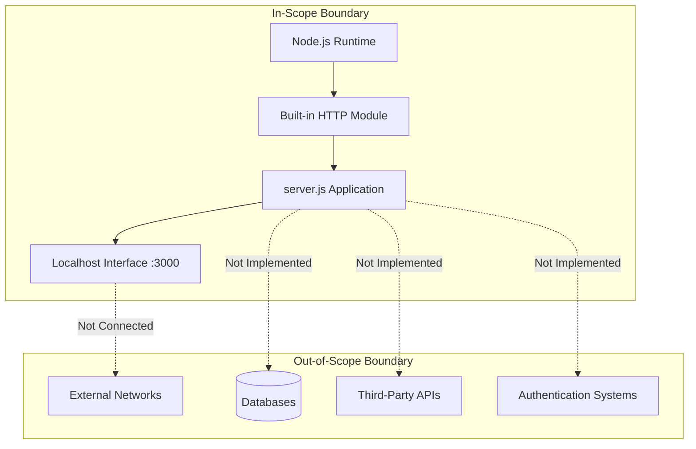

**User Groups Covered:**

| User Group | Access Level | Purpose |
|------------|--------------|---------|
| Developers | Full | Run server, execute tests |
| Backprop Service | Read | Analyze repository contents |
| Automated Tests | Network | Send HTTP requests, validate responses |

**Geographic/Market Coverage:**

- Localhost only (127.0.0.1 binding)
- No external network accessibility
- No geographic distribution considerations

**Data Domains Included:**

- HTTP request metadata (method, path, headers) — received but not processed
- Static response content ("Hello, World!") — hardcoded output

### 1.3.2 Out-of-Scope Elements

#### Explicitly Excluded Features

| Feature | Rationale | Future Consideration |
|---------|-----------|---------------------|
| URL Routing | Not needed for minimal test server | N/A |
| Request Body Parsing | No input processing required | N/A |
| Authentication/Authorization | Security not required for local test fixture | N/A |
| HTTPS/TLS | Encryption unnecessary for localhost testing | N/A |
| Database Integration | No data persistence needed | N/A |
| Logging Framework | Console.log sufficient for test purposes | N/A |
| Configuration Management | Hardcoded values acceptable for test scope | N/A |
| Error Handling | Basic Node.js defaults sufficient | N/A |

#### Future Phase Considerations

The following items exist as placeholders or stubs but are not implemented:

| Item | Current State | Files |
|------|---------------|-------|
| Automated Testing | Placeholder npm script only | `package.json` ("test" script exits with error) |
| Java Integration | Non-compilable stub | `LoginTest.java`, `LoginTest - Copy.java` |
| Python Integration | Empty files | `test.py.txt`, `test.py - Copy.txt`, `test.txt.txt` |
| Industry Data Processing | Sample data without processor | `industry.csv` |

#### Integration Points Not Covered

- External API consumption
- Message queue integration
- Service mesh participation
- Container orchestration
- Cloud platform services
- Monitoring and observability platforms

#### Unsupported Use Cases

| Use Case | Reason Not Supported |
|----------|---------------------|
| Production Deployment | Explicitly designated as test-only project |
| External Network Access | Server binds to localhost only |
| Multi-User Concurrent Access | Not designed for load handling |
| Data Persistence | No database or file storage implemented |
| Dynamic Content Generation | Only static "Hello, World!" response |
| API Versioning | Single, unversioned endpoint |

### 1.3.3 Known Limitations and Discrepancies

| Issue | Description | Impact |
|-------|-------------|--------|
| Entry Point Mismatch | `package.json` declares `"main": "index.js"` but actual server is `server.js` | npm start may fail; manual `node server.js` required |
| Duplicate Files | `server - Copy.js` is an exact duplicate of `server.js` | No functional impact; artifact from development |
| Non-Functional Stubs | Java and Python files are non-compilable/empty | Exist only as Backprop analysis targets |

## 1.4 References

The following files and folders were examined to compile this Introduction section:

#### Files

| File | Relevance |
|------|-----------|
| `README.md` | Project description, purpose statement, usage warning |
| `package.json` | npm metadata, author, version, license, scripts configuration |
| `package-lock.json` | Dependency verification (confirms zero external dependencies) |
| `server.js` | Core HTTP server implementation (15 lines) |
| `server - Copy.js` | Duplicate artifact of server.js |
| `LoginTest.java` | Non-functional Java stub (test artifact for multi-language analysis) |
| `LoginTest - Copy.java` | Duplicate of LoginTest.java |
| `industry.csv` | Sample industry category data (44 entries) |
| `test.py.txt`, `test.py - Copy.txt`, `test.txt.txt` | Empty Python placeholder files |

#### Folders

| Folder | Relevance |
|--------|-----------|
| `/` (root) | Flat repository structure containing all 12 files with no subfolders |

# 2. Product Requirements

## 2.1 Feature Catalog

This section documents all discrete, testable features of the `hao-backprop-test` repository. Given the deliberately minimal nature of this test project, the feature set is intentionally constrained to four core capabilities that collectively deliver a predictable HTTP test server for Backprop integration validation.

### 2.1.1 Feature F-001: HTTP Server Functionality

#### Feature Metadata

| Attribute | Value |
|-----------|-------|
| Unique ID | F-001 |
| Feature Name | HTTP Server Functionality |
| Feature Category | Core Infrastructure |
| Priority Level | Critical |

| Attribute | Value |
|-----------|-------|
| Status | Completed |
| Version | 1.0.0 |
| Owner | hxu |

#### Description

**Overview:**
The HTTP Server Functionality feature provides the foundational capability for the entire application. It instantiates a Node.js HTTP server using the built-in `http` module, establishing a listener that can accept and process incoming HTTP connections. This feature serves as the prerequisite for all other system capabilities.

**Business Value:**
- Establishes a controlled, isolated test environment for Backprop integration validation
- Eliminates external dependency variables that could confound integration test results
- Provides a deterministic server instance for reproducible testing scenarios

**User Benefits:**
- Developers can execute `node server.js` to immediately start a functioning HTTP server
- Backprop testing team receives a predictable analysis target with minimal complexity
- Zero setup requirements beyond Node.js runtime installation

**Technical Context:**
The implementation leverages Node.js's native `http.createServer()` method with CommonJS module syntax (`require('http')`). The server is created with a single request handler callback that processes all incoming requests uniformly. This 15-line implementation in `server.js` represents the entire application logic.

#### Dependencies

| Dependency Type | Dependency |
|-----------------|------------|
| Prerequisite Features | None (foundational feature) |
| System Dependencies | Node.js runtime with CommonJS support |
| External Dependencies | None (zero npm packages) |
| Integration Requirements | Node.js built-in `http` module |

---

### 2.1.2 Feature F-002: Static Response Delivery

#### Feature Metadata

| Attribute | Value |
|-----------|-------|
| Unique ID | F-002 |
| Feature Name | Static Response Delivery |
| Feature Category | Core Functionality |
| Priority Level | Critical |

| Attribute | Value |
|-----------|-------|
| Status | Completed |
| Version | 1.0.0 |
| Owner | hxu |

#### Description

**Overview:**
The Static Response Delivery feature defines the server's response behavior to all incoming HTTP requests. Regardless of the HTTP method, URL path, headers, or request body, the server returns an identical response: HTTP status code 200 with a `text/plain` content type and the body `Hello, World!\n`.

**Business Value:**
- Enables consistent, deterministic test assertions against server output
- Simplifies integration test development by providing predictable behavior
- Reduces debugging complexity by eliminating conditional response logic

**User Benefits:**
- Testing teams can validate HTTP connectivity with a single expected response
- No special request formatting or authentication required for testing
- Response consistency allows for automated regression testing

**Technical Context:**
The response is constructed within the `http.createServer()` callback function in `server.js`:
- `res.statusCode = 200` sets the HTTP status
- `res.setHeader('Content-Type', 'text/plain')` defines the content type header
- `res.end('Hello, World!\n')` writes the response body and terminates the response

#### Dependencies

| Dependency Type | Dependency |
|-----------------|------------|
| Prerequisite Features | F-001 (HTTP Server Functionality) |
| System Dependencies | Node.js HTTP response API |
| External Dependencies | None |
| Integration Requirements | Active HTTP server instance |

---

### 2.1.3 Feature F-003: Localhost Network Binding

#### Feature Metadata

| Attribute | Value |
|-----------|-------|
| Unique ID | F-003 |
| Feature Name | Localhost Network Binding |
| Feature Category | Network/Security |
| Priority Level | Critical |

| Attribute | Value |
|-----------|-------|
| Status | Completed |
| Version | 1.0.0 |
| Owner | hxu |

#### Description

**Overview:**
The Localhost Network Binding feature configures the HTTP server to listen exclusively on the IPv4 loopback interface (`127.0.0.1`) on port `3000`. This binding restricts network access to the local machine only, preventing external network connections.

**Business Value:**
- Ensures test server cannot be inadvertently exposed to external networks
- Provides a secure default configuration for development and testing
- Eliminates need for firewall configuration during testing

**User Benefits:**
- Developers can run the server without security concerns
- No port forwarding or network configuration required
- Immediate local access via `http://127.0.0.1:3000/`

**Technical Context:**
The binding configuration is hardcoded in `server.js`:
- `hostname = '127.0.0.1'` restricts to IPv4 loopback
- `port = 3000` defines the listening port
- `server.listen(port, hostname, callback)` initiates the binding

#### Dependencies

| Dependency Type | Dependency |
|-----------------|------------|
| Prerequisite Features | F-001 (HTTP Server Functionality) |
| System Dependencies | Available port 3000 on localhost |
| External Dependencies | None |
| Integration Requirements | IPv4 networking stack |

---

### 2.1.4 Feature F-004: Console Startup Logging

#### Feature Metadata

| Attribute | Value |
|-----------|-------|
| Unique ID | F-004 |
| Feature Name | Console Startup Logging |
| Feature Category | Observability |
| Priority Level | Medium |

| Attribute | Value |
|-----------|-------|
| Status | Completed |
| Version | 1.0.0 |
| Owner | hxu |

#### Description

**Overview:**
The Console Startup Logging feature provides operational feedback when the server successfully starts. Upon successful binding to the configured host and port, the server outputs a confirmation message to the console: `Server running at http://127.0.0.1:3000/`.

**Business Value:**
- Provides immediate visual confirmation of successful server startup
- Aids debugging by confirming the server is ready to accept connections
- Documents the exact URL for accessing the server

**User Benefits:**
- Users receive immediate feedback that the server is operational
- The log message includes the full URL for easy copy-paste access
- Absence of the message indicates a startup failure

**Technical Context:**
The logging is implemented as a callback to the `server.listen()` method in `server.js`:
```
server.listen(port, hostname, () => {
  console.log(`Server running at http://${hostname}:${port}/`);
});
```
This uses standard Node.js `console.log()` for output, which writes to stdout.

#### Dependencies

| Dependency Type | Dependency |
|-----------------|------------|
| Prerequisite Features | F-001, F-003 (Server must be created and bound) |
| System Dependencies | Console/stdout access |
| External Dependencies | None |
| Integration Requirements | Successful port binding |

---

## 2.2 Functional Requirements Tables

This section details the testable requirements for each feature with acceptance criteria, technical specifications, and validation rules.

### 2.2.1 F-001: HTTP Server Functionality Requirements

#### Requirement F-001-RQ-001: Server Initialization

| Attribute | Value |
|-----------|-------|
| Requirement ID | F-001-RQ-001 |
| Description | System must create an HTTP server instance using Node.js built-in http module |
| Priority | Must-Have |
| Complexity | Low |

**Acceptance Criteria:**
- Server instance is created without errors when `server.js` is executed
- Server uses CommonJS `require('http')` syntax
- No external npm dependencies are loaded

| Technical Specification | Value |
|------------------------|-------|
| Input Parameters | `node server.js` command execution |
| Output/Response | HTTP server instance ready for configuration |
| Performance Criteria | Server creation < 100ms |
| Data Requirements | None |

**Validation Rules:**

| Rule Type | Rule |
|-----------|------|
| Business Rules | Server must be created before binding |
| Data Validation | N/A |
| Security Requirements | No external network modules loaded |
| Compliance Requirements | N/A |

---

#### Requirement F-001-RQ-002: Request Handler Registration

| Attribute | Value |
|-----------|-------|
| Requirement ID | F-001-RQ-002 |
| Description | Server must register a unified request handler for all incoming HTTP requests |
| Priority | Must-Have |
| Complexity | Low |

**Acceptance Criteria:**
- Single callback function handles all request types
- Handler is registered during server creation via `http.createServer(callback)`
- Handler receives `req` (request) and `res` (response) objects

| Technical Specification | Value |
|------------------------|-------|
| Input Parameters | HTTP request object, HTTP response object |
| Output/Response | Configured response sent to client |
| Performance Criteria | Handler registration instantaneous |
| Data Requirements | None |

**Validation Rules:**

| Rule Type | Rule |
|-----------|------|
| Business Rules | Handler must process all HTTP methods uniformly |
| Data Validation | N/A (no input validation performed) |
| Security Requirements | No user input processing |
| Compliance Requirements | N/A |

---

### 2.2.2 F-002: Static Response Delivery Requirements

#### Requirement F-002-RQ-001: HTTP Status Code

| Attribute | Value |
|-----------|-------|
| Requirement ID | F-002-RQ-001 |
| Description | Server must respond with HTTP status code 200 (OK) for all requests |
| Priority | Must-Have |
| Complexity | Low |

**Acceptance Criteria:**
- All HTTP requests receive status code 200
- Status code is set via `res.statusCode = 200`
- No conditional status code logic exists

| Technical Specification | Value |
|------------------------|-------|
| Input Parameters | Any HTTP request |
| Output/Response | HTTP/1.1 200 OK |
| Performance Criteria | Immediate status assignment |
| Data Requirements | None |

**Validation Rules:**

| Rule Type | Rule |
|-----------|------|
| Business Rules | Status code must always be 200 |
| Data Validation | N/A |
| Security Requirements | N/A |
| Compliance Requirements | HTTP/1.1 protocol compliance |

---

#### Requirement F-002-RQ-002: Content-Type Header

| Attribute | Value |
|-----------|-------|
| Requirement ID | F-002-RQ-002 |
| Description | Server must set Content-Type header to text/plain for all responses |
| Priority | Must-Have |
| Complexity | Low |

**Acceptance Criteria:**
- Response includes `Content-Type: text/plain` header
- Header is set via `res.setHeader('Content-Type', 'text/plain')`
- No character encoding specified (defaults to system)

| Technical Specification | Value |
|------------------------|-------|
| Input Parameters | Any HTTP request |
| Output/Response | Content-Type: text/plain header |
| Performance Criteria | Immediate header assignment |
| Data Requirements | None |

**Validation Rules:**

| Rule Type | Rule |
|-----------|------|
| Business Rules | Content-Type must be text/plain |
| Data Validation | N/A |
| Security Requirements | N/A |
| Compliance Requirements | HTTP header compliance |

---

#### Requirement F-002-RQ-003: Response Body Content

| Attribute | Value |
|-----------|-------|
| Requirement ID | F-002-RQ-003 |
| Description | Server must return "Hello, World!\n" as the response body for all requests |
| Priority | Must-Have |
| Complexity | Low |

**Acceptance Criteria:**
- Response body is exactly `Hello, World!\n` (14 characters including newline)
- Response is sent via `res.end('Hello, World!\n')`
- Body is identical regardless of request method, path, headers, or body

| Technical Specification | Value |
|------------------------|-------|
| Input Parameters | Any HTTP request (content ignored) |
| Output/Response | `Hello, World!\n` |
| Performance Criteria | Sub-millisecond response generation |
| Data Requirements | Static string literal |

**Validation Rules:**

| Rule Type | Rule |
|-----------|------|
| Business Rules | Response must be deterministic and unchanging |
| Data Validation | N/A |
| Security Requirements | No dynamic content generation |
| Compliance Requirements | N/A |

---

### 2.2.3 F-003: Localhost Network Binding Requirements

#### Requirement F-003-RQ-001: Host Address Configuration

| Attribute | Value |
|-----------|-------|
| Requirement ID | F-003-RQ-001 |
| Description | Server must bind exclusively to IPv4 loopback address 127.0.0.1 |
| Priority | Must-Have |
| Complexity | Low |

**Acceptance Criteria:**
- Server binds to `127.0.0.1` only
- External network interfaces are not accessible
- Connection attempts from non-localhost addresses are rejected

| Technical Specification | Value |
|------------------------|-------|
| Input Parameters | Hardcoded hostname constant |
| Output/Response | Server bound to loopback interface |
| Performance Criteria | Binding < 50ms |
| Data Requirements | `const hostname = '127.0.0.1'` |

**Validation Rules:**

| Rule Type | Rule |
|-----------|------|
| Business Rules | Only localhost access permitted |
| Data Validation | Valid IPv4 address format |
| Security Requirements | External network isolation mandatory |
| Compliance Requirements | N/A |

---

#### Requirement F-003-RQ-002: Port Configuration

| Attribute | Value |
|-----------|-------|
| Requirement ID | F-003-RQ-002 |
| Description | Server must listen on port 3000 |
| Priority | Must-Have |
| Complexity | Low |

**Acceptance Criteria:**
- Server binds to TCP port 3000
- Port is hardcoded (not configurable)
- Server fails if port 3000 is already in use

| Technical Specification | Value |
|------------------------|-------|
| Input Parameters | Hardcoded port constant |
| Output/Response | Server listening on port 3000 |
| Performance Criteria | Port binding < 50ms |
| Data Requirements | `const port = 3000` |

**Validation Rules:**

| Rule Type | Rule |
|-----------|------|
| Business Rules | Port must be 3000 |
| Data Validation | Valid port number (1-65535) |
| Security Requirements | Standard unprivileged port |
| Compliance Requirements | N/A |

---

### 2.2.4 F-004: Console Startup Logging Requirements

#### Requirement F-004-RQ-001: Startup Confirmation Message

| Attribute | Value |
|-----------|-------|
| Requirement ID | F-004-RQ-001 |
| Description | Server must output startup confirmation to console upon successful binding |
| Priority | Should-Have |
| Complexity | Low |

**Acceptance Criteria:**
- Console displays: `Server running at http://127.0.0.1:3000/`
- Message appears only after successful port binding
- Output uses template literal with hostname and port variables

| Technical Specification | Value |
|------------------------|-------|
| Input Parameters | hostname, port variables |
| Output/Response | Formatted string to stdout |
| Performance Criteria | Immediate output after binding |
| Data Requirements | String template |

**Validation Rules:**

| Rule Type | Rule |
|-----------|------|
| Business Rules | Message must include full server URL |
| Data Validation | N/A |
| Security Requirements | N/A |
| Compliance Requirements | N/A |

---

## 2.3 Requirements Traceability Matrix

The following matrix maps features to their requirements and provides traceability to implementation files.

### 2.3.1 Feature-to-Requirement Mapping

| Feature ID | Feature Name | Requirements |
|------------|--------------|--------------|
| F-001 | HTTP Server Functionality | F-001-RQ-001, F-001-RQ-002 |
| F-002 | Static Response Delivery | F-002-RQ-001, F-002-RQ-002, F-002-RQ-003 |
| F-003 | Localhost Network Binding | F-003-RQ-001, F-003-RQ-002 |
| F-004 | Console Startup Logging | F-004-RQ-001 |

### 2.3.2 Requirement-to-Implementation Mapping

| Requirement ID | Implementation File | Code Line(s) |
|----------------|---------------------|--------------|
| F-001-RQ-001 | `server.js` | Lines 1, 6-10 |
| F-001-RQ-002 | `server.js` | Lines 6-10 |
| F-002-RQ-001 | `server.js` | Line 7 |
| F-002-RQ-002 | `server.js` | Line 8 |
| F-002-RQ-003 | `server.js` | Line 9 |
| F-003-RQ-001 | `server.js` | Lines 3, 12 |
| F-003-RQ-002 | `server.js` | Lines 4, 12 |
| F-004-RQ-001 | `server.js` | Lines 12-14 |

### 2.3.3 Requirement Priority Summary

| Priority | Count | Requirements |
|----------|-------|--------------|
| Must-Have | 7 | F-001-RQ-001, F-001-RQ-002, F-002-RQ-001, F-002-RQ-002, F-002-RQ-003, F-003-RQ-001, F-003-RQ-002 |
| Should-Have | 1 | F-004-RQ-001 |
| Could-Have | 0 | None |

---

## 2.4 Feature Relationships

This section documents the dependencies and relationships between features based on the implementation in `server.js`.

### 2.4.1 Feature Dependencies Map

```mermaid
flowchart TD
    subgraph CoreLayer[Core Layer]
        F001[F-001: HTTP Server Functionality]
    end
    
    subgraph FunctionalLayer[Functional Layer]
        F002[F-002: Static Response Delivery]
        F003[F-003: Localhost Network Binding]
    end
    
    subgraph ObservabilityLayer[Observability Layer]
        F004[F-004: Console Startup Logging]
    end
    
    F001 --> F002
    F001 --> F003
    F003 --> F004
    
    F001 -.->|Creates server instance| F002
    F001 -.->|Provides server.listen()| F003
    F003 -.->|Triggers on successful bind| F004
```

### 2.4.2 Dependency Matrix

| Feature | Depends On | Depended By |
|---------|------------|-------------|
| F-001 | None | F-002, F-003, F-004 |
| F-002 | F-001 | None |
| F-003 | F-001 | F-004 |
| F-004 | F-001, F-003 | None |

### 2.4.3 Integration Points

All features integrate through a single file (`server.js`) with no external integration points:

| Integration Point | Features Involved | Type |
|-------------------|-------------------|------|
| `http.createServer()` | F-001, F-002 | Internal API |
| `server.listen()` | F-001, F-003, F-004 | Internal API |
| Request Handler Callback | F-001, F-002 | Callback Pattern |
| Listen Callback | F-003, F-004 | Callback Pattern |

### 2.4.4 Shared Components

| Component | Used By Features | Location |
|-----------|------------------|----------|
| `http` module | F-001, F-002, F-003 | Node.js built-in |
| `server` instance | F-001, F-002, F-003, F-004 | `server.js` line 6 |
| `hostname` constant | F-003, F-004 | `server.js` line 3 |
| `port` constant | F-003, F-004 | `server.js` line 4 |

### 2.4.5 Common Services

Given the minimal nature of this test project, no external common services are utilized. All functionality is self-contained within `server.js` using only Node.js built-in capabilities.

| Service Category | Status |
|------------------|--------|
| Authentication | Not Implemented |
| Logging Framework | Not Implemented (uses console.log) |
| Configuration Service | Not Implemented (hardcoded values) |
| Database Service | Not Implemented |
| Caching Service | Not Implemented |

---

## 2.5 Implementation Considerations

This section documents technical constraints, performance requirements, and operational considerations for each feature.

### 2.5.1 F-001: HTTP Server Functionality

#### Technical Constraints

| Constraint | Description |
|------------|-------------|
| Runtime Dependency | Requires Node.js with CommonJS module support |
| Single-Threaded | Subject to Node.js event loop limitations |
| Module System | Uses `require()` syntax; not ES modules |

#### Performance Requirements

| Metric | Target | Rationale |
|--------|--------|-----------|
| Startup Time | < 1 second | Test environment efficiency |
| Memory Footprint | < 50 MB | Minimal resource consumption |
| Event Loop Blocking | None | Non-blocking I/O only |

#### Scalability Considerations

This feature is not designed for scalability:
- Single-threaded execution model
- No clustering or worker processes
- Suitable only for local testing scenarios

#### Security Implications

| Security Aspect | Status |
|-----------------|--------|
| Input Validation | None (by design) |
| Request Size Limits | Node.js defaults |
| Timeout Handling | Node.js defaults |

#### Maintenance Requirements

| Requirement | Description |
|-------------|-------------|
| Node.js Updates | Keep runtime current for security patches |
| Code Modifications | Explicitly discouraged (README: "Do not touch!") |

---

### 2.5.2 F-002: Static Response Delivery

#### Technical Constraints

| Constraint | Description |
|------------|-------------|
| Static Content Only | No dynamic content generation capability |
| No Content Negotiation | Always returns text/plain regardless of Accept header |
| No Request Processing | Request body, method, and path are ignored |

#### Performance Requirements

| Metric | Target | Rationale |
|--------|--------|-----------|
| Response Latency | < 10 ms | Local execution benchmark |
| Throughput | N/A | Not designed for load testing |
| Response Size | 14 bytes | Fixed "Hello, World!\n" payload |

#### Scalability Considerations

Not applicable—the feature intentionally provides no scaling capabilities as it serves a testing purpose only.

#### Security Implications

| Security Aspect | Status |
|-----------------|--------|
| Information Disclosure | Minimal (static response only) |
| Injection Attacks | Not vulnerable (no input processing) |
| Content Security | No sensitive data exposed |

#### Maintenance Requirements

| Requirement | Description |
|-------------|-------------|
| Response Consistency | Response text must remain "Hello, World!\n" |
| Protocol Compliance | Maintain HTTP/1.1 compatibility |

---

### 2.5.3 F-003: Localhost Network Binding

#### Technical Constraints

| Constraint | Description |
|------------|-------------|
| IPv4 Only | Binds to 127.0.0.1, not IPv6 ::1 |
| Fixed Port | Port 3000 is hardcoded, not configurable |
| Single Interface | Cannot bind to 0.0.0.0 for all interfaces |

#### Performance Requirements

| Metric | Target | Rationale |
|--------|--------|-----------|
| Binding Time | < 100 ms | Fast server startup |
| Connection Handling | Default Node.js limits | No custom configuration |

#### Scalability Considerations

| Consideration | Assessment |
|---------------|------------|
| Horizontal Scaling | Not supported |
| Load Balancing | Not applicable |
| High Availability | Not implemented |

#### Security Implications

| Security Aspect | Assessment |
|-----------------|------------|
| Network Exposure | Minimal (localhost only) |
| Port Security | Standard unprivileged port |
| Firewall Requirements | None (internal loopback) |

#### Maintenance Requirements

| Requirement | Description |
|-------------|-------------|
| Port Availability | Ensure port 3000 is not in use |
| Network Stack | IPv4 loopback must be functional |

---

### 2.5.4 F-004: Console Startup Logging

#### Technical Constraints

| Constraint | Description |
|------------|-------------|
| Output Destination | stdout only (no file logging) |
| Log Format | Single unstructured message |
| Log Level | No log level classification |

#### Performance Requirements

| Metric | Target | Rationale |
|--------|--------|-----------|
| Log Output Time | Immediate | User feedback requirement |
| I/O Overhead | Negligible | Single console.log call |

#### Scalability Considerations

Not applicable—single log statement at startup only.

#### Security Implications

| Security Aspect | Assessment |
|-----------------|------------|
| Sensitive Data Logging | None (only URL logged) |
| Log Injection | Not vulnerable (static template) |

#### Maintenance Requirements

| Requirement | Description |
|-------------|-------------|
| Message Accuracy | URL in log must match actual binding |
| Output Visibility | stdout must be accessible |

---

## 2.6 Out-of-Scope Features

Based on Section 1.3.2 of the technical specification, the following features are explicitly out of scope for this product:

### 2.6.1 Excluded Features Matrix

| Feature | Status | Rationale |
|---------|--------|-----------|
| URL Routing | Out of Scope | Not needed for minimal test server |
| Request Body Parsing | Out of Scope | No input processing required |
| Authentication/Authorization | Out of Scope | Security not required for local test fixture |
| HTTPS/TLS Support | Out of Scope | Encryption unnecessary for localhost testing |

| Feature | Status | Rationale |
|---------|--------|-----------|
| Database Integration | Out of Scope | No data persistence needed |
| Logging Framework | Out of Scope | console.log sufficient for test purposes |
| Configuration Management | Out of Scope | Hardcoded values acceptable |
| Error Handling | Out of Scope | Basic Node.js defaults sufficient |

### 2.6.2 Placeholder Items

The following items exist in the repository but are not functional product requirements:

| Item | Current State | Files |
|------|---------------|-------|
| Automated Testing | Placeholder npm script only | `package.json` |
| Java Integration | Non-compilable stub | `LoginTest.java` |
| Python Integration | Empty files | `test.py.txt` |
| Industry Data Processing | Sample data without processor | `industry.csv` |

---

## 2.7 Known Limitations and Assumptions

### 2.7.1 Known Limitations

| Limitation ID | Description | Impact | Workaround |
|---------------|-------------|--------|------------|
| LIM-001 | Entry point mismatch: `package.json` declares `main: index.js` but server is `server.js` | `npm start` may fail | Execute `node server.js` directly |
| LIM-002 | Test script placeholder exits with error | No automated tests | Manual testing required |
| LIM-003 | IPv4 only binding (no IPv6 support) | Cannot use `::1` | Use `127.0.0.1` |
| LIM-004 | Hardcoded configuration | No runtime flexibility | Modify source code if needed |

### 2.7.2 Assumptions

| Assumption ID | Description | Risk if Invalid |
|---------------|-------------|-----------------|
| ASM-001 | Node.js runtime is installed on target system | Server will not start |
| ASM-002 | Port 3000 is available on localhost | Binding will fail |
| ASM-003 | IPv4 networking stack is functional | Connection will fail |
| ASM-004 | Repository is used for Backprop testing only | Unexpected production use |

---

## 2.8 Process Flowchart

The following flowchart illustrates the request-response process flow for all features:

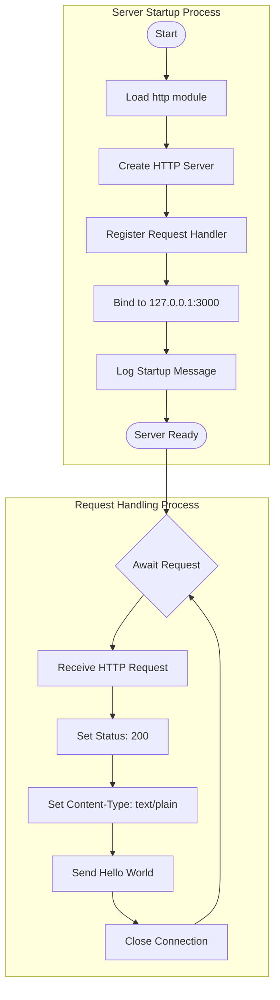

---

## 2.9 References

### 2.9.1 Source Files Examined

| File | Relevance to Requirements |
|------|---------------------------|
| `server.js` | Core implementation of all features F-001 through F-004 |
| `package.json` | npm metadata, version 1.0.0, entry point configuration |
| `package-lock.json` | Confirms zero external dependencies |
| `README.md` | Project purpose and "Do not touch!" directive |

### 2.9.2 Technical Specification Sections Referenced

| Section | Content Used |
|---------|--------------|
| 1.1 Executive Summary | Project overview, stakeholders, value proposition |
| 1.2 System Overview | System capabilities, success criteria, KPIs |
| 1.3 Scope | In-scope/out-of-scope elements, limitations |
| 1.4 References | File relevance mapping |

### 2.9.3 Related Documentation

| Document | Relationship |
|----------|--------------|
| Section 1: Introduction | Provides context for product requirements |
| Section 3: Architecture | Implements requirements defined here |
| Section 4: API Specifications | Details HTTP interface requirements |

# 3. Technology Stack

## 3.1 Overview

The `hao-backprop-test` repository employs a deliberately minimal technology stack designed for maximum simplicity and test isolation. As a dedicated test fixture for Backprop integration testing, the project uses **only Node.js built-in modules** with **zero external dependencies**. This architectural decision eliminates third-party complexity and ensures that any integration issues are traceable to the tooling under test rather than dependency conflicts.

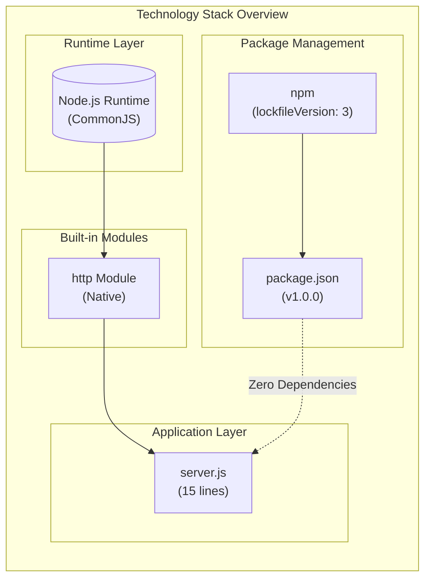

### 3.1.1 Technology Selection Philosophy

The technology choices in this project prioritize:

| Principle | Implementation | Rationale |
|-----------|----------------|-----------|
| **Isolation** | Zero external dependencies | Test failures indicate integration issues, not dependency conflicts |
| **Simplicity** | Single built-in module | Minimal attack surface and complexity |
| **Predictability** | Hardcoded configuration | Deterministic behavior for consistent test assertions |
| **Portability** | Node.js built-in APIs only | No platform-specific dependencies |

### 3.1.2 Stack Comparison with Enterprise Standards

This project intentionally diverges from enterprise technology stacks. The following table clarifies what this minimal test project does **not** include:

| Stack Category | Enterprise Default | This Project | Rationale |
|----------------|-------------------|--------------|-----------|
| Cloud Platform | AWS | None | Local-only execution |
| Containerization | Docker | None | Direct Node.js execution |
| Infrastructure as Code | Terraform | None | No infrastructure requirements |
| CI/CD | GitHub Actions | None | Manual testing only |
| Web Framework | Express/Fastify | None | Built-in `http` module sufficient |
| Authentication | Auth0 | None | Security out of scope |
| Database | MongoDB | None | No data persistence |
| AI Framework | Langchain | None | Not applicable |
| Frontend | React/TypeScript | None | Backend-only server |
| CSS Framework | TailwindCSS | None | No UI layer |

---

## 3.2 Programming Languages

### 3.2.1 Primary Language: JavaScript (Node.js)

JavaScript serves as the sole functional programming language in this project, executed through the Node.js runtime environment.

#### Language Specifications

| Attribute | Value | Evidence |
|-----------|-------|----------|
| Language | JavaScript (ECMAScript) | `server.js` implementation |
| Runtime Environment | Node.js | `package.json` npm configuration |
| Module System | CommonJS | `require('http')` syntax in `server.js` |
| Version Requirement | Any Node.js with CommonJS support | No `.nvmrc` or `engines` field specified |
| Execution Entry Point | `server.js` | Manual execution required |

#### Selection Criteria and Justification

| Criterion | Assessment |
|-----------|------------|
| **Simplicity** | Node.js provides built-in HTTP server capabilities without requiring external frameworks |
| **Ubiquity** | Node.js is widely installed on developer machines, ensuring easy test execution |
| **Zero Configuration** | CommonJS modules work natively without transpilation or build steps |
| **Backprop Compatibility** | JavaScript/Node.js is a common analysis target for code intelligence tools |

#### Module System Details

The project uses CommonJS (CJS) module syntax rather than ES Modules (ESM):

| Module Feature | CJS (Used) | ESM (Not Used) |
|----------------|------------|----------------|
| Import Syntax | `const http = require('http')` | `import http from 'http'` |
| File Extension | `.js` | `.mjs` or `"type": "module"` |
| Compatibility | Older Node.js versions | Node.js 12+ native support |

#### Constraints and Dependencies

| Constraint | Description | Impact |
|------------|-------------|--------|
| Runtime Dependency | Requires Node.js with CommonJS support | ASM-001: Server will not start without Node.js |
| Single-Threaded | Subject to Node.js event loop limitations | Acceptable for test server purposes |
| Module System Lock | Uses `require()` syntax exclusively | Not compatible with pure ESM environments |

### 3.2.2 Non-Functional Language Stubs

The repository contains file artifacts in other programming languages that are **explicitly non-functional**. These exist solely to test Backprop's multi-language analysis capabilities.

#### Java Stub

| Attribute | Value |
|-----------|-------|
| File | `LoginTest.java` |
| Status | Non-compilable stub |
| Package Declaration | `package com.example.app;` |
| Purpose | Multi-language analysis testing |
| Functional Code | None (invalid Java structure) |

#### Python Placeholders

| File | Status | Contents |
|------|--------|----------|
| `test.py.txt` | Empty placeholder | No Python code |
| `test.py - Copy.txt` | Empty placeholder | No Python code |
| `test.txt.txt` | Empty placeholder | No functional content |

These files provide targets for testing language detection and analysis features in Backprop without introducing functional complexity.

---

## 3.3 Frameworks and Libraries

### 3.3.1 Core Framework: Node.js Built-in HTTP Module

The project relies exclusively on Node.js's native `http` module, avoiding all external frameworks.

#### Module Specifications

| Attribute | Value |
|-----------|-------|
| Module Name | `http` |
| Type | Node.js built-in module |
| Import Statement | `const http = require('http');` |
| Primary API | `http.createServer()` |
| External Frameworks Used | **None** |

#### API Usage Pattern

The application utilizes a single method from the `http` module:

| API Method | Purpose | Implementation |
|------------|---------|----------------|
| `http.createServer(callback)` | Creates HTTP server with request handler | Returns `http.Server` instance |
| `server.listen(port, hostname, callback)` | Binds server to network interface | Binds to `127.0.0.1:3000` |

#### Framework Alternatives Considered (Not Used)

| Framework | Typical Use Case | Why Not Used |
|-----------|------------------|--------------|
| Express.js | Web applications, REST APIs | Adds external dependency; unnecessary for simple test server |
| Fastify | High-performance APIs | Adds external dependency; performance not a requirement |
| Koa | Middleware-based servers | Adds external dependency; no middleware needed |
| Hapi | Enterprise applications | Adds external dependency; excessive for test fixture |
| http-server (npm) | Static file serving | Adds external dependency; not serving static files |

### 3.3.2 Supporting Libraries

**Status: None**

The project contains **zero supporting libraries**. All functionality is achieved through:

1. Node.js built-in `http` module
2. Native JavaScript APIs (`console.log`)
3. Built-in response methods (`res.statusCode`, `res.setHeader`, `res.end`)

#### Justification for Zero Library Approach

| Justification | Benefit |
|---------------|---------|
| **Dependency Isolation** | Eliminates third-party complexity from test environment |
| **Version Stability** | No dependency updates can break functionality |
| **Security Surface** | Zero attack vectors from external packages |
| **Reproducibility** | Behavior is consistent across all environments with Node.js |
| **Analysis Simplicity** | Backprop can analyze without resolving dependency trees |

### 3.3.3 Compatibility Requirements

| Requirement | Specification | Status |
|-------------|---------------|--------|
| Node.js Runtime | CommonJS module support required | Required |
| npm Version | npm 7+ (lockfileVersion 3) | Recommended |
| Operating System | Any platform supporting Node.js | Cross-platform |
| Network Stack | IPv4 loopback interface | Required |

---

## 3.4 Open Source Dependencies

### 3.4.1 Third-Party Dependencies

**Status: Zero External Dependencies**

The project explicitly maintains a zero-dependency design. This is a deliberate architectural decision, not an oversight.

#### Evidence from Package Configuration

**`package.json` (complete)**:
- Contains no `dependencies` field
- Contains no `devDependencies` field
- Contains no `peerDependencies` field
- Contains no `optionalDependencies` field

**`package-lock.json` (complete)**:
- `lockfileVersion: 3` (npm 7+ compatible)
- `packages` object contains only the root package entry
- No external packages are locked

#### Dependency Count Verification

| Dependency Type | Count | Notes |
|-----------------|-------|-------|
| Production Dependencies | 0 | None declared |
| Development Dependencies | 0 | None declared |
| Peer Dependencies | 0 | None declared |
| Optional Dependencies | 0 | None declared |
| Transitive Dependencies | 0 | No dependency tree |
| **Total Dependencies** | **0** | Intentional design |

### 3.4.2 Package Registry Configuration

| Attribute | Value |
|-----------|-------|
| Registry | npm (default: registry.npmjs.org) |
| Package Name | `hello_world` |
| Package Version | `1.0.0` |
| License | MIT |
| Author | hxu |

### 3.4.3 Lock File Analysis

The `package-lock.json` file confirms the zero-dependency state:

| Lock File Attribute | Value | Significance |
|---------------------|-------|--------------|
| `lockfileVersion` | 3 | Generated by npm v7 or later |
| `requires` | true | Enables strict dependency tracking |
| `packages[""]` | Root package only | No external packages locked |

### 3.4.4 Dependency Management Strategy

| Strategy | Implementation |
|----------|----------------|
| No dependency updates | Nothing to update |
| No security audits required | No third-party code to audit |
| No license compliance concerns | Only MIT-licensed root package |
| No breaking changes from dependencies | Self-contained implementation |

---

## 3.5 Third-Party Services

### 3.5.1 External APIs and Integrations

**Status: None**

The application makes no outbound API calls and consumes no external services.

| Integration Category | Status | Rationale |
|---------------------|--------|-----------|
| REST APIs | None | No external data sources required |
| GraphQL Services | None | No query interfaces needed |
| WebSocket Services | None | No real-time communication |
| Webhook Receivers | None | No event-driven integrations |

### 3.5.2 Authentication Services

**Status: None**

Authentication is explicitly out of scope for this test fixture.

| Authentication Option | Status | Rationale |
|----------------------|--------|-----------|
| Auth0 | Not Used | Security not required for local test fixture |
| OAuth Providers | Not Used | No user authentication needed |
| JWT Services | Not Used | No token-based authentication |
| API Keys | Not Used | No external service consumption |

### 3.5.3 Monitoring and Observability

**Status: None**

The application includes no monitoring, logging frameworks, or observability tooling.

| Monitoring Category | Status | Alternative |
|--------------------|--------|-------------|
| Application Performance Monitoring | None | Not required for test fixture |
| Log Aggregation | None | Single `console.log` at startup |
| Distributed Tracing | None | Single-node execution only |
| Error Tracking | None | Node.js defaults sufficient |
| Health Checks | None | Manual verification acceptable |

### 3.5.4 Cloud Services

**Status: None**

The application is designed for local execution only and uses no cloud services.

| Cloud Service Category | Status | Rationale |
|-----------------------|--------|-----------|
| Compute (EC2, Lambda) | None | Local Node.js execution |
| Storage (S3) | None | No file storage requirements |
| Database (RDS, DynamoDB) | None | No data persistence |
| Networking (VPC, Load Balancers) | None | Localhost binding only |
| Container Services (ECS, EKS) | None | No containerization |
| CDN (CloudFront) | None | No static asset delivery |

### 3.5.5 Integration Point Summary

As documented in the System Overview, the following table summarizes all integration points:

| Integration Point | Status | Description |
|-------------------|--------|-------------|
| Backprop | Primary | Target repository for integration testing |
| External APIs | None | No outbound API calls |
| Databases | None | No data persistence layer |
| CI/CD Pipelines | None | No automated deployment configured |

---

## 3.6 Databases and Storage

### 3.6.1 Primary and Secondary Databases

**Status: None**

The application implements no database connectivity or data persistence layer.

| Database Category | Status | Rationale |
|-------------------|--------|-----------|
| Relational Databases (PostgreSQL, MySQL) | None | No structured data requirements |
| Document Databases (MongoDB) | None | No document storage needed |
| Key-Value Stores (Redis) | None | No caching requirements |
| Graph Databases (Neo4j) | None | No relationship modeling |
| Time-Series Databases (InfluxDB) | None | No metrics collection |

### 3.6.2 Data Persistence Strategies

**Status: Not Implemented**

The application is stateless by design:

| Persistence Aspect | Implementation |
|--------------------|----------------|
| Request Data | Not stored (received but ignored) |
| Response Data | Hardcoded ("Hello, World!\n") |
| Session State | None |
| Application State | None beyond server runtime |
| Configuration | Hardcoded in source |

### 3.6.3 Caching Solutions

**Status: None**

| Caching Layer | Status | Rationale |
|---------------|--------|-----------|
| In-Memory Cache | None | No computed data to cache |
| Distributed Cache | None | Single-node execution |
| CDN Cache | None | No static assets |
| HTTP Cache Headers | None | Not implemented |

### 3.6.4 Storage Services

**Status: None**

| Storage Category | Status |
|------------------|--------|
| File Storage | None |
| Object Storage | None |
| Block Storage | None |
| Archive Storage | None |

### 3.6.5 Static Data Assets

The repository contains one data file that is **not processed by the application**:

| File | Contents | Status |
|------|----------|--------|
| `industry.csv` | 44 industry category entries | Reference data; not loaded or processed |

This file exists as a test artifact for Backprop's file type analysis capabilities.

---

## 3.7 Development and Deployment

### 3.7.1 Development Tools

#### Package Manager

| Tool | Version | Configuration |
|------|---------|---------------|
| npm | v7+ (inferred from lockfileVersion 3) | Default configuration |

#### Development Environment Requirements

| Requirement | Specification |
|-------------|---------------|
| Node.js | Any version with CommonJS support |
| Text Editor | Any (no IDE-specific configuration) |
| Terminal | Required for `node server.js` execution |

#### Version Control

| Attribute | Value |
|-----------|-------|
| System | Git |
| Platform | GitHub (implied by Backprop context) |
| Branch Strategy | Not specified |

### 3.7.2 Build System

**Status: None Required**

The application requires no build, transpilation, or bundling process.

| Build Aspect | Status | Rationale |
|--------------|--------|-----------|
| Transpilation (Babel) | Not Used | Native JavaScript only |
| Bundling (webpack, rollup) | Not Used | Single-file application |
| Minification | Not Used | Development/test code only |
| TypeScript Compilation | Not Used | Plain JavaScript |
| Asset Processing | Not Used | No static assets |

#### Execution Method

The server is executed directly without a build step:

```
node server.js
```

### 3.7.3 NPM Scripts Configuration

The `package.json` defines minimal scripts:

| Script | Command | Status |
|--------|---------|--------|
| `npm test` | `echo "Error: no test specified" && exit 1` | Placeholder (exits with error) |
| `npm start` | Not configured | LIM-001: Would fail due to entry point mismatch |

#### Known Limitations

| Limitation ID | Description | Workaround |
|---------------|-------------|------------|
| LIM-001 | `package.json` declares `main: index.js` but server is `server.js` | Execute `node server.js` directly |
| LIM-002 | Test script placeholder exits with error | Manual testing required |

### 3.7.4 Containerization

**Status: None**

The project includes no containerization configuration.

| Container Technology | Status | Rationale |
|---------------------|--------|-----------|
| Docker | Not Used | Direct Node.js execution sufficient |
| Docker Compose | Not Used | No multi-container orchestration |
| Kubernetes | Not Used | No container orchestration needed |
| Container Registry | Not Used | No images to store |

#### Missing Container Files

| File | Purpose | Status |
|------|---------|--------|
| `Dockerfile` | Container image definition | Not present |
| `docker-compose.yml` | Multi-container configuration | Not present |
| `.dockerignore` | Build context exclusions | Not present |

### 3.7.5 CI/CD Pipeline

**Status: None**

The project includes no automated build, test, or deployment pipelines.

| CI/CD Component | Status | Rationale |
|-----------------|--------|-----------|
| GitHub Actions | Not Configured | Manual testing acceptable |
| Jenkins | Not Configured | Not required for test fixture |
| CircleCI | Not Configured | Not required for test fixture |
| Automated Testing | Not Implemented | LIM-002: Test script is placeholder |
| Automated Deployment | Not Applicable | No deployment target |

#### Missing CI/CD Configuration Files

| File/Directory | Purpose | Status |
|----------------|---------|--------|
| `.github/workflows/` | GitHub Actions workflows | Not present |
| `Jenkinsfile` | Jenkins pipeline definition | Not present |
| `.circleci/` | CircleCI configuration | Not present |
| `.travis.yml` | Travis CI configuration | Not present |

---

## 3.8 Network and Protocol Configuration

### 3.8.1 Network Binding

| Configuration | Value | Source |
|---------------|-------|--------|
| Hostname | `127.0.0.1` | `server.js` line 3 |
| Port | `3000` | `server.js` line 4 |
| Protocol | HTTP/1.1 | Node.js `http` module default |
| IP Version | IPv4 only | LIM-003: No IPv6 support |

### 3.8.2 Security Implications

| Security Aspect | Assessment |
|-----------------|------------|
| Network Exposure | Minimal (localhost only) |
| Port Security | Standard unprivileged port (no root required) |
| Firewall Requirements | None (internal loopback) |
| TLS/HTTPS | Not implemented (explicitly out of scope) |
| Input Validation | None (acceptable for test fixture) |

### 3.8.3 Connection Handling

| Attribute | Value |
|-----------|-------|
| Connection Model | HTTP/1.1 keep-alive (Node.js default) |
| Concurrent Connections | Node.js default limits |
| Request Timeout | Node.js default (2 minutes) |
| Socket Timeout | Node.js default |

---

## 3.9 Technology Stack Summary

### 3.9.1 Complete Technology Inventory

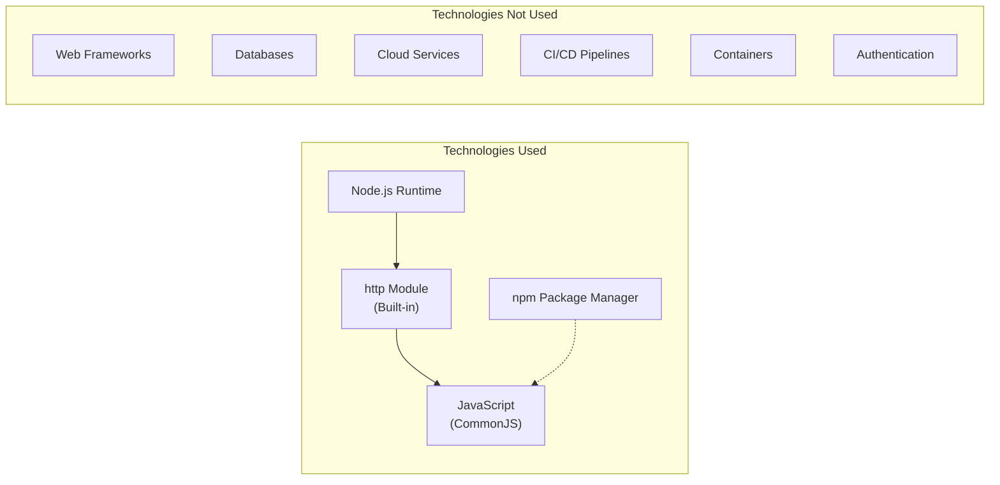

### 3.9.2 Dependency Matrix

| Layer | Technology | Version | Dependencies |
|-------|------------|---------|--------------|
| Runtime | Node.js | Any (CommonJS) | Operating System |
| Module | `http` | Built-in | Node.js Core |
| Package Manager | npm | v7+ | Node.js |
| Language | JavaScript | ES5+ | Node.js Runtime |
| **External Dependencies** | **None** | **N/A** | **N/A** |

### 3.9.3 Technology Decision Rationale Summary

| Decision | Choice | Primary Rationale |
|----------|--------|-------------------|
| Runtime | Node.js | Universal availability, built-in HTTP support |
| Module System | CommonJS | Maximum Node.js version compatibility |
| HTTP Framework | None (built-in `http`) | Zero-dependency test isolation |
| Database | None | No data persistence requirements |
| Authentication | None | Security out of scope for test fixture |
| Containerization | None | Direct execution sufficient |
| CI/CD | None | Manual testing acceptable |

---

## 3.10 References

### 3.10.1 Source Files Examined

| File Path | Relevance |
|-----------|-----------|
| `server.js` | Core application; HTTP module usage, network binding configuration |
| `package.json` | npm metadata, dependency declarations (none), scripts configuration |
| `package-lock.json` | Lock file version, dependency verification (confirms zero dependencies) |
| `README.md` | Project purpose, usage warning ("Do not touch!") |
| `LoginTest.java` | Non-functional Java stub for multi-language analysis testing |
| `industry.csv` | Static data asset (not processed by application) |

### 3.10.2 Technical Specification Sections Referenced

| Section | Information Retrieved |
|---------|----------------------|
| 1.1 Executive Summary | Project context, value proposition, stakeholder information |
| 1.2 System Overview | Integration points, technical approach, success criteria |
| 1.3 Scope | In-scope and out-of-scope elements, system boundaries |
| 2.5 Implementation Considerations | Technical constraints, performance requirements, security implications |
| 2.6 Out-of-Scope Features | Excluded features matrix, placeholder items |
| 2.7 Known Limitations and Assumptions | Limitation IDs, assumptions, risk factors |

### 3.10.3 Configuration Files Verified

| File | Status | Significance |
|------|--------|--------------|
| `package.json` | Present | Confirms zero dependencies |
| `package-lock.json` | Present | Confirms lockfileVersion 3, zero locked packages |
| `Dockerfile` | Absent | Confirms no containerization |
| `.github/workflows/` | Absent | Confirms no CI/CD pipelines |
| `.nvmrc` | Absent | No Node.js version pinning |
| `tsconfig.json` | Absent | No TypeScript configuration |

# 4. Process Flowchart

This section provides comprehensive workflow documentation for the `hao-backprop-test` Hello World server. Given the intentionally minimal nature of this test project designed for Backprop integration validation, the process flows are straightforward yet documented with the same rigor applied to production systems.

## 4.1 System Workflow Overview

### 4.1.1 High-Level System Interaction

The system implements a simple client-server architecture with a single, deterministic request-response flow. All HTTP requests receive identical responses regardless of method, path, headers, or body content.

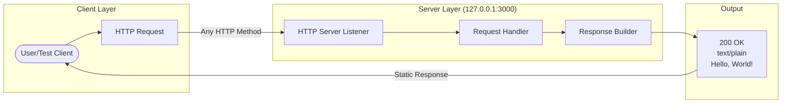

#### Workflow Characteristics

| Characteristic | Description | Technical Reference |
|----------------|-------------|---------------------|
| Request Processing | Synchronous, single-threaded | F-001: Event loop model |
| Response Generation | Static, deterministic | F-002: Fixed response content |
| Network Scope | Localhost only | F-003: 127.0.0.1 binding |
| Observability | Console startup logging | F-004: stdout output |

### 4.1.2 End-to-End User Journey

The complete user journey encompasses server startup, request submission, and response delivery. This journey is designed to be instantaneous and repeatable.

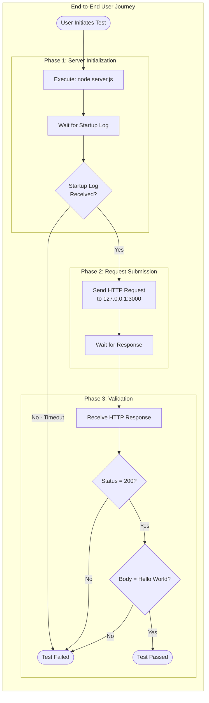

#### Timing Expectations

| Phase | Expected Duration | Source |
|-------|-------------------|--------|
| Server Initialization | < 1 second | Implementation Considerations (F-001) |
| Port Binding | < 100 ms | Implementation Considerations (F-003) |
| Request Processing | < 10 ms | Implementation Considerations (F-002) |
| Total Round Trip | < 1.2 seconds | Derived from component timings |

## 4.2 Core Business Processes

### 4.2.1 Server Startup Process

The server startup process follows a linear, synchronous initialization sequence. All steps must complete successfully for the server to reach the ready state.

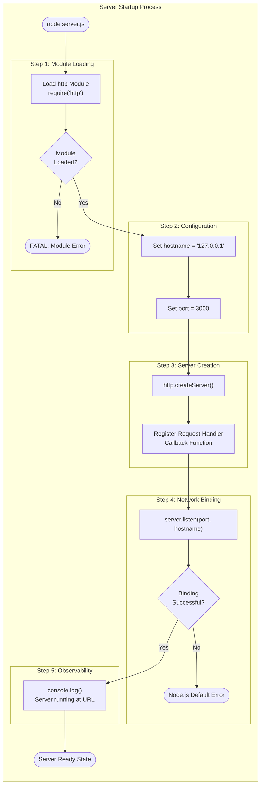

#### Process Step Details

| Step | Feature | Code Location | Output |
|------|---------|---------------|--------|
| Load http Module | F-001 | `server.js` line 1 | http module reference |
| Set Configuration | F-003 | `server.js` lines 3-4 | hostname, port constants |
| Create Server | F-001, F-002 | `server.js` line 6 | server instance |
| Register Handler | F-002 | `server.js` lines 6-10 | Callback registered |
| Bind to Port | F-003 | `server.js` line 12 | Socket listening |
| Log Startup | F-004 | `server.js` line 13 | Console output |

### 4.2.2 Request Handling Process

The request handling process is the core business logic of the server. Every incoming request follows an identical path with no branching or conditional logic.

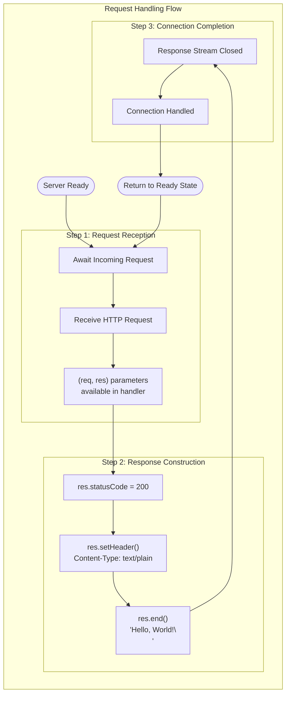

#### Validation Rules at Each Step

| Step | Validation Rule | Implementation |
|------|-----------------|----------------|
| Request Reception | Accept any valid HTTP request | Node.js http module handles validation |
| Status Code | Always set to 200 | Hardcoded value |
| Content-Type | Always text/plain | Hardcoded header |
| Response Body | Always "Hello, World!\n" | Exactly 14 bytes |
| Connection Close | Implicit with res.end() | Node.js handles TCP cleanup |

### 4.2.3 Decision Points Analysis

Given the intentional simplicity of this test server, decision points are minimal. This section documents the absence of conditional logic as a design decision.

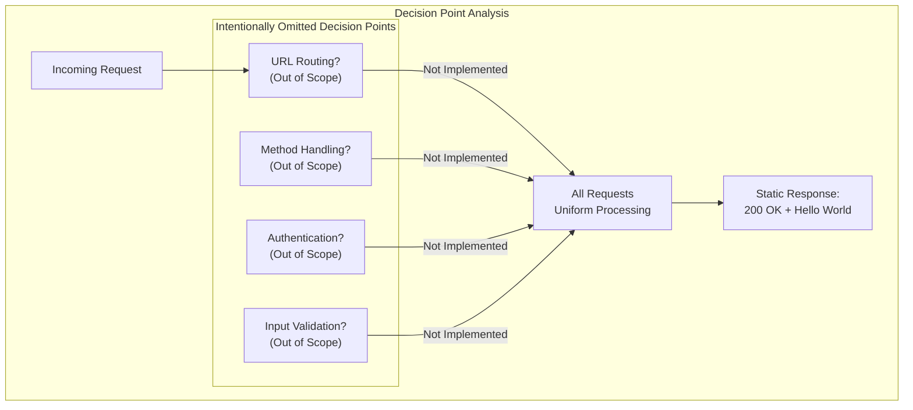

#### Out-of-Scope Decision Logic

| Decision Type | Status | Rationale (per Section 2.6) |
|---------------|--------|----------------------------|
| URL Routing | Out of Scope | Not needed for minimal test server |
| HTTP Method | Out of Scope | No input processing required |
| Authentication | Out of Scope | Security not required for local test fixture |
| Input Validation | Out of Scope | Basic Node.js defaults sufficient |

## 4.3 State Management

### 4.3.1 Application State Transitions

The server maintains minimal state with clear transitions between operational phases. The primary states relate to server lifecycle rather than request data.

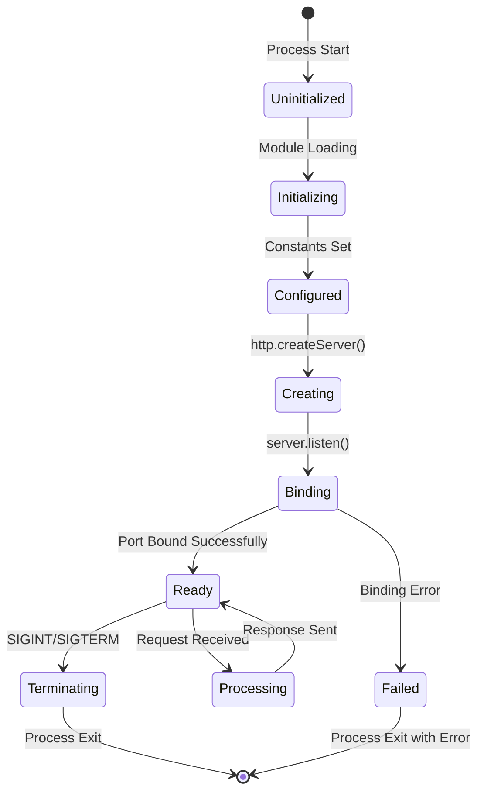

#### State Definitions

| State | Description | Duration | Exit Condition |
|-------|-------------|----------|----------------|
| Uninitialized | Before code execution | Instant | Script loaded |
| Initializing | Loading http module | < 50 ms | Module available |
| Configured | Constants defined | Instant | Proceed to creation |
| Creating | Server instance creation | < 100 ms | Server instance ready |
| Binding | Attaching to port | < 100 ms | Port bound or error |
| Ready | Listening for connections | Indefinite | Request or termination |
| Processing | Handling request | < 10 ms | Response sent |
| Terminating | Cleanup phase | < 100 ms | Process exit |
| Failed | Error state | N/A | Process exit |

### 4.3.2 Data Persistence Points

This system implements a completely stateless design with no data persistence requirements.

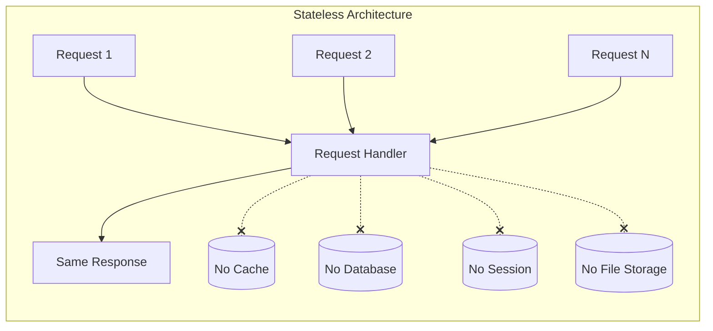

#### Persistence Analysis

| Category | Implementation | Requirement |
|----------|----------------|-------------|
| Request Data | Not persisted | By design |
| Session State | Not implemented | Out of scope |
| Caching | Not implemented | Not needed |
| Transaction Boundaries | N/A | No transactions |
| Database | Not integrated | Out of scope |

### 4.3.3 Transaction Boundaries

Given the absence of external data stores, transaction management is not applicable. Each request is an atomic, independent operation.

| Transaction Aspect | Status | Notes |
|-------------------|--------|-------|
| ACID Properties | N/A | No data persistence |
| Rollback Capability | N/A | No state to roll back |
| Commit Points | N/A | Response = completion |
| Isolation Levels | N/A | Requests are independent |

## 4.4 Error Handling Flows

### 4.4.1 Error Handling Philosophy

Per Section 2.6, explicit error handling is out of scope for this test project. The system relies on Node.js default behaviors for error conditions. This section documents potential error states and their default handling.

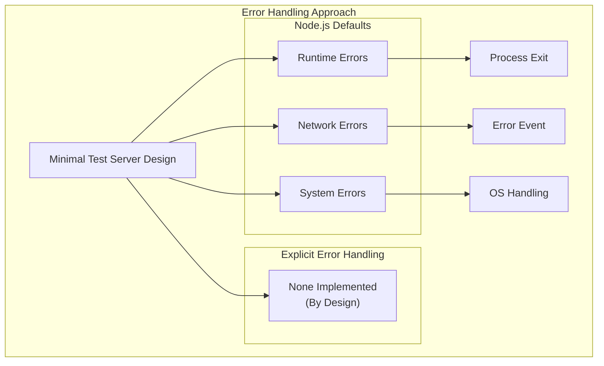

### 4.4.2 Startup Error Scenarios

The following errors may occur during server startup, all handled by Node.js defaults.

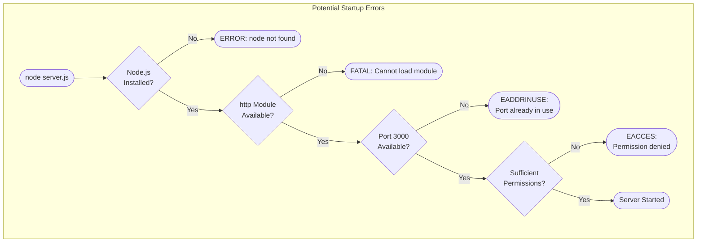

#### Startup Error Reference

| Error Code | Cause | Node.js Default Behavior | Recovery |
|------------|-------|-------------------------|----------|
| EADDRINUSE | Port 3000 in use | Process exits with error | Free port or change port |
| EACCES | Insufficient permissions | Process exits with error | Run with proper permissions |
| MODULE_NOT_FOUND | Missing http module | Process exits with error | Reinstall Node.js |
| ENOENT | server.js not found | Process exits with error | Run from correct directory |

### 4.4.3 Runtime Error Scenarios

Runtime errors during request handling rely on Node.js default behaviors.

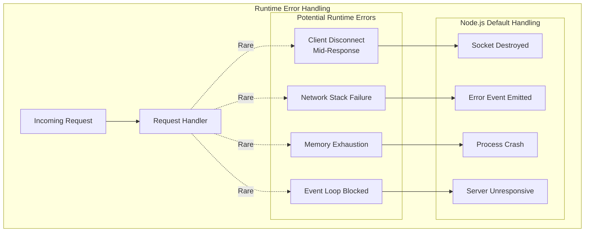

#### Error Probability Assessment

| Error Type | Probability | Impact | Mitigation |
|------------|-------------|--------|------------|
| Client Disconnect | Low | Minimal | Socket cleanup automatic |
| Network Failure | Very Low | Server restart needed | Manual process restart |
| Memory Exhaustion | Very Low | Process crash | Monitor memory usage |
| Event Loop Block | Very Low | Unresponsive server | Not applicable (sync code) |

### 4.4.4 Recovery Procedures

Given the test server nature, the primary recovery procedure is process restart.

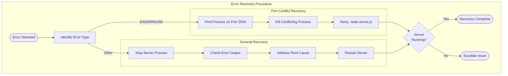

## 4.5 Integration Workflows

### 4.5.1 Integration Architecture

This server has no external integration points. All functionality is self-contained within `server.js` using only Node.js built-in capabilities.

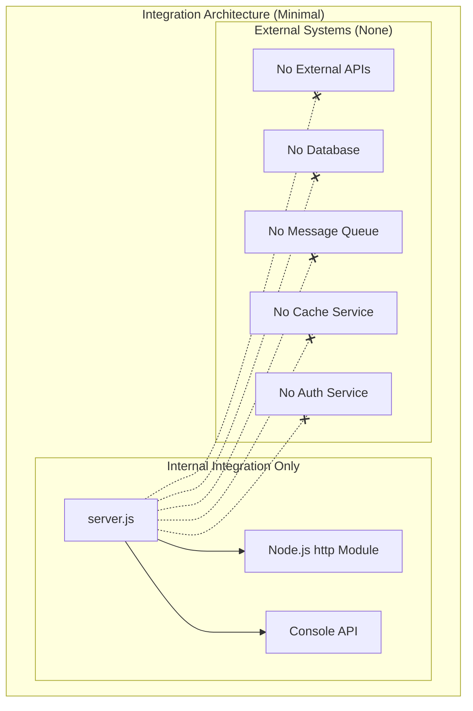

### 4.5.2 Internal API Interactions

The server uses Node.js built-in APIs with callback patterns for internal integration.

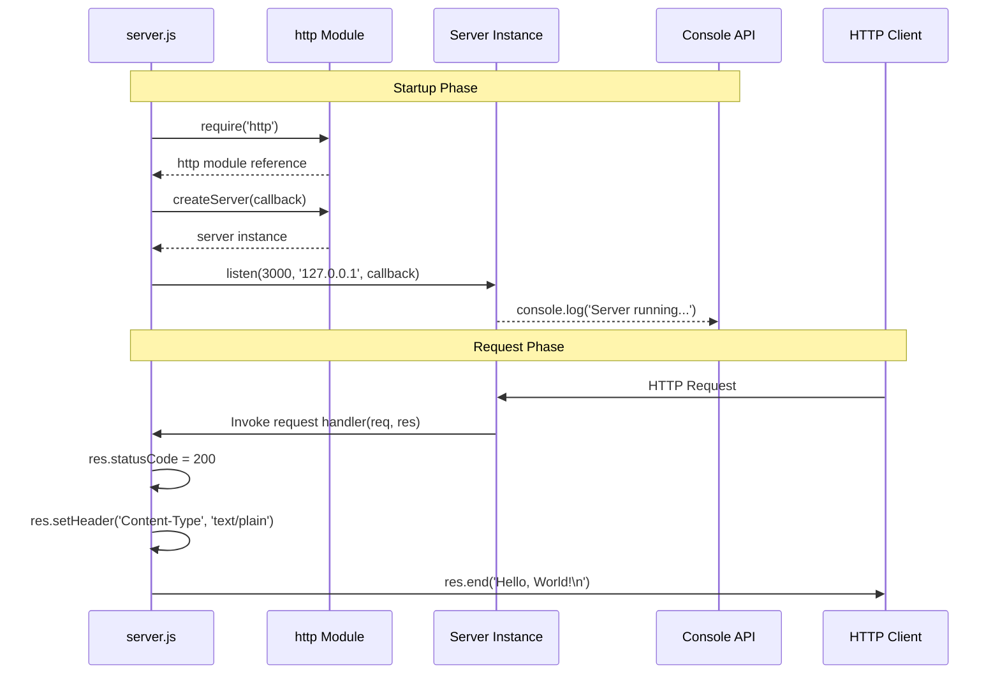

### 4.5.3 Event Processing Flow

The server uses Node.js event-driven architecture with the event loop handling connection events.

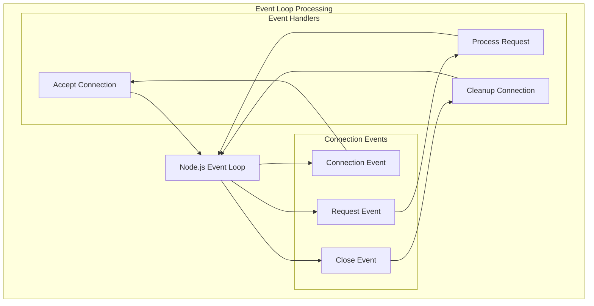

#### Event Processing Characteristics

| Event | Handler | Processing Time | Blocking |
|-------|---------|-----------------|----------|
| Connection | Node.js internal | < 1 ms | Non-blocking |
| Request | User-defined callback | < 10 ms | Synchronous (fast) |
| Close | Node.js internal | < 1 ms | Non-blocking |

## 4.6 Feature Dependency Workflow

### 4.6.1 Feature Execution Order

Features execute in a specific order during server operation, with clear dependencies between them.

```mermaid
flowchart TD
    subgraph FeatureFlow["Feature Execution Workflow"]
        subgraph Layer1["Layer 1: Foundation"]
            F001[F-001: HTTP Server Functionality]
        end
        
        subgraph Layer2["Layer 2: Capabilities"]
            F002[F-002: Static Response Delivery]
            F003[F-003: Localhost Network Binding]
        end
        
        subgraph Layer3["Layer 3: Observability"]
            F004[F-004: Console Startup Logging]
        end
        
        Start([Server Start])
        Ready([Server Ready])
        
        Start --> F001
        F001 -->|Creates Server| F002
        F001 -->|Provides listen()| F003
        F003 -->|Triggers on Bind| F004
        F002 --> Ready
        F004 --> Ready
    end
```

### 4.6.2 Feature Interaction Matrix

| Feature | Triggered By | Triggers | Shared Resources |
|---------|--------------|----------|------------------|
| F-001 | Script execution | F-002, F-003 | http module, server instance |
| F-002 | HTTP request | None | server instance, res object |
| F-003 | Server creation | F-004 | hostname, port, server instance |
| F-004 | Successful binding | None | hostname, port, console |

## 4.7 Timing and SLA Considerations

### 4.7.1 Performance Timeline

```mermaid
gantt
    title Server Operation Timeline
    dateFormat X
    axisFormat %L ms
    
    section Startup
    Module Loading      :0, 50
    Server Creation     :50, 100
    Port Binding        :100, 200
    Log Output          :200, 210
    
    section Ready State
    Awaiting Requests   :210, 1000
    
    section Request Processing
    Receive Request     :1000, 1001
    Set Status          :1001, 1002
    Set Header          :1002, 1003
    Send Response       :1003, 1010
```

### 4.7.2 SLA Targets

While formal SLAs are not defined for this test project, the following performance targets are derived from Implementation Considerations:

| Operation | Target | Measurement Point | Source |
|-----------|--------|-------------------|--------|
| Total Startup | < 1 second | Console log timestamp | F-001 Performance |
| Server Creation | < 100 ms | createServer() completion | F-001-RQ-001 |
| Port Binding | < 100 ms | listen() callback | F-003 Performance |
| Response Latency | < 10 ms | Request to response | F-002 Performance |
| Memory Usage | < 50 MB | Process monitoring | F-001 Performance |

### 4.7.3 Performance Monitoring Points

```mermaid
flowchart LR
    subgraph MonitoringPoints["Performance Monitoring Points"]
        T1[T1: Process Start]
        T2[T2: Server Created]
        T3[T3: Port Bound]
        T4[T4: Log Output]
        T5[T5: Request In]
        T6[T6: Response Out]
        
        T1 -->|"< 100ms"| T2
        T2 -->|"< 100ms"| T3
        T3 -->|"< 10ms"| T4
        T5 -->|"< 10ms"| T6
    end
```

| Interval | Metric | Target | Validation Method |
|----------|--------|--------|-------------------|
| T1 → T4 | Startup Time | < 1 second | Timestamp comparison |
| T5 → T6 | Response Time | < 10 ms | HTTP client timing |

## 4.8 Assumptions and Constraints

### 4.8.1 Workflow Assumptions

Based on Section 2.7.2, the following assumptions underpin all process flows:

| Assumption | ID | Impact on Workflow |
|------------|----|--------------------|
| Node.js runtime installed | ASM-001 | Required for all flows |
| Port 3000 available | ASM-002 | Required for startup |
| IPv4 networking functional | ASM-003 | Required for binding |
| Test use only | ASM-004 | No production requirements |

### 4.8.2 Known Workflow Limitations

Based on Section 2.7.1, the following limitations affect process flows:

| Limitation | ID | Workflow Impact |
|------------|----|--------------------|
| Entry point mismatch | LIM-001 | npm start may fail; use `node server.js` |
| No test automation | LIM-002 | Manual testing required |
| IPv4 only | LIM-003 | Cannot use IPv6 addresses |
| Hardcoded configuration | LIM-004 | No runtime port/host changes |

## 4.9 References

### 4.9.1 Source Files Examined

| File Path | Relevance to Process Flows |
|-----------|---------------------------|
| `server.js` | Complete implementation of all process flows (15 lines) |
| `package.json` | Project configuration and metadata |
| `README.md` | Project purpose and usage constraints |

### 4.9.2 Technical Specification Sections Referenced

| Section | Information Used |
|---------|------------------|
| 2.1 Feature Catalog | Feature definitions (F-001 through F-004) |
| 2.4 Feature Relationships | Dependency matrix and integration points |
| 2.5 Implementation Considerations | Timing constraints and performance targets |
| 2.6 Out-of-Scope Features | Excluded functionality (error handling, routing) |
| 2.7 Known Limitations | Workflow constraints (LIM-001 through LIM-004) |
| 2.8 Process Flowchart | Existing startup and request handling diagrams |
| 1.2 System Overview | High-level architecture and success criteria |
| 3.8 Network and Protocol | Connection handling and security configuration |

### 4.9.3 Integration Context

This server is designed as a test project for Backprop integration validation. All process flows should be interpreted in the context of providing a predictable, minimal HTTP test fixture rather than a production-ready application.

# 5. System Architecture

## 5.1 High-Level Architecture

### 5.1.1 System Overview

#### Architecture Style and Rationale

The Hello World test server implements a **Minimal Monolithic Single-Process Architecture**, representing the simplest viable pattern for an HTTP server application. This architectural choice is deliberate and purpose-driven, optimizing for the system's role as a test fixture within the Backprop development and testing ecosystem.

The architecture follows a pure client-server pattern with a single-threaded Node.js process handling all operations. Unlike typical production systems that employ layered architectures, microservices, or event-driven patterns, this system intentionally eschews such complexity in favor of predictable, analyzable behavior. The entire application logic resides in a single 15-line JavaScript file (`server.js`), making it an ideal candidate for code analysis tool validation.

**Key Architectural Principles:**

- **Intentional Simplicity**: The architecture prioritizes minimal complexity over extensibility, ensuring predictable behavior during automated analysis
- **Zero External Dependencies**: By relying exclusively on Node.js built-in modules, the system eliminates dependency management concerns and version conflicts
- **Stateless Design**: Every request receives an identical response regardless of context, ensuring complete test reproducibility
- **Local Isolation**: Localhost-only binding prevents unintended network exposure while maintaining full HTTP functionality
- **Single Responsibility**: The system performs exactly one function—serving a static "Hello, World!" response to any HTTP request

**System Boundaries and Major Interfaces:**

The system operates within strictly defined boundaries. The sole external interface is the HTTP listener on `127.0.0.1:3000`, which accepts any valid HTTP request and returns a uniform response. No outbound connections, database interactions, or external service integrations exist.

```mermaid
flowchart TB
    subgraph ExternalContext["External Environment"]
        Client["HTTP Client<br/>(Browser, cURL, Test Runner)"]
    end
    
    subgraph SystemBoundary["System Boundary"]
        subgraph NodeProcess["Node.js Process"]
            HTTPListener["HTTP Listener<br/>127.0.0.1:3000"]
            Handler["Request Handler<br/>(server.js)"]
        end
    end
    
    subgraph ExcludedSystems["Excluded Integration Points"]
        DB[("Databases<br/>(Not Implemented)")]
        ExtAPI["External APIs<br/>(Not Implemented)"]
        Auth["Auth Services<br/>(Not Implemented)"]
    end
    
    Client -->|"HTTP Request"| HTTPListener
    HTTPListener --> Handler
    Handler -->|"200 OK<br/>Hello, World!"| Client
    
    Handler -.-x|"Out of Scope"| DB
    Handler -.-x|"Out of Scope"| ExtAPI
    Handler -.-x|"Out of Scope"| Auth
```

### 5.1.2 Core Components Table

The system comprises minimal components, each serving a specific purpose within the test fixture design.

| Component Name | Primary Responsibility | Key Dependencies |
|----------------|------------------------|------------------|
| HTTP Server Instance | Accept and route incoming TCP connections | Node.js `http` module |
| Request Handler | Process requests and generate responses | Server instance reference |
| Configuration Constants | Define binding parameters | None (hardcoded values) |
| Startup Logger | Provide operational feedback | Node.js `console` object |

| Component Name | Integration Points | Critical Considerations |
|----------------|-------------------|------------------------|
| HTTP Server Instance | Network socket binding | Port 3000 must be available |
| Request Handler | Callback registration | Synchronous execution only |
| Configuration Constants | Used by listener | IPv4 only (127.0.0.1) |
| Startup Logger | stdout stream | Confirms successful startup |

### 5.1.3 Data Flow Description

#### Primary Data Flows Between Components

The system implements a unidirectional request-response flow with no intermediate data transformations or storage operations. Data flows linearly from client to server and back, with minimal processing at each stage.

**Inbound Request Flow:**
1. An HTTP client initiates a TCP connection to `127.0.0.1:3000`
2. The Node.js event loop detects the incoming connection
3. The `http` module parses the HTTP request and creates request/response objects
4. The registered callback function receives `(req, res)` parameters

**Response Generation Flow:**
1. The handler sets the HTTP status code to `200`
2. The `Content-Type` header is set to `text/plain`
3. The response body "Hello, World!\n" (14 bytes) is written
4. The `res.end()` call flushes the response and signals connection completion

**Critical Data Flow Characteristics:**
- **No Request Processing**: The request object (`req`) is received but never accessed—HTTP method, URL path, headers, and body are all ignored
- **No Data Transformation**: The response is a static string with no dynamic content generation
- **No Persistence Points**: Data passes through the system without storage or caching
- **Atomic Operations**: Each request-response cycle is independent and complete

```mermaid
sequenceDiagram
    participant C as HTTP Client
    participant N as Node.js Event Loop
    participant H as http Module
    participant R as Request Handler
    
    C->>N: TCP Connection Request
    N->>H: Connection Accepted
    C->>H: HTTP Request (Any Method/Path)
    H->>H: Parse HTTP Headers
    H->>R: Invoke Callback(req, res)
    
    Note over R: Request content ignored
    R->>R: res.statusCode = 200
    R->>R: res.setHeader('Content-Type', 'text/plain')
    R->>R: res.end('Hello, World!\n')
    
    R->>H: Response Complete
    H->>C: HTTP 200 OK + Body
    H->>N: Connection Closed
```

### 5.1.4 External Integration Points

Given the system's role as an isolated test fixture, external integrations are intentionally absent. This table documents the integration posture:

| System Name | Integration Type | Status |
|-------------|------------------|--------|
| Backprop | Analysis Target | Passive (read-only access to repository) |
| Node.js Runtime | Runtime Environment | Required dependency |
| Operating System | Network Stack | IPv4 loopback interface |

| System Name | Protocol/Format | Notes |
|-------------|-----------------|-------|
| Backprop | Repository access | No runtime integration |
| Node.js Runtime | CommonJS modules | `require('http')` syntax |
| Operating System | TCP/IP sockets | Bound to 127.0.0.1:3000 |

---

## 5.2 Component Details

### 5.2.1 HTTP Server Component

#### Purpose and Responsibilities

The HTTP Server component serves as the core runtime element of the application. Its responsibilities include:

- Creating and managing a TCP socket listener on the configured host and port
- Accepting incoming HTTP connections from localhost clients
- Parsing raw HTTP requests into structured objects
- Dispatching parsed requests to the registered handler callback
- Managing connection lifecycle and resource cleanup

#### Technologies and Frameworks Used

| Technology | Purpose | Version Requirement |
|------------|---------|---------------------|
| Node.js `http` Module | HTTP server functionality | Built-in (any Node.js version) |
| CommonJS Module System | Module loading via `require()` | Node.js standard |
| JavaScript (ES5+) | Implementation language | Runtime dependent |

The component relies exclusively on Node.js built-in capabilities, avoiding external frameworks such as Express, Fastify, or Koa. This decision ensures zero-dependency operation and maximum compatibility across Node.js versions.

#### Key Interfaces and APIs

**Server Creation Interface:**
```
http.createServer(callback) → Server
```
- Accepts a request handler callback function
- Returns a Server instance capable of listening on network interfaces

**Listener Interface:**
```
server.listen(port, hostname, callback) → void
```
- Binds the server to the specified network interface
- Executes the callback upon successful binding

**Request Handler Signature:**
```
function(req: IncomingMessage, res: ServerResponse) → void
```
- `req`: Contains request metadata (unused in this implementation)
- `res`: Provides response construction methods

#### Data Persistence Requirements

**None.** The HTTP Server component maintains no persistent state. Each request is handled independently with no reference to previous requests or stored data.

#### Scaling Considerations

This component is explicitly designed for single-instance, single-threaded operation:

| Scaling Aspect | Implementation | Rationale |
|----------------|----------------|-----------|
| Horizontal Scaling | Not supported | Test fixture design |
| Vertical Scaling | Not applicable | Minimal resource requirements |
| Clustering | Not implemented | Single-process architecture |
| Load Balancing | Not applicable | Localhost-only binding |

### 5.2.2 Request Handler Component

#### Purpose and Responsibilities

The Request Handler is implemented as an inline callback function within `server.js`. Its sole responsibility is generating a uniform HTTP response for every incoming request, regardless of request characteristics.

#### Implementation Details

The handler executes three sequential operations:
1. **Status Assignment**: Sets `res.statusCode` to `200` (HTTP OK)
2. **Header Configuration**: Applies `Content-Type: text/plain` via `res.setHeader()`
3. **Body Transmission**: Sends "Hello, World!\n" and closes the connection via `res.end()`

#### Response Characteristics

| Attribute | Value | Consistency |
|-----------|-------|-------------|
| HTTP Status Code | 200 | Always |
| Content-Type Header | text/plain | Always |
| Response Body | "Hello, World!\n" | Always (14 bytes) |
| Character Encoding | UTF-8 (implicit) | Always |

### 5.2.3 Component Interaction Diagram

The following diagram illustrates the complete component interaction model during a typical request-response cycle:

```mermaid
flowchart TD
    subgraph ClientLayer["Client Layer"]
        HTTPClient["HTTP Client"]
    end
    
    subgraph ApplicationLayer["Application Layer (server.js)"]
        subgraph ServerCreation["Initialization Phase"]
            LoadModule["require('http')"]
            DefineConfig["hostname = '127.0.0.1'<br/>port = 3000"]
            CreateServer["http.createServer()"]
        end
        
        subgraph RuntimePhase["Runtime Phase"]
            Listener["server.listen()"]
            Handler["Request Handler<br/>Callback Function"]
        end
        
        subgraph ResponseBuilder["Response Construction"]
            SetStatus["res.statusCode = 200"]
            SetHeader["res.setHeader()"]
            SendBody["res.end('Hello, World!')"]
        end
        
        StartupLog["console.log()<br/>Server Running Message"]
    end
    
    LoadModule --> DefineConfig
    DefineConfig --> CreateServer
    CreateServer --> Listener
    Listener --> StartupLog
    
    HTTPClient -->|"HTTP Request"| Listener
    Listener --> Handler
    Handler --> SetStatus
    SetStatus --> SetHeader
    SetHeader --> SendBody
    SendBody -->|"HTTP Response"| HTTPClient
```

### 5.2.4 Server Lifecycle State Diagram

The server progresses through well-defined states from initialization to request handling:

```mermaid
stateDiagram-v2
    [*] --> Uninitialized: node server.js
    
    Uninitialized --> Initializing: Load http module
    
    Initializing --> Configured: Define constants
    
    Configured --> Creating: Call createServer()
    
    Creating --> Binding: Call listen()
    
    Binding --> Ready: Port bound
    Binding --> Failed: EADDRINUSE/EACCES
    
    Ready --> Processing: Request received
    
    Processing --> Ready: Response sent
    
    Ready --> Terminating: SIGINT/SIGTERM
    
    Failed --> [*]: Exit with error
    Terminating --> [*]: Clean exit
```

#### State Duration Estimates

| State | Expected Duration | Exit Trigger |
|-------|-------------------|--------------|
| Uninitialized | < 10 ms | Script parsing complete |
| Initializing | < 50 ms | Module loaded |
| Configured | Instant | Constants assigned |
| Creating | < 100 ms | Server instance ready |
| Binding | < 100 ms | Socket bound or error |
| Ready | Indefinite | Request or termination signal |
| Processing | < 10 ms | Response sent |
| Terminating | < 100 ms | Resources released |

---

## 5.3 Technical Decisions

### 5.3.1 Architecture Style Decisions

The selection of a minimal monolithic architecture over alternatives represents a deliberate trade-off optimized for the system's test fixture purpose.

| Decision | Choice | Alternatives Considered |
|----------|--------|-------------------------|
| Architecture Pattern | Single-file monolith | Layered, MVC, microservices |
| Module System | CommonJS (`require`) | ES Modules (`import`) |
| HTTP Framework | None (built-in `http`) | Express, Fastify, Koa |
| Configuration | Hardcoded constants | Environment variables, config files |

| Decision | Rationale | Trade-off Accepted |
|----------|-----------|-------------------|
| Single-file monolith | Maximum analyzability for Backprop | No code organization |
| CommonJS | Broader Node.js compatibility | No tree-shaking benefits |
| Built-in `http` | Zero dependencies | No middleware ecosystem |
| Hardcoded constants | Simplicity over flexibility | Source modification required |

### 5.3.2 Communication Pattern Choices

| Pattern | Decision | Justification |
|---------|----------|---------------|
| Protocol | HTTP/1.1 | Simplest HTTP implementation |
| Request Model | Synchronous callback | Predictable execution flow |
| Response Model | Static content | No processing complexity |
| Connection Handling | Default Node.js | No custom timeout/keepalive |

### 5.3.3 Data Storage Solution Rationale

**Decision: No Data Storage Implementation**

| Storage Option | Consideration | Decision |
|----------------|---------------|----------|
| In-memory cache | Adds unnecessary state | Rejected |
| File system | Creates external dependencies | Rejected |
| Database | Violates zero-dependency goal | Rejected |
| Session storage | Not required for static response | Rejected |

The stateless design ensures that the system produces identical, reproducible results across all test executions—a critical requirement for integration testing scenarios.

### 5.3.4 Security Mechanism Selection

| Security Aspect | Decision | Rationale |
|-----------------|----------|-----------|
| Network Exposure | Localhost only (127.0.0.1) | Prevents external access |
| Port Selection | 3000 (unprivileged) | No root/admin required |
| Authentication | Not implemented | Out of scope for test fixture |
| TLS/HTTPS | Not implemented | Unnecessary for local loopback |
| Input Validation | Not implemented | No input processing occurs |

### 5.3.5 Architecture Decision Record Summary

```mermaid
flowchart TD
    subgraph ADRSummary["Architecture Decision Records"]
        ADR1["ADR-001: Zero Dependencies"]
        ADR2["ADR-002: Localhost Binding"]
        ADR3["ADR-003: Static Response"]
        ADR4["ADR-004: No Error Handling"]
        
        subgraph Drivers["Key Drivers"]
            D1["Test Reproducibility"]
            D2["Analysis Simplicity"]
            D3["Security Isolation"]
        end
        
        D1 --> ADR1
        D1 --> ADR3
        D2 --> ADR1
        D2 --> ADR4
        D3 --> ADR2
    end
```

| ADR ID | Decision | Status | Consequences |
|--------|----------|--------|--------------|
| ADR-001 | Use only Node.js built-in modules | Accepted | No npm install required |
| ADR-002 | Bind exclusively to 127.0.0.1 | Accepted | Cannot serve external requests |
| ADR-003 | Return static response always | Accepted | No dynamic behavior testing |
| ADR-004 | Rely on Node.js default error handling | Accepted | Limited error recovery |

---

## 5.4 Cross-Cutting Concerns

### 5.4.1 Monitoring and Observability Approach

Given the system's nature as a minimal test fixture, observability is intentionally limited to basic startup confirmation.

| Observability Aspect | Implementation | Capability |
|----------------------|----------------|------------|
| Health Check | HTTP response availability | Implicit (any 200 response) |
| Metrics Collection | Not implemented | N/A |
| Distributed Tracing | Not implemented | N/A |
| Application Logs | Single startup message | Minimal |

**Monitoring Strategy:**
The only built-in observability is the console startup message: `Server running at http://127.0.0.1:3000/`. Server health can be verified by sending any HTTP request and confirming a 200 response with "Hello, World!\n" body.

### 5.4.2 Logging and Tracing Strategy

| Logging Aspect | Implementation | Location |
|----------------|----------------|----------|
| Log Destination | stdout | Console |
| Log Format | Unstructured text | Human-readable |
| Log Events | Startup only | `server.js` line 13 |
| Request Logging | Not implemented | N/A |

**Log Message Format:**
```
Server running at http://127.0.0.1:3000/
```

No structured logging, log levels, or request tracing capabilities exist. This represents an intentional design choice per the out-of-scope features documented in Section 2.6.

### 5.4.3 Error Handling Patterns

The system implements no explicit error handling, relying entirely on Node.js default behaviors. This approach is documented as acceptable for the test fixture use case.

```mermaid
flowchart TD
    subgraph ErrorScenarios["Error Handling Flow"]
        StartupPhase["Startup Phase"]
        RuntimePhase["Runtime Phase"]
        
        subgraph StartupErrorsSection["Startup Errors"]
            PortInUse["Port 3000 In Use"]
            PermDenied["Permission Denied"]
            ModuleMissing["http Module Missing"]
        end
        
        subgraph RuntimeErrorsSection["Runtime Errors"]
            ClientDisconnect["Client Disconnect"]
            NetworkFailure["Network Failure"]
        end
        
        subgraph NodeDefaults["Node.js Default Handling"]
            ProcessExit["Process Exit with Error"]
            SocketCleanup["Automatic Socket Cleanup"]
            ErrorEvent["Error Event Emission"]
        end
        
        StartupPhase --> PortInUse
        StartupPhase --> PermDenied
        StartupPhase --> ModuleMissing
        
        RuntimePhase --> ClientDisconnect
        RuntimePhase --> NetworkFailure
        
        PortInUse --> ProcessExit
        PermDenied --> ProcessExit
        ModuleMissing --> ProcessExit
        
        ClientDisconnect --> SocketCleanup
        NetworkFailure --> ErrorEvent
    end
```

#### Startup Error Reference

| Error Code | Trigger Condition | Default Behavior |
|------------|-------------------|------------------|
| EADDRINUSE | Port 3000 occupied | Process exits |
| EACCES | Insufficient permissions | Process exits |
| MODULE_NOT_FOUND | Corrupted Node.js installation | Process exits |
| ENOENT | server.js not found | Process exits |

#### Recovery Strategy

| Error Type | Recovery Action | Automation |
|------------|-----------------|------------|
| Port conflict | Kill conflicting process or change port | Manual |
| Permission error | Adjust permissions or use different port | Manual |
| Module error | Reinstall Node.js | Manual |
| Runtime errors | Restart server process | Manual |

### 5.4.4 Authentication and Authorization Framework

**Decision: Not Implemented**

Authentication and authorization are explicitly out of scope for this test fixture. The localhost-only binding provides implicit security through network isolation rather than application-level access control.

| Security Layer | Status | Justification |
|----------------|--------|---------------|
| Authentication | Not implemented | Local test fixture only |
| Authorization | Not implemented | All requests treated equally |
| Session Management | Not implemented | Stateless design |
| API Keys/Tokens | Not implemented | No external access |

### 5.4.5 Performance Requirements and SLAs

The system has minimal performance requirements appropriate for its test fixture role:

| Metric | Target | Measurement |
|--------|--------|-------------|
| Startup Time | < 1 second | Process start to console log |
| Response Latency | < 10 ms | Request to response (localhost) |
| Memory Footprint | < 50 MB | Process RSS |
| Availability | N/A | No SLA (test environment) |

**Total Expected Round Trip:**

| Phase | Duration | Cumulative |
|-------|----------|------------|
| Module Loading | < 50 ms | 50 ms |
| Configuration | Instant | 50 ms |
| Server Creation | < 100 ms | 150 ms |
| Port Binding | < 100 ms | 250 ms |
| Startup Log | < 10 ms | 260 ms |
| Ready State | - | < 1 second |

### 5.4.6 Disaster Recovery Procedures

Given the stateless nature and test-only purpose of this system, disaster recovery is simplified to process restart.

| Failure Scenario | Impact | Recovery Procedure |
|------------------|--------|-------------------|
| Process crash | Server unavailable | Execute `node server.js` |
| Port conflict | Server won't start | Free port 3000, restart |
| File corruption | Server won't start | Restore from repository |
| Node.js unavailable | Server won't start | Reinstall Node.js runtime |

**Recovery Time Objective (RTO):** Not formally defined—manual restart typically completes within seconds.

**Recovery Point Objective (RPO):** Not applicable—no data is stored or persisted.

---

## 5.5 Architectural Assumptions and Constraints

### 5.5.1 Documented Assumptions

| ID | Assumption | Risk if Invalid |
|----|------------|-----------------|
| ASM-001 | Node.js runtime is installed | Server will not start |
| ASM-002 | Port 3000 is available | Binding will fail (EADDRINUSE) |
| ASM-003 | IPv4 loopback is functional | Connection will fail |
| ASM-004 | System used for testing only | Security exposure if deployed |

### 5.5.2 Known Architectural Limitations

| ID | Limitation | Impact | Workaround |
|----|------------|--------|------------|
| LIM-001 | Entry point mismatch | npm start may fail | Use `node server.js` directly |
| LIM-002 | No automated tests | Manual verification required | Execute manual HTTP tests |
| LIM-003 | IPv4 only | No IPv6 support | Use 127.0.0.1 address |
| LIM-004 | Hardcoded configuration | No runtime flexibility | Modify source code |

### 5.5.3 Architectural Constraints Summary

```mermaid
flowchart LR
    subgraph Constraints["Architectural Constraints"]
        direction TB
        C1["Single-Threaded<br/>Execution"]
        C2["Localhost-Only<br/>Binding"]
        C3["Zero External<br/>Dependencies"]
        C4["Stateless<br/>Operation"]
        C5["Static Response<br/>Only"]
    end
    
    subgraph EnabledBy["Enabled Capabilities"]
        E1["Predictable<br/>Behavior"]
        E2["Easy<br/>Analysis"]
        E3["Fast<br/>Startup"]
    end
    
    subgraph PreventedBy["Prevented Capabilities"]
        P1["Production<br/>Deployment"]
        P2["Dynamic<br/>Content"]
        P3["External<br/>Access"]
    end
    
    C1 --> E1
    C2 --> E2
    C3 --> E3
    
    C2 --> P3
    C4 --> P2
    C5 --> P1
```

---

## 5.6 References

### 5.6.1 Source Files Examined

| File Path | Relevance to Architecture |
|-----------|---------------------------|
| `server.js` | Complete application implementation (15 lines) |
| `package.json` | Project metadata and npm configuration |
| `package-lock.json` | Dependency verification (confirms zero dependencies) |
| `README.md` | Project purpose documentation ("Do not touch!") |

### 5.6.2 Technical Specification Sections Referenced

- Section 1.2 System Overview — High-level architecture context and success criteria
- Section 1.3 Scope — In-scope and out-of-scope boundaries
- Section 2.5 Implementation Considerations — Technical constraints and performance requirements
- Section 2.7 Known Limitations and Assumptions — LIM-001 through LIM-004, ASM-001 through ASM-004
- Section 3.9 Technology Stack Summary — Complete technology inventory
- Section 4.2 Core Business Processes — Startup and request handling workflows
- Section 4.3 State Management — Stateless architecture details
- Section 4.4 Error Handling Flows — Node.js default error handling patterns

# 6. SYSTEM COMPONENTS DESIGN

## 6.1 Core Services Architecture

#### SERVICE ARCHITECTURE

## 6.1 Core Services Architecture

### 6.1.1 Applicability Statement

**Core Services Architecture is not applicable for this system.**

The Hello World test server implements a **Minimal Monolithic Single-Process Architecture** that fundamentally differs from systems requiring core services documentation. This architectural style was deliberately chosen to serve the system's purpose as a test fixture for Backprop integration testing, where predictability, analyzability, and simplicity are paramount.

#### Architectural Classification

| Architecture Aspect | Classification | Evidence |
|---------------------|----------------|----------|
| Pattern Type | Single-file monolith | Entire application in `server.js` (15 lines) |
| Service Count | Zero distinct services | No service decomposition |
| Process Model | Single-threaded, single-process | Node.js default execution model |
| Distribution Model | None | Localhost-only binding |
| Dependency Model | Zero external dependencies | Only Node.js built-in `http` module |

```mermaid
flowchart TB
    subgraph ComparisonDiagram["Architecture Comparison"]
        subgraph TypicalMSA["Typical Microservices Architecture"]
            direction TB
            Gateway[API Gateway]
            SvcA[Service A]
            SvcB[Service B]
            SvcC[Service C]
            MsgBus[Message Bus]
            Registry[Service Registry]
            
            Gateway --> SvcA
            Gateway --> SvcB
            SvcA --> MsgBus
            SvcB --> MsgBus
            MsgBus --> SvcC
            SvcA -.-> Registry
            SvcB -.-> Registry
            SvcC -.-> Registry
        end
        
        subgraph ThisSystem["This System's Architecture"]
            direction TB
            SingleProcess["Single Node.js Process<br/>(server.js)"]
            LocalClient["Local HTTP Client"]
            
            LocalClient -->|"HTTP Request"| SingleProcess
            SingleProcess -->|"Static Response"| LocalClient
        end
    end
```

### 6.1.2 Justification for Non-Applicability

The following analysis explains why each aspect of Core Services Architecture does not apply to this system.

#### 6.1.2.1 Service Components: Not Applicable

Traditional service architecture concepts require distinct, independently deployable service units with defined boundaries and responsibilities. This system contains no such decomposition.

| Service Architecture Element | Status | Rationale |
|------------------------------|--------|-----------|
| Service Boundaries | Not Present | Single-file contains all logic |
| Service Responsibilities | Not Segmented | One atomic function only |
| Inter-service Communication | Not Applicable | No services to communicate |
| Service Discovery | Not Implemented | Nothing to discover |
| Load Balancing | Not Applicable | Localhost-only, single instance |
| Circuit Breaker Patterns | Not Implemented | No service dependencies |
| Retry/Fallback Mechanisms | Not Implemented | No external calls to retry |

**Evidence from Architecture Decision Records:**

| ADR ID | Decision | Consequence |
|--------|----------|-------------|
| ADR-001 | Use only Node.js built-in modules | No external service dependencies |
| ADR-002 | Bind exclusively to 127.0.0.1 | Cannot participate in distributed topology |
| ADR-003 | Return static response always | No service orchestration needed |
| ADR-004 | Rely on Node.js default error handling | No custom resilience patterns |

#### 6.1.2.2 Scalability Design: Not Applicable

The system is explicitly designed as a non-scalable test fixture. Production scaling patterns have been intentionally omitted.

| Scaling Aspect | Implementation Status | Design Rationale |
|----------------|----------------------|------------------|
| Horizontal Scaling | **Not Supported** | Test fixture design; single-instance operation |
| Vertical Scaling | **Not Applicable** | Minimal resource requirements (~50 MB RAM) |
| Clustering | **Not Implemented** | Single-process architecture by design |
| Load Balancing | **Not Applicable** | Localhost-only binding prevents distribution |
| Auto-scaling Triggers | **Not Defined** | No metrics collection infrastructure |
| Resource Allocation | **Not Managed** | Default Node.js memory allocation |

```mermaid
flowchart LR
    subgraph ScalabilityStatus["Scalability Implementation Status"]
        subgraph NotImplemented["Intentionally Excluded"]
            HS["Horizontal<br/>Scaling"]
            Cluster["Node.js<br/>Clustering"]
            LB["Load<br/>Balancing"]
            AutoScale["Auto-scaling<br/>Rules"]
        end
        
        subgraph Rationale["Design Rationale"]
            TestFixture["Test Fixture<br/>Purpose"]
            LocalOnly["Localhost-Only<br/>Binding"]
            SingleProc["Single-Process<br/>Architecture"]
        end
        
        TestFixture --> HS
        LocalOnly --> LB
        SingleProc --> Cluster
        TestFixture --> AutoScale
    end
```

#### 6.1.2.3 Resilience Patterns: Not Applicable

Given the system's role as a local test fixture with no external dependencies, traditional resilience patterns provide no value.

| Resilience Element | Status | Justification |
|--------------------|--------|---------------|
| Fault Tolerance | Default Node.js behavior only | No custom error handling implemented |
| Disaster Recovery | Manual process restart | Stateless operation—no data recovery needed |
| Data Redundancy | Not Applicable | No data persistence layer exists |
| Failover Configurations | Not Implemented | Single-instance design |
| Service Degradation | Not Applicable | Single capability with no graceful fallback |
| Health Checks | Implicit only | Any successful HTTP response indicates health |
| Circuit Breakers | Not Implemented | No downstream services to protect |

**Recovery Procedures (Simplified):**

| Failure Scenario | Impact | Recovery Action |
|------------------|--------|-----------------|
| Process crash | Server unavailable | Execute `node server.js` |
| Port conflict (EADDRINUSE) | Server fails to start | Free port 3000 and restart |
| File corruption | Server fails to start | Restore from repository |
| Node.js unavailable | Server fails to start | Reinstall Node.js runtime |

**Recovery Objectives:**
- **RTO (Recovery Time Objective):** Not formally defined—manual restart completes within seconds
- **RPO (Recovery Point Objective):** Not applicable—no data is stored or persisted

### 6.1.3 Actual System Architecture

While Core Services Architecture is not applicable, the following describes what the system actually implements.

#### 6.1.3.1 Single-Component Architecture

The entire system consists of one executable unit performing one function:

```mermaid
flowchart TB
    subgraph ActualArchitecture["Actual System Architecture"]
        subgraph ExternalContext["External Environment"]
            Client["HTTP Client<br/>(Browser, cURL, Test Runner)"]
        end
        
        subgraph SystemBoundary["System Boundary: Node.js Process"]
            subgraph ApplicationLayer["Application Layer"]
                HTTPModule["http Module<br/>(Node.js Built-in)"]
                ServerInstance["HTTP Server Instance"]
                Handler["Request Handler<br/>(Inline Callback)"]
            end
            
            subgraph ConfigLayer["Configuration"]
                Hostname["hostname = '127.0.0.1'"]
                Port["port = 3000"]
            end
        end
        
        Client -->|"Any HTTP Request"| ServerInstance
        ServerInstance --> HTTPModule
        HTTPModule --> Handler
        Handler -->|"200 OK<br/>Hello, World!"| Client
        
        ConfigLayer -.->|"Binding Parameters"| ServerInstance
    end
```

#### 6.1.3.2 Component Inventory

| Component | Location | Responsibility | Dependencies |
|-----------|----------|----------------|--------------|
| HTTP Server Instance | `server.js` lines 7-10 | Accept TCP connections, route requests | Node.js `http` module |
| Request Handler | `server.js` lines 7-10 (inline) | Generate static HTTP response | Server instance reference |
| Configuration Constants | `server.js` lines 3-4 | Define binding parameters | None (hardcoded) |
| Startup Logger | `server.js` lines 12-13 | Confirm operational status | Node.js `console` object |

#### 6.1.3.3 Request-Response Flow

The system implements a minimal, unidirectional data flow with no intermediate processing:

```mermaid
sequenceDiagram
    participant C as HTTP Client
    participant N as Node.js Event Loop
    participant H as http Module
    participant R as Request Handler

    C->>N: TCP Connection (127.0.0.1:3000)
    N->>H: Connection Accepted
    C->>H: HTTP Request (Method/Path Ignored)
    H->>H: Parse HTTP Headers
    H->>R: Invoke Callback(req, res)
    
    Note over R: Request content not examined
    R->>R: res.statusCode = 200
    R->>R: res.setHeader('Content-Type', 'text/plain')
    R->>R: res.end('Hello, World!\n')
    
    R->>H: Response Complete
    H->>C: HTTP 200 OK (14 bytes)
    H->>N: Connection Closed
```

**Response Characteristics:**

| Attribute | Value | Consistency |
|-----------|-------|-------------|
| HTTP Status Code | 200 | Always identical |
| Content-Type Header | text/plain | Always identical |
| Response Body | "Hello, World!\n" | Always identical (14 bytes) |
| Character Encoding | UTF-8 (implicit) | Always identical |

### 6.1.4 Architectural Constraints

The following constraints were deliberately imposed to achieve the test fixture objectives:

```mermaid
flowchart LR
    subgraph Constraints["Architectural Constraints"]
        direction TB
        C1["Single-Threaded<br/>Execution"]
        C2["Localhost-Only<br/>Binding"]
        C3["Zero External<br/>Dependencies"]
        C4["Stateless<br/>Operation"]
        C5["Static Response<br/>Only"]
    end
    
    subgraph EnabledCapabilities["Enabled Capabilities"]
        E1["Predictable<br/>Behavior"]
        E2["Easy Code<br/>Analysis"]
        E3["Fast Startup<br/>(< 1 second)"]
    end
    
    subgraph PreventedCapabilities["Prevented Capabilities"]
        P1["Production<br/>Deployment"]
        P2["Dynamic<br/>Content"]
        P3["External Network<br/>Access"]
    end
    
    C1 --> E1
    C3 --> E2
    C3 --> E3
    
    C2 --> P3
    C4 --> P2
    C5 --> P1
```

| Constraint ID | Constraint | Impact on Services Architecture |
|---------------|------------|--------------------------------|
| CON-001 | Single-Threaded Execution | Prevents concurrent request handling patterns |
| CON-002 | Localhost-Only Binding | Eliminates distributed deployment options |
| CON-003 | Zero External Dependencies | Removes need for service discovery |
| CON-004 | Stateless Operation | Eliminates data consistency concerns |
| CON-005 | Static Response Only | Removes need for service orchestration |

### 6.1.5 Comparison to Production Service Architectures

For clarity, this table contrasts what would typically be documented in a Core Services Architecture section versus what exists in this system:

| Documentation Element | Production System | This System |
|-----------------------|-------------------|-------------|
| **Service Catalog** | Multiple services with defined boundaries | Single 15-line file |
| **API Contracts** | OpenAPI/Swagger specifications | None (single hardcoded response) |
| **Message Queues** | RabbitMQ, Kafka, SQS | None |
| **Service Mesh** | Istio, Linkerd, Consul | None |
| **Container Orchestration** | Kubernetes, Docker Swarm | None |
| **Configuration Management** | Consul, etcd, config servers | Hardcoded constants |
| **Secrets Management** | Vault, AWS Secrets Manager | None (no secrets) |
| **Service Discovery** | DNS-based, client-side, server-side | None |
| **Load Balancing** | Round-robin, least connections, weighted | None |
| **Circuit Breakers** | Hystrix, Resilience4j, Polly | None |
| **Distributed Tracing** | Jaeger, Zipkin, AWS X-Ray | None |
| **Centralized Logging** | ELK Stack, Splunk, CloudWatch | Single console.log statement |
| **Health Endpoints** | /health, /ready, /live | None (implicit via any response) |

### 6.1.6 Summary

The Hello World test server's minimal architecture is a deliberate design choice optimized for its role as a Backprop integration test fixture. The system achieves its goals through intentional simplicity:

| Goal | How Achieved | Trade-off Accepted |
|------|--------------|-------------------|
| Test Reproducibility | Static response, stateless design | No dynamic behavior |
| Code Analyzability | Single-file, zero dependencies | No code organization |
| Security Isolation | Localhost-only binding | No external accessibility |
| Fast Startup | Minimal initialization | No extensibility |
| Easy Maintenance | 15 lines of code | No feature expansion |

**Conclusion:** Core Services Architecture documentation is not applicable because the system is intentionally designed as a non-distributed, single-process, zero-dependency test fixture. The architectural decisions documented in Sections 5.1-5.5 of this specification explicitly excluded service decomposition, distributed deployment, and production-grade resilience patterns in favor of maximum simplicity and predictability.

### 6.1.7 References

#### Files Examined

- `server.js` - Complete application implementation (15 lines); confirms single-file monolithic architecture
- `package.json` - Project manifest; confirms zero external dependencies
- `README.md` - Project documentation; confirms test fixture purpose

#### Technical Specification Sections Referenced

- Section 5.1 High-Level Architecture - "Minimal Monolithic Single-Process Architecture" designation
- Section 5.2 Component Details - Scaling considerations explicitly marked as "Not supported/Not applicable"
- Section 5.3 Technical Decisions - Architecture Decision Records (ADR-001 through ADR-004)
- Section 5.4 Cross-Cutting Concerns - Error handling, disaster recovery, and observability status
- Section 5.5 Architectural Assumptions and Constraints - Documented limitations and design constraints
- Section 1.2 System Overview - Project context as Backprop test fixture

## 6.2 Database Design

### 6.2.1 Applicability Statement

**Database Design is not applicable to this system.**

The Hello World test server implements a **stateless, zero-persistence architecture** that fundamentally excludes any database or data storage requirements. This architectural decision was deliberately made to serve the system's purpose as a test fixture for Backprop integration testing, where simplicity, predictability, and code analyzability are the primary objectives.

#### 6.2.1.1 Database Implementation Status

| Database Aspect | Status | Evidence |
|-----------------|--------|----------|
| Database Connections | **None** | `server.js` uses only Node.js built-in `http` module |
| Data Persistence Layer | **None** | No ORM, query builders, or database drivers |
| External Dependencies | **Zero** | `package.json` contains no `dependencies` |
| Database Configuration | **None** | No connection strings, credentials, or pool settings |
| Schema Definitions | **None** | No entity models, migrations, or DDL scripts |

#### 6.2.1.2 Technical Evidence Summary

The complete source code review confirms the absence of any database implementation:

```mermaid
flowchart TB
    subgraph EvidenceAnalysis["Technical Evidence Analysis"]
        subgraph SourceCode["Source Code Evidence"]
            ServerJS["server.js<br/>15 lines total"]
            OnlyImport["Only Import:<br/>const http = require('http')"]
        end
        
        subgraph Dependencies["Dependency Evidence"]
            PackageJSON["package.json<br/>No dependencies object"]
            LockFile["package-lock.json<br/>Empty dependency tree"]
        end
        
        subgraph Conclusion["Conclusion"]
            NoDB["No Database<br/>Implementation"]
        end
        
        ServerJS --> OnlyImport
        OnlyImport --> NoDB
        PackageJSON --> LockFile
        LockFile --> NoDB
    end
```

| File | Content Analysis | Database Indicators |
|------|------------------|---------------------|
| `server.js` | Complete application logic | No database imports, connections, or queries |
| `package.json` | Project manifest | No database driver packages |
| `package-lock.json` | Dependency lock | Empty `packages` object confirms zero dependencies |

### 6.2.2 Justification for Non-Applicability

The absence of database design is not an oversight but a deliberate architectural decision. This section documents the rationale and supporting evidence.

#### 6.2.2.1 Architectural Design Decisions

The system's architecture explicitly excludes databases to achieve specific test fixture objectives:

| Design Decision | Impact on Database Design |
|-----------------|---------------------------|
| Stateless Operation | No session, state, or context storage required |
| Static Response | No dynamic content retrieval from data stores |
| Zero Dependencies | No ORM libraries or database drivers permitted |
| Localhost-Only Binding | No external database connections possible |
| Test Fixture Purpose | Data persistence would complicate analysis testing |

#### 6.2.2.2 Data Flow Analysis

The system's data flow demonstrates why persistence is unnecessary:

```mermaid
flowchart LR
    subgraph DataFlowAnalysis["Request-Response Data Flow"]
        subgraph Inbound["Inbound Data"]
            Request["HTTP Request<br/>(Method, Path, Headers, Body)"]
        end
        
        subgraph Processing["Processing"]
            Ignored["Request Content<br/>IGNORED"]
            Static["Static Response<br/>Generated"]
        end
        
        subgraph Outbound["Outbound Data"]
            Response["HTTP Response<br/>Hello, World!"]
        end
        
        subgraph NotPresent["Not Present"]
            DB[(Database)]
            Cache[(Cache)]
            Storage[(Storage)]
        end
        
        Request --> Ignored
        Ignored -.->|"No Data Stored"| NotPresent
        Static --> Response
    end
```

**Data Handling Characteristics:**

| Data Type | Handling | Persistence |
|-----------|----------|-------------|
| Inbound HTTP Request | Received but ignored | None |
| HTTP Method | Not examined | None |
| URL Path | Not examined | None |
| Request Headers | Not examined | None |
| Request Body | Not examined | None |
| Response Data | Hardcoded static string | None (in-memory constant) |

#### 6.2.2.3 Constraint Analysis

The following constraints make database implementation incompatible with the system's purpose:

| Constraint ID | Constraint | Database Impact |
|---------------|------------|-----------------|
| CON-001 | Single-threaded execution | No connection pooling needed |
| CON-002 | Localhost-only binding | Cannot connect to external databases |
| CON-003 | Zero external dependencies | Cannot use database drivers |
| CON-004 | Stateless operation | No state persistence required |
| CON-005 | Static response only | No dynamic data retrieval needed |

### 6.2.3 Database Categories Analysis

This section documents the status of each database category as it relates to the system.

#### 6.2.3.1 Relational Databases

**Status: Not Implemented**

| Database System | Status | Rationale |
|-----------------|--------|-----------|
| PostgreSQL | None | No structured data requirements |
| MySQL | None | No relational data modeling needs |
| SQLite | None | No local persistence requirements |
| Microsoft SQL Server | None | No enterprise database needs |

#### 6.2.3.2 Document Databases

**Status: Not Implemented**

| Database System | Status | Rationale |
|-----------------|--------|-----------|
| MongoDB | None | No document storage needed |
| CouchDB | None | No JSON document persistence |
| DynamoDB | None | No NoSQL requirements |

#### 6.2.3.3 Key-Value Stores

**Status: Not Implemented**

| Cache/Store System | Status | Rationale |
|--------------------|--------|-----------|
| Redis | None | No caching requirements |
| Memcached | None | No session storage needs |
| etcd | None | No configuration storage |

#### 6.2.3.4 Specialized Databases

**Status: Not Implemented**

| Database Type | Example Systems | Status | Rationale |
|---------------|-----------------|--------|-----------|
| Graph | Neo4j, ArangoDB | None | No relationship modeling |
| Time-Series | InfluxDB, TimescaleDB | None | No metrics collection |
| Search Engine | Elasticsearch, Solr | None | No full-text search |
| Vector | Pinecone, Milvus | None | No embedding storage |

### 6.2.4 Data Persistence Strategies

#### 6.2.4.1 Current Implementation

**Status: Not Implemented (Stateless by Design)**

The application maintains no persistent state:

| Persistence Aspect | Implementation Status | Notes |
|--------------------|----------------------|-------|
| Request Data | Not stored | Received but immediately discarded |
| Response Data | Hardcoded | `'Hello, World!\n'` literal string |
| Session State | None | No user sessions tracked |
| Application State | Runtime only | Lost on process termination |
| Configuration Data | Hardcoded | Constants in source code |

#### 6.2.4.2 State Lifecycle

```mermaid
stateDiagram-v2
    [*] --> ProcessStart: node server.js
    ProcessStart --> Running: Server listening
    Running --> Running: Handle Request
    Running --> ProcessEnd: SIGINT/SIGTERM
    ProcessEnd --> [*]: No state to persist
    
    note right of Running
        No state accumulated
        No data stored
        Each request independent
    end note
```

### 6.2.5 Caching Architecture

#### 6.2.5.1 Caching Implementation Status

**Status: None**

| Caching Layer | Status | Justification |
|---------------|--------|---------------|
| In-Memory Cache | None | No computed data to cache |
| Distributed Cache | None | Single-node execution model |
| CDN Cache | None | No static assets to distribute |
| HTTP Cache Headers | None | Not implemented in response |
| Query Result Cache | None | No database queries exist |

#### 6.2.5.2 Cache Requirement Analysis

The system's design eliminates all caching requirements:

| Caching Scenario | Applicability | Reason |
|------------------|---------------|--------|
| Database Query Results | Not Applicable | No database queries |
| Computed Values | Not Applicable | No computations performed |
| Session Data | Not Applicable | No sessions maintained |
| Static Assets | Not Applicable | No assets served |
| API Response Caching | Not Applicable | Response is already instant |

### 6.2.6 Storage Services

#### 6.2.6.1 Storage Implementation Status

**Status: None**

| Storage Category | Status | Notes |
|------------------|--------|-------|
| File Storage | None | No files read or written at runtime |
| Object Storage (S3-compatible) | None | No blob storage requirements |
| Block Storage | None | No volume mounts |
| Archive Storage | None | No long-term retention |

#### 6.2.6.2 Static Data Assets

The repository contains one data file that exists for testing purposes only:

| File | Contents | Runtime Usage |
|------|----------|---------------|
| `industry.csv` | 44 industry category entries | **Not processed by application** |

**Important**: The `industry.csv` file serves as a test artifact for Backprop's file type analysis capabilities. The application code does not read, parse, or process this file in any way.

### 6.2.7 Production Database Design Comparison

For reference and clarity, this section compares what would typically be documented in a Database Design section versus what exists in this system.

#### 6.2.7.1 Schema Design Elements

| Element | Production System | This System |
|---------|-------------------|-------------|
| Entity-Relationship Diagrams | Comprehensive ERD with entities, relationships, cardinalities | None (no entities) |
| Data Models | Normalized or denormalized schemas | None (no schemas) |
| Table Definitions | DDL with columns, types, constraints | None (no tables) |
| Indexing Strategy | Primary, secondary, composite indexes | None (no indexes) |
| Partitioning Approach | Time-based, range, or hash partitioning | None (no partitions) |

#### 6.2.7.2 Data Management Elements

| Element | Production System | This System |
|---------|-------------------|-------------|
| Migration Procedures | Version-controlled schema migrations | None (no schema) |
| Versioning Strategy | Flyway, Liquibase, or custom versioning | None |
| Archival Policies | Cold storage, retention rules | None (no data) |
| Backup Architecture | Full, incremental, point-in-time recovery | None (no data) |
| Replication Configuration | Primary-replica, multi-master | None |

#### 6.2.7.3 Compliance and Security Elements

| Element | Production System | This System |
|---------|-------------------|-------------|
| Data Retention Rules | Legal/regulatory compliance | None (no data stored) |
| Privacy Controls | PII handling, encryption | None (no PII) |
| Audit Mechanisms | Change tracking, access logs | None |
| Access Controls | Row-level, column-level security | None |
| Encryption | At-rest and in-transit | None (no data) |

#### 6.2.7.4 Performance Optimization Elements

| Element | Production System | This System |
|---------|-------------------|-------------|
| Query Optimization | Execution plans, query hints | None (no queries) |
| Connection Pooling | Pool size, timeout configuration | None |
| Read/Write Splitting | Replica routing | None |
| Batch Processing | Bulk operations, batch jobs | None |
| Caching Strategy | Cache-aside, write-through | None |

### 6.2.8 Architectural Data Flow Diagram

The following diagram illustrates the complete absence of database components in the system architecture:

```mermaid
flowchart TB
    subgraph SystemArchitecture["System Architecture - Database Context"]
        subgraph ExternalLayer["External Layer"]
            Client["HTTP Client"]
        end
        
        subgraph ApplicationLayer["Application Layer"]
            Server["HTTP Server<br/>(127.0.0.1:3000)"]
            Handler["Request Handler"]
        end
        
        subgraph DataLayerNotPresent["Data Layer (NOT PRESENT)"]
            direction TB
            ORM["ORM/Query Builder<br/>❌ Not Implemented"]
            ConnPool["Connection Pool<br/>❌ Not Implemented"]
            DB[(Database<br/>❌ Not Implemented)]
            Cache[(Cache<br/>❌ Not Implemented)]
        end
        
        Client -->|"HTTP Request"| Server
        Server --> Handler
        Handler -->|"Static Response"| Client
        
        Handler -.->|"No Connection"| ORM
        ORM -.->|"No Pool"| ConnPool
        ConnPool -.->|"No Database"| DB
        Handler -.->|"No Caching"| Cache
    end
```

### 6.2.9 Summary

#### 6.2.9.1 Database Design Non-Applicability Rationale

The Hello World test server's stateless architecture is a deliberate design choice optimized for its role as a Backprop integration test fixture:

| Design Goal | How Achieved | Database Impact |
|-------------|--------------|-----------------|
| Test Reproducibility | Static response, no state | No database needed |
| Code Analyzability | Minimal code, zero dependencies | No database drivers |
| Security Isolation | Localhost-only binding | Cannot connect to databases |
| Fast Startup | No initialization overhead | No connection pooling |
| Simple Maintenance | 15 lines of code | No schema migrations |

#### 6.2.9.2 Conclusion

**Database Design documentation is not applicable because:**

1. **No Data Persistence**: The system is stateless by design—request data is received but ignored, and response data is hardcoded
2. **Zero Dependencies**: The `package.json` and `package-lock.json` confirm no database driver packages exist
3. **Single-File Architecture**: The entire application (`server.js`) contains only HTTP server logic with no database operations
4. **Test Fixture Purpose**: As a test fixture for Backprop, data persistence would add unnecessary complexity and reduce analyzability
5. **Intentional Design**: The architectural decisions documented in Section 5.1 explicitly excluded database interactions

This non-applicability should be viewed as a feature, not a limitation—the system achieves its objectives precisely because it maintains maximum simplicity through the exclusion of data persistence concerns.

### 6.2.10 References

#### Files Examined

- `server.js` - Complete application source code (15 lines); confirms no database imports or operations
- `package.json` - Project manifest; confirms zero external dependencies including database drivers
- `package-lock.json` - Dependency lock file; confirms empty dependency tree
- `industry.csv` - Static data file; confirmed NOT processed by application code
- `README.md` - Project documentation; confirms test fixture purpose

#### Technical Specification Sections Referenced

- Section 3.6 Databases and Storage - Explicit documentation of no database implementation
- Section 5.1 High-Level Architecture - System boundaries excluding database interactions
- Section 6.1 Core Services Architecture - Architectural constraints preventing database need
- Section 1.2 System Overview - Integration points table confirming "Databases: None"

## 6.3 Integration Architecture

### 6.3.1 Applicability Statement

**Integration Architecture is not applicable for this system.**

The Hello World test server is a minimal, zero-dependency Node.js HTTP server explicitly designed as a test fixture for Backprop integration testing. The system has no external integrations, APIs, message processing systems, or third-party service connections by deliberate architectural decision.

#### 6.3.1.1 Architectural Classification for Integration

| Integration Aspect | Classification | Evidence |
|-------------------|----------------|----------|
| External API Design | Not Applicable | No routing, single hardcoded response |
| Message Processing | Not Implemented | No message queues or event streaming |
| Third-Party Services | None | Zero external dependencies in `package.json` |
| External System Interfaces | None | Localhost-only binding (127.0.0.1) |

#### 6.3.1.2 Design Intent

The absence of integration architecture is a deliberate design choice, not an oversight. As documented in the Architecture Decision Records:

| ADR ID | Decision | Integration Consequence |
|--------|----------|------------------------|
| ADR-001 | Use only Node.js built-in modules | No external service dependencies |
| ADR-002 | Bind exclusively to 127.0.0.1 | Cannot participate in distributed topology |
| ADR-003 | Return static response always | No service orchestration needed |
| ADR-004 | Rely on Node.js default error handling | No custom resilience patterns |

```mermaid
flowchart TB
    subgraph IntegrationContext["Integration Architecture Context"]
        subgraph SystemBoundary["System Boundary"]
            Server["Node.js HTTP Server<br/>(server.js)"]
            HTTPModule["http Module<br/>(Built-in)"]
            Console["Console API<br/>(Built-in)"]
            
            Server --> HTTPModule
            Server --> Console
        end
        
        subgraph ExternalWorld["External Integration Points"]
            ExtAPI["External APIs"]
            MsgQueue["Message Queues"]
            Database["Databases"]
            AuthService["Auth Services"]
            ThirdParty["Third-Party Services"]
        end
        
        Server -.-x|"Not Implemented"| ExtAPI
        Server -.-x|"Not Implemented"| MsgQueue
        Server -.-x|"Not Implemented"| Database
        Server -.-x|"Not Implemented"| AuthService
        Server -.-x|"Not Implemented"| ThirdParty
    end
```

### 6.3.2 API Design Analysis

#### 6.3.2.1 API Design Status

The system does not implement an API in the conventional sense. While it accepts HTTP requests, it provides no structured API interface, routing, or request processing.

| API Design Element | Status | Rationale |
|-------------------|--------|-----------|
| Protocol Specifications | Minimal HTTP/1.1 | Node.js `http` module defaults only |
| Authentication Methods | Not Implemented | Explicitly out of scope (Section 3.5.2) |
| Authorization Framework | Not Implemented | All requests treated equally |
| Rate Limiting Strategy | Not Implemented | No middleware or request processing |
| Versioning Approach | Not Applicable | No API endpoints exist |
| Documentation Standards | Not Applicable | No API to document |

#### 6.3.2.2 HTTP Interface Characteristics

Although not a designed API, the server does expose an HTTP interface with the following characteristics:

| Attribute | Value | Consistency |
|-----------|-------|-------------|
| Endpoint | `http://127.0.0.1:3000/*` | Any path accepted |
| HTTP Methods | All accepted (ignored) | Request method not processed |
| Content-Type | `text/plain` | Always identical |
| Response Code | `200 OK` | Always identical |
| Response Body | `Hello, World!\n` | Always identical (14 bytes) |

```mermaid
sequenceDiagram
    participant C as HTTP Client
    participant S as Server (server.js)
    
    Note over C,S: Any HTTP Request - Same Response
    
    C->>S: GET / HTTP/1.1
    S-->>C: 200 OK - "Hello, World!"
    
    C->>S: POST /api/users HTTP/1.1
    S-->>C: 200 OK - "Hello, World!"
    
    C->>S: DELETE /anything HTTP/1.1
    S-->>C: 200 OK - "Hello, World!"
    
    Note over S: Request details ignored<br/>No routing, parsing, or validation
```

#### 6.3.2.3 Network Configuration

| Configuration | Value | Source |
|---------------|-------|--------|
| Hostname | `127.0.0.1` | `server.js` line 3 |
| Port | `3000` | `server.js` line 4 |
| Protocol | HTTP/1.1 | Node.js `http` module default |
| IP Version | IPv4 only | Localhost binding limitation |
| TLS/HTTPS | Not implemented | Out of scope |

#### 6.3.2.4 Security Posture

| Security Layer | Status | Justification |
|----------------|--------|---------------|
| Network Exposure | Localhost only | Prevents external access |
| Authentication | Not implemented | Local test fixture only |
| Authorization | Not implemented | All requests treated equally |
| Input Validation | Not implemented | No input processing occurs |
| TLS Encryption | Not implemented | Unnecessary for loopback |

### 6.3.3 Message Processing Analysis

#### 6.3.3.1 Message Processing Status

The system implements no message processing capabilities. All traditional messaging patterns are absent by design.

| Message Processing Element | Status | Rationale |
|---------------------------|--------|-----------|
| Event Processing Patterns | Minimal (Node.js event loop only) | No custom event handling |
| Message Queue Architecture | Not Implemented | Zero external dependencies |
| Stream Processing Design | Not Implemented | No data streams |
| Batch Processing Flows | Not Implemented | No batch operations |
| Error Handling Strategy | Node.js defaults | No custom error handlers |

#### 6.3.3.2 Event Loop Integration

The only "message processing" in the system is the built-in Node.js event loop handling HTTP connection events:

```mermaid
flowchart TD
    subgraph EventProcessing["Node.js Event Loop (Built-in Only)"]
        EventLoop["Event Loop"]
        
        subgraph ConnectionEvents["Connection Events"]
            ConnEvent["Connection"]
            ReqEvent["Request"]
            CloseEvent["Close"]
        end
        
        subgraph Handlers["Event Handlers"]
            ConnHandler["Accept Connection"]
            ReqHandler["Process Request<br/>(Return Static Response)"]
            CloseHandler["Cleanup"]
        end
        
        EventLoop --> ConnEvent
        EventLoop --> ReqEvent
        EventLoop --> CloseEvent
        
        ConnEvent --> ConnHandler
        ReqEvent --> ReqHandler
        CloseEvent --> CloseHandler
        
        ConnHandler --> EventLoop
        ReqHandler --> EventLoop
        CloseHandler --> EventLoop
    end
```

| Event | Handler | Processing Time | Blocking |
|-------|---------|-----------------|----------|
| Connection | Node.js internal | < 1 ms | Non-blocking |
| Request | User-defined callback | < 10 ms | Synchronous (fast) |
| Close | Node.js internal | < 1 ms | Non-blocking |

#### 6.3.3.3 Error Handling Flow

Error handling relies entirely on Node.js default behaviors:

```mermaid
flowchart TD
    subgraph ErrorHandling["Error Handling (Node.js Defaults)"]
        subgraph StartupErrors["Startup Errors"]
            PortInUse["EADDRINUSE<br/>Port 3000 Occupied"]
            PermDenied["EACCES<br/>Permission Denied"]
            ModuleMissing["MODULE_NOT_FOUND<br/>http Module Missing"]
        end
        
        subgraph RuntimeErrors["Runtime Errors"]
            ClientDisconnect["Client<br/>Disconnects Early"]
            NetworkFailure["Network<br/>Interface Failure"]
        end
        
        subgraph DefaultHandling["Node.js Default Handling"]
            ProcessExit["Process Exit<br/>with Error Code"]
            SocketCleanup["Automatic<br/>Socket Cleanup"]
        end
        
        PortInUse --> ProcessExit
        PermDenied --> ProcessExit
        ModuleMissing --> ProcessExit
        
        ClientDisconnect --> SocketCleanup
        NetworkFailure --> ProcessExit
    end
```

| Error Code | Trigger Condition | Default Behavior |
|------------|-------------------|------------------|
| EADDRINUSE | Port 3000 occupied | Process exits |
| EACCES | Insufficient permissions | Process exits |
| MODULE_NOT_FOUND | Corrupted Node.js installation | Process exits |
| Client disconnect | Connection terminated early | Socket cleanup |

### 6.3.4 External Systems Analysis

#### 6.3.4.1 External Systems Status

The system has no external system integrations. This is a deliberate architectural decision to maintain the test fixture's simplicity and predictability.

| External System Category | Status | Evidence |
|-------------------------|--------|----------|
| Third-Party Integration Patterns | None | No `dependencies` in `package.json` |
| Legacy System Interfaces | None | No outbound connections |
| API Gateway Configuration | None | Localhost-only binding |
| External Service Contracts | None | Zero external dependencies |

#### 6.3.4.2 Integration Point Summary

| Integration Point | Status | Description |
|-------------------|--------|-------------|
| Backprop | Primary | Target repository for integration testing (passive/read-only) |
| External APIs | None | No outbound API calls |
| Databases | None | No data persistence layer |
| Message Queues | None | No asynchronous messaging |
| Cache Services | None | No caching layer |
| Auth Services | None | No authentication infrastructure |
| CI/CD Pipelines | None | No automated deployment configured |

#### 6.3.4.3 Dependency Verification

Evidence from `package.json` confirms zero external dependencies:

| Dependency Category | Count | Status |
|--------------------|-------|--------|
| `dependencies` | 0 | Not present in manifest |
| `devDependencies` | 0 | Not present in manifest |
| `peerDependencies` | 0 | Not present in manifest |
| `optionalDependencies` | 0 | Not present in manifest |
| Node.js Built-ins | 1 | `http` module only |

### 6.3.5 Comparison to Production Integration Architecture

#### 6.3.5.1 Feature Comparison Matrix

For clarity, this table contrasts typical production integration architecture elements versus what exists in this system:

| Integration Element | Production System | This System |
|--------------------|-------------------|-------------|
| API Contracts | OpenAPI/Swagger specifications | None |
| Authentication | OAuth 2.0, JWT, API Keys | None |
| Authorization | RBAC, ABAC, Policy engines | None |
| Rate Limiting | Token bucket, sliding window | None |
| API Versioning | URL path, header, query param | None |
| Message Queues | RabbitMQ, Kafka, SQS | None |
| Event Streaming | Kafka Streams, Kinesis | None |
| Service Mesh | Istio, Linkerd, Consul | None |

| Integration Element | Production System | This System |
|--------------------|-------------------|-------------|
| Circuit Breakers | Hystrix, Resilience4j | None |
| Service Discovery | DNS, Consul, Eureka | None |
| Load Balancing | Round-robin, weighted | None |
| API Gateway | Kong, AWS API Gateway | None |
| Distributed Tracing | Jaeger, Zipkin, X-Ray | None |
| Centralized Logging | ELK Stack, Splunk | Single `console.log` |

#### 6.3.5.2 Architecture Comparison Diagram

```mermaid
flowchart TB
    subgraph ArchComparison["Architecture Comparison"]
        subgraph ProductionArch["Typical Production Integration Architecture"]
            direction TB
            Gateway["API Gateway"]
            Auth["Auth Service"]
            SvcA["Service A"]
            SvcB["Service B"]
            Queue["Message Queue"]
            Cache["Cache Layer"]
            DB[(Database)]
            ExtAPI["External APIs"]
            
            Gateway --> Auth
            Gateway --> SvcA
            Gateway --> SvcB
            SvcA --> Queue
            SvcB --> Queue
            SvcA --> Cache
            SvcB --> DB
            SvcA --> ExtAPI
        end
        
        subgraph ThisSystem["This System's Architecture"]
            direction TB
            SingleServer["Single Node.js Process<br/>(server.js - 15 lines)"]
            LocalClient["Local HTTP Client"]
            
            LocalClient -->|"HTTP Request"| SingleServer
            SingleServer -->|"Static Response"| LocalClient
        end
    end
```

### 6.3.6 Internal Integration Flow

#### 6.3.6.1 Node.js Module Integration

While external integration is absent, the system does utilize internal Node.js module integration:

```mermaid
sequenceDiagram
    participant Script as server.js
    participant HTTP as http Module
    participant Server as Server Instance
    participant Console as Console API
    participant Client as HTTP Client
    
    Note over Script,Console: Startup Phase
    Script->>HTTP: require('http')
    HTTP-->>Script: http module reference
    
    Script->>HTTP: createServer(callback)
    HTTP-->>Script: server instance
    
    Script->>Server: listen(3000, '127.0.0.1', callback)
    Server-->>Console: console.log('Server running...')
    
    Note over Script,Client: Request Phase
    Client->>Server: HTTP Request
    Server->>Script: Invoke request handler(req, res)
    Script->>Script: res.statusCode = 200
    Script->>Script: res.setHeader('Content-Type', 'text/plain')
    Script->>Client: res.end('Hello, World!\n')
```

#### 6.3.6.2 Internal API Interactions

| Integration Step | Source | Target | Protocol |
|-----------------|--------|--------|----------|
| Module loading | `server.js` | Node.js `http` module | CommonJS `require()` |
| Server creation | `server.js` | `http.createServer()` | Callback registration |
| Port binding | Server instance | OS network stack | TCP/IPv4 socket |
| Startup logging | `server.js` | `console.log()` | stdout stream |
| Request handling | HTTP module | User callback | Event emission |
| Response delivery | User callback | HTTP client | HTTP/1.1 protocol |

### 6.3.7 Architectural Constraints Affecting Integration

The following constraints explain why integration architecture is not applicable:

```mermaid
flowchart LR
    subgraph Constraints["Architectural Constraints"]
        C1["Zero External<br/>Dependencies"]
        C2["Localhost-Only<br/>Binding"]
        C3["Static Response<br/>Only"]
        C4["Single-Threaded<br/>Execution"]
        C5["Stateless<br/>Operation"]
    end
    
    subgraph Exclusions["Integration Exclusions"]
        E1["No API<br/>Gateway"]
        E2["No Service<br/>Discovery"]
        E3["No Message<br/>Queues"]
        E4["No External<br/>APIs"]
        E5["No Database<br/>Integration"]
    end
    
    C1 --> E3
    C1 --> E4
    C2 --> E1
    C2 --> E2
    C3 --> E4
    C5 --> E5
```

| Constraint ID | Constraint | Impact on Integration |
|---------------|------------|----------------------|
| CON-001 | Zero External Dependencies | Eliminates third-party service integrations |
| CON-002 | Localhost-Only Binding | Prevents distributed system participation |
| CON-003 | Static Response Only | Removes need for data integration |
| CON-004 | Single-Threaded Execution | Eliminates async messaging requirements |
| CON-005 | Stateless Operation | Removes database/cache integration needs |

### 6.3.8 Summary

#### 6.3.8.1 Integration Architecture Decision Summary

| Decision Area | Outcome | Justification |
|---------------|---------|---------------|
| API Design | Not Applicable | No structured API exists; single static response |
| Message Processing | Not Implemented | No event streaming, queues, or batch processing |
| External Systems | None | Zero dependencies; test fixture isolation |
| Authentication | Not Implemented | Out of scope for local test fixture |
| Service Integration | Not Applicable | Single-process monolith by design |

#### 6.3.8.2 Conclusion

Integration Architecture documentation is not applicable for the Hello World test server because:

1. **Purpose-Driven Simplicity**: The system exists solely as a Backprop integration testing fixture, where predictability takes precedence over extensibility
2. **Zero External Dependencies**: The `package.json` confirms no external packages, eliminating all third-party integration points
3. **Localhost Isolation**: The `127.0.0.1` binding prevents network-level integration with external systems
4. **Static Response Design**: All requests receive identical responses, eliminating the need for API contracts or service orchestration
5. **Deliberate Architectural Decisions**: ADR-001 through ADR-004 explicitly prioritize simplicity over integration capabilities

The architectural decisions documented in Sections 5.1-5.5 of this specification intentionally excluded API design patterns, message processing infrastructure, and external system integrations in favor of maximum simplicity and test reproducibility.

### 6.3.9 References

#### Files Examined

- `server.js` - Complete application implementation (15 lines); confirms no external integrations
- `package.json` - Project manifest; confirms zero external dependencies
- `package-lock.json` - Dependency lock file; confirms empty dependency tree
- `README.md` - Project documentation; confirms test fixture purpose

#### Technical Specification Sections Referenced

- Section 1.2 System Overview - Project context and integration point summary
- Section 2.6 Out-of-Scope Features - Explicit exclusion of integration features
- Section 3.5 Third-Party Services - Documents "None" for all integration categories
- Section 3.8 Network and Protocol Configuration - Network binding details
- Section 4.5 Integration Workflows - Confirms no external integrations
- Section 5.1 High-Level Architecture - System boundaries and excluded integration points
- Section 5.3 Technical Decisions - Architecture Decision Records
- Section 5.4 Cross-Cutting Concerns - Authentication/authorization status
- Section 6.1 Core Services Architecture - Companion non-applicability documentation

## 6.4 Security Architecture

### 6.4.1 Applicability Statement

**Detailed Security Architecture is not applicable for this system.**

The Hello World test server is a minimal, zero-dependency Node.js HTTP server explicitly designed as a test fixture for Backprop integration testing. Security mechanisms such as authentication, authorization, encryption, and data protection have been deliberately excluded from the system's scope. Instead, the system relies on implicit security practices provided by its architectural constraints.

#### 6.4.1.1 Security Classification Summary

| Security Domain | Status | Rationale |
|-----------------|--------|-----------|
| Authentication Framework | Not Implemented | Explicitly out of scope for local test fixture |
| Authorization System | Not Implemented | All requests treated equally—no access control needed |
| Data Protection | Not Applicable | No data persistence, collection, or transmission |
| Encryption (TLS/HTTPS) | Not Implemented | Unnecessary for localhost loopback communication |

#### 6.4.1.2 Design Intent

The absence of security architecture is a deliberate design choice aligned with the system's purpose as a Backprop integration test fixture, not an oversight. As documented in the Architecture Decision Records and Out-of-Scope Features:

| ADR ID | Decision | Security Consequence |
|--------|----------|---------------------|
| ADR-001 | Use only Node.js built-in modules | No security libraries or dependencies to manage |
| ADR-002 | Bind exclusively to 127.0.0.1 | Network isolation prevents external access |
| ADR-003 | Return static response always | No dynamic content eliminates injection vectors |
| ADR-004 | Rely on Node.js default error handling | No sensitive error information exposure |

### 6.4.2 Security Posture Analysis

#### 6.4.2.1 Implicit Security Through Architectural Constraints

While no explicit security mechanisms are implemented, the system achieves security through intentional architectural constraints that inherently limit attack surface and exposure.

```mermaid
flowchart TB
    subgraph SecurityPosture["Security Posture Overview"]
        subgraph ImplicitSecurity["Implicit Security Controls"]
            direction TB
            LocalBind["Localhost Binding<br/>(127.0.0.1)"]
            ZeroDeps["Zero External<br/>Dependencies"]
            UnprivPort["Unprivileged Port<br/>(3000)"]
            Stateless["Stateless<br/>Operation"]
            StaticResp["Static Response<br/>Only"]
        end
        
        subgraph ThreatMitigation["Threat Mitigation Effects"]
            direction TB
            NoExtAccess["No External<br/>Network Access"]
            NoVulnLibs["No Vulnerable<br/>Third-Party Libraries"]
            NoRootReq["No Root/Admin<br/>Required"]
            NoDataBreach["No Data<br/>Breach Risk"]
            NoInjection["No Injection<br/>Vectors"]
        end
        
        LocalBind --> NoExtAccess
        ZeroDeps --> NoVulnLibs
        UnprivPort --> NoRootReq
        Stateless --> NoDataBreach
        StaticResp --> NoInjection
    end
```

#### 6.4.2.2 Security Control Matrix

| Control Category | Implementation | Status | Security Benefit |
|------------------|----------------|--------|------------------|
| Network Isolation | Localhost-only binding (127.0.0.1) | Active | Prevents all external network access |
| Dependency Security | Zero external dependencies | Active | Eliminates supply chain vulnerabilities |
| Privilege Minimization | Port 3000 (unprivileged) | Active | No elevated permissions required |
| Data Minimization | No data collection or storage | Active | No sensitive data to protect |
| Attack Surface Reduction | 15 lines of code, single file | Active | Minimal codebase to audit and secure |

#### 6.4.2.3 Security Boundary Diagram

```mermaid
flowchart TB
    subgraph SecurityBoundary["Security Boundary Architecture"]
        subgraph ExternalZone["External Zone (Untrusted)"]
            ExtNetwork["External Network<br/>Traffic"]
            RemoteClient["Remote HTTP<br/>Clients"]
        end
        
        subgraph NetworkBarrier["Network Security Barrier"]
            LoopbackOnly["Loopback Interface<br/>(127.0.0.1)"]
        end
        
        subgraph TrustedZone["Trusted Zone (Localhost Only)"]
            LocalClient["Local HTTP Client<br/>(Browser, cURL, Tests)"]
            NodeProcess["Node.js Process<br/>(server.js)"]
            
            LocalClient -->|"HTTP Request"| NodeProcess
            NodeProcess -->|"Static Response"| LocalClient
        end
        
        ExtNetwork -.-x|"BLOCKED"| LoopbackOnly
        RemoteClient -.-x|"BLOCKED"| LoopbackOnly
        LoopbackOnly -.->|"Local Only"| TrustedZone
    end
```

### 6.4.3 Authentication Framework

#### 6.4.3.1 Authentication Status

**Decision: Not Implemented**

Authentication is explicitly out of scope for this test fixture. The system does not implement identity management, session handling, or credential validation.

| Authentication Element | Status | Justification |
|-----------------------|--------|---------------|
| Identity Management | Not Implemented | Local test fixture requires no user identification |
| Multi-Factor Authentication | Not Implemented | No authentication mechanism to enhance |
| Session Management | Not Implemented | Stateless design—no sessions to manage |
| Token Handling (JWT, OAuth) | Not Implemented | No authentication tokens required |
| Password Policies | Not Applicable | No credentials stored or validated |

#### 6.4.3.2 Authentication Flow Analysis

Since authentication is not implemented, all HTTP requests are accepted and processed identically without identity verification:

```mermaid
sequenceDiagram
    participant C as HTTP Client
    participant S as Server (server.js)
    
    Note over C,S: No Authentication - All Requests Accepted
    
    C->>S: HTTP Request (Any Method, Any Path)
    Note over S: No credential check<br/>No session validation<br/>No token verification
    S-->>C: 200 OK - "Hello, World!"
    
    Note over C,S: Request processed identically<br/>regardless of sender identity
```

#### 6.4.3.3 Authentication Comparison Matrix

| Authentication Feature | Production Systems | This System |
|-----------------------|-------------------|-------------|
| Login/Logout Flow | OAuth 2.0, OIDC, SAML | Not Implemented |
| Password Storage | bcrypt, Argon2, PBKDF2 | Not Applicable |
| Session Tokens | JWT, signed cookies | Not Implemented |
| MFA Support | TOTP, SMS, WebAuthn | Not Implemented |
| SSO Integration | LDAP, Active Directory | Not Implemented |
| API Keys | Key generation and validation | Not Implemented |
| Rate Limiting | Per-user/IP throttling | Not Implemented |

### 6.4.4 Authorization System

#### 6.4.4.1 Authorization Status

**Decision: Not Implemented**

Authorization is explicitly out of scope for this test fixture. All requests are treated equally with no access control, role management, or permission enforcement.

| Authorization Element | Status | Justification |
|----------------------|--------|---------------|
| Role-Based Access Control (RBAC) | Not Implemented | No users, no roles needed |
| Permission Management | Not Implemented | Single capability requires no permissions |
| Resource Authorization | Not Implemented | No protected resources exist |
| Policy Enforcement Points | Not Implemented | No policies to enforce |
| Audit Logging | Not Implemented | No security events to audit |

#### 6.4.4.2 Authorization Flow Analysis

Since authorization is not implemented, all requests receive identical treatment without access control evaluation:

```mermaid
flowchart TD
    subgraph AuthorizationFlow["Authorization Status: Not Implemented"]
        Request["Incoming HTTP Request"]
        
        subgraph NotImplemented["Authorization Checks (Bypassed)"]
            RoleCheck["Role Verification"]
            PermCheck["Permission Check"]
            ResourceAuth["Resource Authorization"]
        end
        
        Response["Static Response:<br/>Hello, World!"]
        
        Request -->|"No Auth Check"| Response
        Request -.-x RoleCheck
        Request -.-x PermCheck
        Request -.-x ResourceAuth
        
        Note["All requests treated equally<br/>No access differentiation"]
    end
```

#### 6.4.4.3 Authorization Comparison Matrix

| Authorization Feature | Production Systems | This System |
|----------------------|-------------------|-------------|
| RBAC/ABAC | Role and attribute-based policies | Not Implemented |
| Permission Model | Hierarchical permission trees | Not Applicable |
| Resource Policies | Per-resource access rules | Not Implemented |
| Admin Interfaces | Privileged administration consoles | Not Applicable |
| Audit Trails | Comprehensive access logging | Not Implemented |
| Policy Engines | OPA, Casbin, custom policies | Not Implemented |

### 6.4.5 Data Protection

#### 6.4.5.1 Data Protection Status

**Decision: Not Applicable**

Data protection measures are not applicable because the system does not collect, store, process, or transmit any user data or sensitive information.

| Data Protection Element | Status | Justification |
|------------------------|--------|---------------|
| Encryption Standards | Not Applicable | No data to encrypt |
| Key Management | Not Applicable | No encryption keys required |
| Data Masking Rules | Not Applicable | No sensitive data exists |
| Secure Communication (TLS) | Not Implemented | Localhost loopback only |
| Compliance Controls | Not Applicable | No regulated data processed |

#### 6.4.5.2 Data Classification

| Data Category | Presence | Classification |
|---------------|----------|----------------|
| Personally Identifiable Information (PII) | None | Not Applicable |
| Financial Data | None | Not Applicable |
| Authentication Credentials | None | Not Applicable |
| Session Data | None | Not Applicable |
| User-Generated Content | None | Not Applicable |
| System Configuration | Hardcoded (public) | Non-Sensitive |
| Application Logs | Single startup message | Non-Sensitive |

#### 6.4.5.3 Data Flow Security Analysis

```mermaid
flowchart LR
    subgraph DataFlow["Data Flow Security Analysis"]
        subgraph Input["Input Data"]
            HTTPRequest["HTTP Request<br/>(Content Ignored)"]
        end
        
        subgraph Processing["Processing"]
            NoProcessing["No Request Body<br/>Processing"]
            NoStorage["No Data<br/>Storage"]
            NoValidation["No Input<br/>Validation"]
        end
        
        subgraph Output["Output Data"]
            StaticResp["Static Response<br/>'Hello, World!'"]
        end
        
        HTTPRequest -->|"Ignored"| NoProcessing
        NoProcessing --> NoStorage
        NoStorage --> StaticResp
        
        Note["No sensitive data enters,<br/>processes, or leaves the system"]
    end
```

#### 6.4.5.4 Data Protection Comparison Matrix

| Data Protection Feature | Production Systems | This System |
|------------------------|-------------------|-------------|
| Data-at-Rest Encryption | AES-256, database encryption | Not Applicable |
| Data-in-Transit Encryption | TLS 1.3, HTTPS | Not Implemented |
| Key Management | HSM, KMS, Vault | Not Applicable |
| Data Masking | Dynamic masking, tokenization | Not Applicable |
| Backup Encryption | Encrypted backup storage | Not Applicable |
| Data Retention Policies | Automated purging, archival | Not Applicable |
| Compliance (GDPR, SOC2) | Formal compliance programs | Not Applicable |

### 6.4.6 Network Security Configuration

#### 6.4.6.1 Network Binding Security

The primary security control in this system is the localhost-only network binding, which provides implicit security through network isolation.

| Configuration | Value | Security Implication |
|---------------|-------|---------------------|
| Hostname | `127.0.0.1` | Restricts access to local machine only |
| Port | `3000` | Unprivileged port—no root access required |
| Protocol | HTTP/1.1 | No TLS overhead for local-only traffic |
| IP Version | IPv4 only | Limited to loopback interface |

#### 6.4.6.2 Network Security Assessment

| Security Aspect | Assessment | Risk Level |
|-----------------|------------|------------|
| Network Exposure | Minimal (localhost only) | Low |
| Port Security | Standard unprivileged port | Low |
| Firewall Requirements | None (internal loopback) | Low |
| TLS/HTTPS | Not implemented | Acceptable (localhost) |
| Input Validation | None | Acceptable (test fixture) |

#### 6.4.6.3 Security Zone Diagram

```mermaid
flowchart TB
    subgraph SecurityZones["Security Zone Architecture"]
        subgraph Internet["Internet Zone (Untrusted)"]
            ExtAttacker["External<br/>Attackers"]
            ExtServices["External<br/>Services"]
        end
        
        subgraph DMZ["DMZ Zone (Not Present)"]
            NoFirewall["No Firewall<br/>Configuration"]
            NoLB["No Load<br/>Balancer"]
        end
        
        subgraph Internal["Internal Network (Not Exposed)"]
            NoInternal["Not Accessible<br/>from LAN"]
        end
        
        subgraph LocalOnly["Localhost Zone (Trusted)"]
            LoopbackIF["Loopback Interface<br/>127.0.0.1:3000"]
            Server["Node.js Server<br/>(server.js)"]
            LocalTools["Local Development<br/>Tools & Tests"]
        end
        
        ExtAttacker -.-x|"BLOCKED<br/>(No Route)"| LocalOnly
        ExtServices -.-x|"BLOCKED<br/>(No Route)"| LocalOnly
        NoInternal -.-x|"BLOCKED<br/>(Loopback Only)"| LocalOnly
        
        LocalTools -->|"HTTP"| LoopbackIF
        LoopbackIF --> Server
    end
```

### 6.4.7 Threat Model Summary

#### 6.4.7.1 Threat Assessment Matrix

| Threat Category | Applicability | Mitigation |
|-----------------|---------------|------------|
| Remote Network Attack | Not Applicable | Localhost binding prevents external access |
| SQL Injection | Not Applicable | No database integration |
| XSS (Cross-Site Scripting) | Not Applicable | No dynamic content or user input |
| CSRF (Cross-Site Request Forgery) | Not Applicable | No state-changing operations |
| Man-in-the-Middle | Not Applicable | Localhost traffic only |
| Authentication Bypass | Not Applicable | No authentication to bypass |
| Privilege Escalation | Not Applicable | No privilege levels exist |
| Supply Chain Attack | Mitigated | Zero external dependencies |
| Denial of Service | Limited Impact | Test fixture, no SLA requirements |

#### 6.4.7.2 Attack Surface Analysis

| Attack Vector | Exposure | Assessment |
|---------------|----------|------------|
| Network Surface | 127.0.0.1:3000 only | Minimal—localhost isolation |
| Code Surface | 15 lines in single file | Minimal—trivial to audit |
| Dependency Surface | 0 external packages | None—zero dependency attack surface |
| Data Surface | No data storage | None—no data to compromise |
| Configuration Surface | Hardcoded values | None—no configuration injection |

### 6.4.8 Standard Security Practices Applied

#### 6.4.8.1 Implicit Security Controls

Although no explicit security mechanisms are implemented, the system follows these implicit security best practices:

| Practice | Implementation | Evidence |
|----------|----------------|----------|
| Principle of Least Privilege | Unprivileged port (3000) | No root/admin permissions required |
| Network Isolation | Localhost-only binding | `server.js` line 3: `hostname = '127.0.0.1'` |
| Dependency Minimization | Zero external dependencies | `package.json` contains no dependencies |
| Attack Surface Reduction | Minimal 15-line codebase | Single-file implementation |
| Defense in Depth | Multiple implicit controls | Localhost + static response + no data |
| Secure Defaults | Node.js built-in module | Maintained by Node.js security team |

#### 6.4.8.2 Security Responsibility Model

| Security Aspect | Responsible Party | Notes |
|-----------------|-------------------|-------|
| Node.js Runtime Security | Node.js Foundation | Keep runtime updated |
| Operating System Security | System Administrator | Standard OS patching |
| Network Security | System Administrator | Firewall configuration (if any) |
| Application Security | Not Applicable | No application-level security |
| Data Security | Not Applicable | No data to secure |

### 6.4.9 Compliance Considerations

#### 6.4.9.1 Regulatory Compliance Status

| Compliance Framework | Applicability | Rationale |
|---------------------|---------------|-----------|
| GDPR | Not Applicable | No personal data collected or processed |
| HIPAA | Not Applicable | No health information handled |
| PCI-DSS | Not Applicable | No payment card data processed |
| SOC 2 | Not Applicable | Test fixture, not production service |
| ISO 27001 | Not Applicable | No formal ISMS required |

#### 6.4.9.2 License Compliance

| Component | License | Compliance Status |
|-----------|---------|-------------------|
| Hello World Server | MIT | Open source, permissive |
| Node.js Runtime | MIT | Open source, permissive |
| Node.js `http` Module | MIT | Part of Node.js core |

### 6.4.10 Production Security Comparison

#### 6.4.10.1 Feature Comparison Matrix

For clarity, this table contrasts what would typically be documented in a Security Architecture section versus what exists in this system:

| Security Element | Production System | This System |
|------------------|-------------------|-------------|
| **Authentication** | OAuth 2.0, OIDC, JWT, MFA | None |
| **Authorization** | RBAC, ABAC, Policy Engines | None |
| **Encryption (Transit)** | TLS 1.3, mTLS | None |
| **Encryption (Rest)** | AES-256, KMS | Not Applicable |
| **Key Management** | HSM, Vault, KMS | Not Applicable |
| **Secrets Management** | Vault, AWS Secrets Manager | None (no secrets) |
| **Security Logging** | SIEM, centralized logging | Single console.log |
| **Intrusion Detection** | IDS/IPS, WAF | None |
| **Vulnerability Scanning** | SAST, DAST, dependency scanning | Not Applicable |
| **Security Monitoring** | 24/7 SOC, alerting | None |
| **Incident Response** | Formal IR procedures | Manual restart |
| **Compliance Audits** | Regular third-party audits | Not Applicable |

### 6.4.11 Security Recommendations

#### 6.4.11.1 Current State Acceptance

For the system's intended purpose as a Backprop integration test fixture, the current security posture is **acceptable and appropriate**. The implicit security controls (localhost binding, zero dependencies, static response) provide adequate protection for a local development/testing tool.

#### 6.4.11.2 Production Deployment Warning

**This system is NOT suitable for production deployment.** If production use were required, the following security controls would need to be implemented:

| Priority | Security Control | Rationale |
|----------|------------------|-----------|
| Critical | TLS/HTTPS encryption | Protect data in transit |
| Critical | Authentication mechanism | Verify user identity |
| Critical | Authorization framework | Control resource access |
| High | Input validation | Prevent injection attacks |
| High | Security logging and monitoring | Detect and respond to threats |
| High | Dependency management | Track and patch vulnerabilities |
| Medium | Rate limiting | Prevent denial of service |
| Medium | Security headers | Mitigate common web attacks |

### 6.4.12 Summary

#### 6.4.12.1 Security Architecture Decision Summary

| Decision Area | Outcome | Justification |
|---------------|---------|---------------|
| Authentication | Not Implemented | Out of scope for local test fixture |
| Authorization | Not Implemented | All requests treated equally |
| Data Protection | Not Applicable | No data collected, stored, or transmitted |
| Network Security | Implicit via localhost binding | Prevents all external access |
| Compliance | Not Applicable | Test fixture with no regulated data |

#### 6.4.12.2 Conclusion

Security Architecture documentation is simplified for the Hello World test server because:

1. **Purpose-Driven Design**: The system exists solely as a Backprop integration testing fixture where predictability and simplicity take precedence over security features
2. **Explicit Scope Exclusion**: Authentication, authorization, and encryption are documented as out-of-scope features in Section 2.6
3. **Implicit Security Controls**: Localhost-only binding (127.0.0.1), zero dependencies, and static response design provide inherent security through architectural constraints
4. **No Data Exposure**: The stateless design with no data persistence eliminates the need for data protection measures
5. **Deliberate Architectural Decisions**: ADR-001 through ADR-004 explicitly prioritize simplicity and test reproducibility over security infrastructure

The architectural decisions documented in Sections 5.1-5.5 of this specification intentionally excluded security mechanisms in favor of maximum simplicity and predictability for the test fixture use case.

### 6.4.13 References

#### Files Examined

- `server.js` - Core application implementation (15 lines); confirms localhost binding at line 3 (`127.0.0.1`) and unprivileged port at line 4 (`3000`)
- `package.json` - Project manifest; confirms zero external dependencies (no `dependencies` section)
- `README.md` - Project documentation; confirms test fixture purpose ("test project for backprop integration")

#### Technical Specification Sections Referenced

- Section 1.2 System Overview - Project context as Backprop test fixture
- Section 2.6 Out-of-Scope Features - Explicit exclusion of Authentication/Authorization and HTTPS/TLS
- Section 2.7 Known Limitations and Assumptions - System constraints and assumptions
- Section 3.8 Network and Protocol Configuration - Network binding and security implications
- Section 5.3 Technical Decisions - Architecture Decision Records (ADR-001 through ADR-004)
- Section 5.4 Cross-Cutting Concerns - Authentication and authorization framework status (Section 5.4.4)
- Section 6.1 Core Services Architecture - Architectural constraints affecting security
- Section 6.3 Integration Architecture - Security posture and external integration status

## 6.5 Monitoring and Observability

### 6.5.1 Monitoring Scope Declaration

**Detailed Monitoring Architecture is not applicable for this system.**

This Hello World Node.js server is a minimal test fixture created specifically for Backprop integration testing. As documented throughout the technical specification, the system is explicitly designed without production monitoring infrastructure. The following factors justify this design decision:

| Factor | Description | Impact on Monitoring |
|--------|-------------|---------------------|
| Project Purpose | Test fixture for Backprop integration | No production availability requirements |
| Deployment Target | Local development environment only | No distributed monitoring needed |
| External Dependencies | Zero dependencies | No dependency health checks required |
| Data Persistence | None (stateless) | No data integrity monitoring |
| Network Exposure | Localhost binding only (127.0.0.1) | No network security monitoring |

#### 6.5.1.1 Out-of-Scope Monitoring Features

Per Section 2.6 of this specification, the following monitoring and observability capabilities are explicitly excluded from scope:

| Feature | Status | Rationale |
|---------|--------|-----------|
| Logging Framework | Out of Scope | console.log sufficient for test purposes |
| Metrics Collection | Out of Scope | No production performance tracking needed |
| Distributed Tracing | Out of Scope | Single-process, single-file application |
| Alert Management | Out of Scope | Manual observation acceptable for test fixture |
| Dashboard Systems | Out of Scope | No persistent metrics to visualize |
| APM Integration | Out of Scope | No third-party monitoring services |

#### 6.5.1.2 Basic Monitoring Practices Followed

Despite the minimal scope, the system adheres to the following basic observability practices:

| Practice | Implementation | Location |
|----------|----------------|----------|
| Startup Confirmation | Console log message | `server.js` line 13 |
| Health Verification | HTTP response availability | Port 3000 |
| Error Reporting | Node.js default stderr | Process output |
| Process Status | OS-level process monitoring | System tools |

---

### 6.5.2 Observability Implementation

#### 6.5.2.1 Current Observability Model

The system implements a minimal observability model appropriate for its test fixture role:

```mermaid
flowchart TD
    subgraph ObservabilityModel["Minimal Observability Model"]
        subgraph ServerProcess["Node.js Server Process"]
            Startup[Server Startup]
            Runtime[Request Handling]
            Console[Console Output]
        end
        
        subgraph ObservationPoints["Observable Endpoints"]
            StartupLog["stdout: Startup Message"]
            HTTPEndpoint["HTTP: localhost:3000"]
            ProcessStatus["OS: Process Status"]
        end
        
        subgraph Observers["Manual Observers"]
            Developer[Developer Terminal]
            HTTPClient[HTTP Client/Browser]
            TaskManager[Process Monitor]
        end
        
        Startup --> StartupLog
        Runtime --> HTTPEndpoint
        ServerProcess --> ProcessStatus
        
        StartupLog --> Developer
        HTTPEndpoint --> HTTPClient
        ProcessStatus --> TaskManager
    end
```

#### 6.5.2.2 Observability Aspect Matrix

| Observability Aspect | Implementation | Capability Level |
|----------------------|----------------|------------------|
| Health Check | HTTP response availability | Implicit (any 200 response) |
| Metrics Collection | Not implemented | N/A |
| Distributed Tracing | Not implemented | N/A |
| Application Logs | Single startup message | Minimal |
| Error Tracking | Node.js default behavior | Basic |

#### 6.5.2.3 Monitoring Strategy

The sole built-in observability mechanism is the console startup message:

```
Server running at http://127.0.0.1:3000/
```

**Server Health Verification Method:**
Server health can be verified by sending any HTTP request to `127.0.0.1:3000` and confirming a 200 response with "Hello, World!\n" body.

---

### 6.5.3 Health Check Implementation

#### 6.5.3.1 Implicit Health Check Design

The system does not expose a dedicated `/health` endpoint. Instead, health is determined implicitly through normal request handling:

```mermaid
flowchart LR
    subgraph HealthCheckFlow["Implicit Health Check Flow"]
        Client([HTTP Client])
        
        subgraph ServerCheck["Health Verification"]
            Request[Any HTTP Request]
            Response{Response<br/>Received?}
            ValidateStatus{Status<br/>200?}
            ValidateBody{Body =<br/>'Hello, World!\n'?}
        end
        
        Healthy([Server Healthy])
        Unhealthy([Server Unhealthy])
        
        Client --> Request
        Request --> Response
        Response -->|No| Unhealthy
        Response -->|Yes| ValidateStatus
        ValidateStatus -->|No| Unhealthy
        ValidateStatus -->|Yes| ValidateBody
        ValidateBody -->|No| Unhealthy
        ValidateBody -->|Yes| Healthy
    end
```

#### 6.5.3.2 Health Check Specification

| Attribute | Value |
|-----------|-------|
| Endpoint | Any path (e.g., `/`, `/health`, `/status`) |
| Method | Any HTTP method (GET, POST, etc.) |
| Expected Status | 200 OK |
| Expected Body | `Hello, World!\n` |
| Expected Content-Type | `text/plain` |
| Timeout Recommendation | 5 seconds |

#### 6.5.3.3 Health States

| State | Indicator | Meaning |
|-------|-----------|---------|
| Healthy | HTTP 200 with correct body | Server running and responsive |
| Unhealthy | Connection refused | Server not running |
| Unhealthy | Connection timeout | Server frozen or blocked |
| Unhealthy | Unexpected response | Server corrupted or modified |

---

### 6.5.4 Logging and Tracing

#### 6.5.4.1 Logging Implementation

| Logging Aspect | Implementation | Location |
|----------------|----------------|----------|
| Log Destination | stdout | Console |
| Log Format | Unstructured text | Human-readable |
| Log Events | Startup only | `server.js` line 13 |
| Request Logging | Not implemented | N/A |
| Error Logging | Node.js default stderr | N/A |

#### 6.5.4.2 Log Output Specification

**Single Log Message:**
```
Server running at http://127.0.0.1:3000/
```

| Field | Value | Notes |
|-------|-------|-------|
| Timestamp | None | Not included in output |
| Log Level | None | No log level system |
| Message | Server running at URL | Static text with interpolated values |
| Structured Data | None | Plain text only |

#### 6.5.4.3 Logging Limitations

| Limitation | Impact | Rationale |
|------------|--------|-----------|
| No structured logging | Cannot parse logs programmatically | Out of scope per Section 2.6 |
| No log levels | Cannot filter by severity | Minimal logging needs |
| No request logging | Cannot trace individual requests | No tracing requirements |
| No timestamps | Cannot correlate events by time | Single startup event only |
| No log rotation | Log accumulation over long runs | Short-lived test execution |

#### 6.5.4.4 Distributed Tracing

**Status: Not Implemented**

Distributed tracing is not applicable for this system due to its architectural characteristics:

| Characteristic | Value | Tracing Impact |
|----------------|-------|----------------|
| Service Count | 1 | No service-to-service calls to trace |
| Process Count | 1 | No inter-process communication |
| External Calls | 0 | No outbound requests to trace |
| Async Operations | 0 | Synchronous response generation |

---

### 6.5.5 Performance Monitoring

#### 6.5.5.1 Performance Targets

While formal SLAs are not defined for this test project, the following informal performance targets apply:

| Metric | Target | Measurement Method |
|--------|--------|-------------------|
| Startup Time | < 1 second | Process start to console log |
| Response Latency | < 10 ms | Request to response (localhost) |
| Memory Footprint | < 50 MB | Process RSS |
| Availability | N/A | No SLA (test environment) |

#### 6.5.5.2 Performance Monitoring Points

```mermaid
flowchart LR
    subgraph PerformanceTimeline["Performance Monitoring Points"]
        T1([T1: Process Start])
        T2([T2: Server Created])
        T3([T3: Port Bound])
        T4([T4: Log Output])
        T5([T5: Request In])
        T6([T6: Response Out])
        
        T1 -->|"< 100ms"| T2
        T2 -->|"< 100ms"| T3
        T3 -->|"< 10ms"| T4
        T5 -->|"< 10ms"| T6
    end
```

#### 6.5.5.3 Timing Intervals

| Interval | Metric | Target | Validation Method |
|----------|--------|--------|-------------------|
| T1 → T4 | Startup Time | < 1 second | Timestamp comparison |
| T5 → T6 | Response Time | < 10 ms | HTTP client timing |

#### 6.5.5.4 Startup Phase Timeline

| Phase | Duration | Cumulative |
|-------|----------|------------|
| Module Loading | < 50 ms | 50 ms |
| Configuration | Instant | 50 ms |
| Server Creation | < 100 ms | 150 ms |
| Port Binding | < 100 ms | 250 ms |
| Startup Log | < 10 ms | 260 ms |
| Ready State | - | < 1 second |

---

### 6.5.6 Error Handling and Alerting

#### 6.5.6.1 Error Handling Philosophy

Per Section 2.6, explicit error handling is out of scope for this test project. The system relies on Node.js default behaviors for all error conditions.

```mermaid
flowchart TD
    subgraph ErrorHandlingApproach["Error Handling Approach"]
        Design[Minimal Test Server Design]
        
        subgraph ExplicitHandling["Explicit Error Handling"]
            None["None Implemented<br/>(By Design)"]
        end
        
        subgraph NodeDefaults["Node.js Defaults"]
            RuntimeErrors[Runtime Errors]
            NetworkErrors[Network Errors]
            SystemErrors[System Errors]
        end
        
        Design --> None
        Design --> RuntimeErrors
        Design --> NetworkErrors
        Design --> SystemErrors
        
        RuntimeErrors --> ProcessExit[Process Exit]
        NetworkErrors --> ErrorEvent[Error Event]
        SystemErrors --> OSHandling[OS Handling]
    end
```

#### 6.5.6.2 Startup Error Reference

| Error Code | Trigger Condition | Default Behavior |
|------------|-------------------|------------------|
| EADDRINUSE | Port 3000 occupied | Process exits with error |
| EACCES | Insufficient permissions | Process exits with error |
| MODULE_NOT_FOUND | Corrupted Node.js installation | Process exits with error |
| ENOENT | server.js not found | Process exits with error |

#### 6.5.6.3 Runtime Error Assessment

| Error Type | Probability | Impact | Node.js Default |
|------------|-------------|--------|-----------------|
| Client Disconnect | Low | Minimal | Socket cleanup automatic |
| Network Failure | Very Low | Server restart needed | Error event emitted |
| Memory Exhaustion | Very Low | Process crash | Process termination |
| Event Loop Block | Very Low | Unresponsive server | No automatic recovery |

#### 6.5.6.4 Alert Management

**Status: Not Implemented**

The system does not include automated alerting. Error detection relies on manual observation:

| Alert Type | Status | Alternative |
|------------|--------|-------------|
| Automated Alerts | Not implemented | Manual process monitoring |
| Email Notifications | Not implemented | Developer observation |
| PagerDuty Integration | Not implemented | N/A for test fixture |
| Slack Notifications | Not implemented | N/A for test fixture |

---

### 6.5.7 Incident Response

#### 6.5.7.1 Recovery Procedures

Given the stateless nature and test-only purpose of this system, incident response is simplified to process restart:

```mermaid
flowchart TD
    subgraph RecoveryProcedure["Error Recovery Procedure"]
        ErrorDetected([Error Detected])
        Identify[Identify Error Type]
        
        subgraph PortConflictRecovery["Port Conflict Recovery"]
            FindProcess[Find Process on Port 3000]
            KillProcess[Kill Conflicting Process]
            RetryStart[Retry: node server.js]
        end
        
        subgraph GeneralRecoverySteps["General Recovery"]
            StopServer[Stop Server Process]
            CheckLogs[Check Error Output]
            FixIssue[Address Root Cause]
            Restart[Restart Server]
        end
        
        Verify{Server<br/>Running?}
        Success([Recovery Complete])
        Escalate([Escalate Issue])
        
        ErrorDetected --> Identify
        Identify -->|EADDRINUSE| FindProcess
        FindProcess --> KillProcess
        KillProcess --> RetryStart
        
        Identify -->|Other| StopServer
        StopServer --> CheckLogs
        CheckLogs --> FixIssue
        FixIssue --> Restart
        
        RetryStart --> Verify
        Restart --> Verify
        Verify -->|Yes| Success
        Verify -->|No| Escalate
    end
```

#### 6.5.7.2 Recovery Action Matrix

| Error Type | Recovery Action | Automation Level |
|------------|-----------------|------------------|
| Port conflict | Kill conflicting process or change port | Manual |
| Permission error | Adjust permissions or use different port | Manual |
| Module error | Reinstall Node.js | Manual |
| Runtime errors | Restart server process | Manual |

#### 6.5.7.3 Disaster Recovery Parameters

| Parameter | Value | Notes |
|-----------|-------|-------|
| Recovery Time Objective (RTO) | Not formally defined | Manual restart typically < 10 seconds |
| Recovery Point Objective (RPO) | Not applicable | No data is stored or persisted |
| Backup Strategy | Not applicable | Restore from source repository |
| Failover | Not applicable | Single-instance test server |

#### 6.5.7.4 Failure Scenario Recovery

| Failure Scenario | Impact | Recovery Procedure |
|------------------|--------|-------------------|
| Process crash | Server unavailable | Execute `node server.js` |
| Port conflict | Server won't start | Free port 3000, restart |
| File corruption | Server won't start | Restore from repository |
| Node.js unavailable | Server won't start | Reinstall Node.js runtime |

---

### 6.5.8 Runbook Summary

#### 6.5.8.1 Server Startup

| Step | Command | Expected Result |
|------|---------|-----------------|
| 1 | `cd <project-directory>` | Navigate to project |
| 2 | `node server.js` | Server starts |
| 3 | Verify console output | "Server running at http://127.0.0.1:3000/" |
| 4 | Test with HTTP client | 200 OK with "Hello, World!\n" |

#### 6.5.8.2 Health Check Execution

| Step | Action | Expected Result |
|------|--------|-----------------|
| 1 | Send HTTP GET to `http://127.0.0.1:3000/` | Connection established |
| 2 | Check response status | 200 OK |
| 3 | Verify response body | "Hello, World!\n" |
| 4 | Verify Content-Type | text/plain |

#### 6.5.8.3 Troubleshooting Guide

| Symptom | Probable Cause | Resolution |
|---------|----------------|------------|
| "EADDRINUSE" error | Port 3000 in use | `lsof -i :3000` to find, kill process |
| "EACCES" error | Permission denied | Use port > 1024 or elevate permissions |
| Connection refused | Server not running | Start server with `node server.js` |
| No console output | Script error | Check Node.js installation |

---

### 6.5.9 Monitoring Architecture Summary

#### 6.5.9.1 Architecture Diagram

```mermaid
flowchart TB
    subgraph MinimalMonitoringArchitecture["Minimal Monitoring Architecture"]
        subgraph Application["Application Layer"]
            Server[Node.js HTTP Server<br/>server.js]
        end
        
        subgraph ObservabilityLayer["Observability Layer"]
            ConsoleLog[Console Log<br/>stdout]
            HTTPResponse[HTTP Response<br/>Port 3000]
        end
        
        subgraph MonitoringMethods["Monitoring Methods"]
            Terminal[Developer Terminal]
            Browser[Web Browser/curl]
            ProcessMon[OS Process Tools]
        end
        
        Server -->|Startup Message| ConsoleLog
        Server -->|200 OK Response| HTTPResponse
        
        ConsoleLog -->|Manual Observation| Terminal
        HTTPResponse -->|Manual Request| Browser
        Server -.->|ps/top/Activity Monitor| ProcessMon
    end
```

#### 6.5.9.2 Capability Summary

| Monitoring Capability | Status | Alternative Approach |
|----------------------|--------|---------------------|
| Metrics Collection | Not Implemented | Manual timing with HTTP clients |
| Log Aggregation | Not Implemented | Direct console observation |
| Distributed Tracing | Not Implemented | Not applicable (single process) |
| Alert Management | Not Implemented | Manual monitoring |
| Dashboard Design | Not Implemented | Not applicable |
| SLA Monitoring | Not Implemented | Informal targets only |
| Capacity Tracking | Not Implemented | OS process monitoring |

#### 6.5.9.3 Justification for Minimal Monitoring

This minimal monitoring approach is appropriate because:

1. **Test Fixture Purpose**: The system exists solely for Backprop integration testing, not production use
2. **Short-Lived Execution**: The server runs only during test cycles, not continuously
3. **Local Deployment**: Localhost-only binding eliminates network-level monitoring needs
4. **Zero Dependencies**: No external services require health monitoring
5. **Stateless Design**: No data persistence eliminates data integrity monitoring requirements
6. **Single Developer Context**: No team coordination requires centralized logging or alerting

---

### 6.5.10 References

#### Files Examined

- `server.js` - Main server implementation confirming single console.log, no monitoring infrastructure
- `package.json` - Project configuration confirming zero dependencies, no monitoring libraries
- `package-lock.json` - Dependency lock file confirming zero external dependencies
- `README.md` - Project description confirming test project status

#### Technical Specification Sections Referenced

- Section 2.6 Out-of-Scope Features - Confirmed logging framework explicitly excluded
- Section 5.4 Cross-Cutting Concerns - Primary source for monitoring/observability approach
- Section 4.4 Error Handling Flows - Error scenarios and recovery procedures
- Section 4.7 Timing and SLA Considerations - Performance targets
- Section 1.2 System Overview - Project context and purpose
- Section 3.7 Development and Deployment - Infrastructure status confirmation

## 6.6 Testing Strategy

### 6.6.1 Testing Scope Declaration

**Detailed Testing Strategy is not applicable for this system.**

This Hello World Node.js server is a minimal test fixture created specifically for Backprop integration testing. As documented throughout the technical specification and confirmed in the repository's README.md, the system is explicitly designed as a controlled test environment for code analysis tool validation—not as a production application requiring comprehensive testing infrastructure.

#### 6.6.1.1 Justification for Minimal Testing Scope

The following factors justify the absence of a comprehensive testing strategy:

| Factor | Evidence | Impact on Testing |
|--------|----------|-------------------|
| Project Purpose | Test fixture for Backprop integration (per README.md) | Testing the test framework itself is redundant |
| Code Complexity | 15 lines of code in `server.js` | Trivial complexity eliminates need for unit tests |
| External Dependencies | Zero dependencies (confirmed in `package.json` and `package-lock.json`) | No dependency testing required |
| Data Persistence | None (stateless) | No data integrity testing needed |
| Authentication | None | No security testing required |
| URL Routing | Single implicit endpoint | Minimal behavior to verify |
| Network Exposure | Localhost only (127.0.0.1) | No network security testing needed |

#### 6.6.1.2 Known Limitations

Per Section 2.7 of this specification, the following testing-related limitation is documented:

| Limitation ID | Description | Impact | Workaround |
|---------------|-------------|--------|------------|
| LIM-002 | Test script placeholder exits with error | No automated tests | Manual testing required |

#### 6.6.1.3 Current Test Script Status

The `package.json` test script configuration demonstrates intentional placeholder behavior:

| Script | Command | Exit Code | Purpose |
|--------|---------|-----------|---------|
| `test` | `echo "Error: no test specified" && exit 1` | 1 (failure) | Placeholder indicating no tests exist |

---

### 6.6.2 Testing Approach

#### 6.6.2.1 Unit Testing

**Status: Not Implemented**

Unit testing is not implemented for this system due to its minimal nature. The following table documents the rationale:

| Unit Testing Aspect | Status | Rationale |
|---------------------|--------|-----------|
| Testing Frameworks | Not installed | Zero devDependencies in `package.json` |
| Test Organization | Not applicable | No test files exist |
| Mocking Strategy | Not applicable | No dependencies to mock |
| Code Coverage | Not tracked | No test framework configured |
| Test Naming Conventions | Not defined | No tests to name |
| Test Data Management | Not applicable | Stateless system |

#### Testing Frameworks Assessment

| Framework | Installed | Rationale for Exclusion |
|-----------|-----------|------------------------|
| Jest | No | Test fixture does not require unit testing |
| Mocha | No | Test fixture does not require unit testing |
| Chai | No | No assertions needed |
| Supertest | No | Manual HTTP testing sufficient |
| Sinon | No | No mocking requirements |

#### 6.6.2.2 Integration Testing

**Status: Not Applicable**

Integration testing is not applicable because the system has no integrations:

| Integration Aspect | Status | Rationale |
|--------------------|--------|-----------|
| Service Integration | Not applicable | Single-process application |
| API Testing | Manual only | Single endpoint, static response |
| Database Integration | Not applicable | No database |
| External Service Mocking | Not applicable | Zero external dependencies |
| Test Environment Management | Local only | Localhost-bound server |

#### 6.6.2.3 End-to-End Testing

**Status: Not Applicable**

End-to-end testing is not applicable due to system characteristics:

| E2E Aspect | Status | Rationale |
|------------|--------|-----------|
| E2E Test Scenarios | Not defined | Single-response behavior |
| UI Automation | Not applicable | No user interface |
| Test Data Setup/Teardown | Not applicable | Stateless system |
| Performance Testing | Informal only | Test environment, no SLAs |
| Cross-Browser Testing | Not applicable | Server-side only, no frontend |

---

### 6.6.3 Manual Verification Testing

Despite the absence of automated testing, the system can be verified through manual testing procedures. This section documents the basic verification approach that serves as the primary quality assurance mechanism.

#### 6.6.3.1 Verification Test Matrix

| Test ID | Test Name | Category | Priority |
|---------|-----------|----------|----------|
| VT-001 | Server Startup Verification | Startup | Critical |
| VT-002 | HTTP Response Validation | Functionality | Critical |
| VT-003 | Console Output Confirmation | Observability | High |
| VT-004 | Graceful Shutdown Test | Lifecycle | Medium |
| VT-005 | Port Binding Verification | Configuration | Medium |

#### 6.6.3.2 Test Procedure Details

#### VT-001: Server Startup Verification

| Attribute | Value |
|-----------|-------|
| Objective | Verify server starts successfully |
| Preconditions | Node.js installed, port 3000 available |
| Procedure | Execute `node server.js` |
| Expected Result | Console displays startup message |
| Pass Criteria | Message: "Server running at http://127.0.0.1:3000/" |

#### VT-002: HTTP Response Validation

| Attribute | Value |
|-----------|-------|
| Objective | Verify HTTP response correctness |
| Preconditions | Server running (VT-001 passed) |
| Procedure | Send HTTP GET to `http://127.0.0.1:3000/` |
| Expected Status | 200 OK |
| Expected Body | `Hello, World!\n` |
| Expected Content-Type | `text/plain` |

#### VT-003: Console Output Confirmation

| Attribute | Value |
|-----------|-------|
| Objective | Verify startup logging |
| Preconditions | Terminal visible during startup |
| Procedure | Observe console during server start |
| Expected Result | Single log message displayed |
| Pass Criteria | Exact match: "Server running at http://127.0.0.1:3000/" |

#### VT-004: Graceful Shutdown Test

| Attribute | Value |
|-----------|-------|
| Objective | Verify clean server termination |
| Preconditions | Server running |
| Procedure | Send SIGINT (Ctrl+C) |
| Expected Result | Process terminates without error |
| Pass Criteria | Exit code 0, no error messages |

#### VT-005: Port Binding Verification

| Attribute | Value |
|-----------|-------|
| Objective | Verify correct port binding |
| Preconditions | Server running |
| Procedure | Check listening ports |
| Expected Result | Port 3000 bound to 127.0.0.1 |
| Validation Command | `netstat -an | grep 3000` or `lsof -i :3000` |

#### 6.6.3.3 Test Execution Flow

```mermaid
flowchart TD
    subgraph ManualTestExecution["Manual Test Execution Flow"]
        Start([Start Testing])
        
        subgraph PrerequisiteChecks["Prerequisite Checks"]
            CheckNode{Node.js<br/>Installed?}
            CheckPort{Port 3000<br/>Available?}
            CheckFiles{server.js<br/>Present?}
        end
        
        subgraph ServerStartup["Server Startup Phase"]
            ExecuteNode[Execute: node server.js]
            VerifyConsole{Console Output<br/>Correct?}
            VerifyPort{Port Binding<br/>Successful?}
        end
        
        subgraph ResponseValidation["Response Validation Phase"]
            SendRequest[Send HTTP Request]
            CheckStatus{Status<br/>200 OK?}
            CheckBody{Body =<br/>'Hello, World!\n'?}
            CheckContentType{Content-Type<br/>= text/plain?}
        end
        
        subgraph ShutdownPhase["Shutdown Phase"]
            SendSIGINT[Send SIGINT]
            VerifyExit{Clean<br/>Termination?}
        end
        
        Pass([All Tests Passed])
        Fail([Test Failed])
        
        Start --> CheckNode
        CheckNode -->|No| Fail
        CheckNode -->|Yes| CheckPort
        CheckPort -->|No| Fail
        CheckPort -->|Yes| CheckFiles
        CheckFiles -->|No| Fail
        CheckFiles -->|Yes| ExecuteNode
        
        ExecuteNode --> VerifyConsole
        VerifyConsole -->|No| Fail
        VerifyConsole -->|Yes| VerifyPort
        VerifyPort -->|No| Fail
        VerifyPort -->|Yes| SendRequest
        
        SendRequest --> CheckStatus
        CheckStatus -->|No| Fail
        CheckStatus -->|Yes| CheckBody
        CheckBody -->|No| Fail
        CheckBody -->|Yes| CheckContentType
        CheckContentType -->|No| Fail
        CheckContentType -->|Yes| SendSIGINT
        
        SendSIGINT --> VerifyExit
        VerifyExit -->|No| Fail
        VerifyExit -->|Yes| Pass
    end
```

---

### 6.6.4 Test Environment Architecture

#### 6.6.4.1 Environment Specification

The test environment is limited to local development machines, with no separate test infrastructure required.

| Environment Aspect | Specification |
|--------------------|---------------|
| Deployment Target | Local machine only |
| Runtime | Node.js (any version with CommonJS support) |
| Network | Localhost (127.0.0.1) |
| Port | 3000 |
| External Dependencies | None |
| Database | None |
| Caching | None |

#### 6.6.4.2 Environment Architecture Diagram

```mermaid
flowchart TB
    subgraph TestEnvironment["Test Environment Architecture"]
        subgraph DeveloperMachine["Developer Machine"]
            subgraph RuntimeEnvironment["Node.js Runtime"]
                ServerProcess[Hello World Server<br/>server.js]
            end
            
            subgraph NetworkStack["Local Network Stack"]
                Loopback[Loopback Interface<br/>127.0.0.1:3000]
            end
            
            subgraph TestingTools["Testing Tools"]
                Terminal[Terminal/CLI]
                Browser[Web Browser]
                Curl[curl/wget]
                Postman[Postman/Insomnia]
            end
        end
        
        ServerProcess <-->|HTTP| Loopback
        Terminal -->|Start/Stop| ServerProcess
        Browser -->|HTTP GET| Loopback
        Curl -->|HTTP Request| Loopback
        Postman -->|HTTP Request| Loopback
    end
```

#### 6.6.4.3 Test Tools Matrix

| Tool Category | Recommended Tools | Purpose |
|---------------|-------------------|---------|
| HTTP Client | curl, wget, HTTPie | Command-line HTTP testing |
| GUI Client | Browser, Postman, Insomnia | Visual HTTP testing |
| Process Monitor | ps, top, htop | Process verification |
| Network Tools | netstat, lsof, ss | Port binding verification |
| Terminal | Any shell | Server execution and observation |

---

### 6.6.5 Test Automation

#### 6.6.5.1 CI/CD Integration Status

**Status: Not Configured**

Per Section 3.7 of this specification, no CI/CD pipeline exists for this test fixture:

| CI/CD Component | Status | Rationale |
|-----------------|--------|-----------|
| GitHub Actions | Not Configured | Manual testing acceptable for test fixture |
| Jenkins | Not Configured | Not required |
| CircleCI | Not Configured | Not required |
| Travis CI | Not Configured | Not required |
| GitLab CI | Not Configured | Not required |

#### 6.6.5.2 Missing CI/CD Configuration Files

The following CI/CD configuration files are absent from the repository:

| File/Directory | Purpose | Status |
|----------------|---------|--------|
| `.github/workflows/` | GitHub Actions workflows | Not present |
| `Jenkinsfile` | Jenkins pipeline | Not present |
| `.circleci/` | CircleCI configuration | Not present |
| `.travis.yml` | Travis CI configuration | Not present |
| `.gitlab-ci.yml` | GitLab CI configuration | Not present |

#### 6.6.5.3 Automation Status Matrix

| Automation Aspect | Status | Alternative |
|-------------------|--------|-------------|
| Automated Test Triggers | Not implemented | Manual execution |
| Parallel Test Execution | Not applicable | N/A |
| Test Reporting | Not implemented | Manual observation |
| Failed Test Handling | Not implemented | Manual investigation |
| Flaky Test Management | Not applicable | No tests to manage |

---

### 6.6.6 Quality Metrics

#### 6.6.6.1 Formal Metrics Status

Formal quality metrics are not defined for this test fixture:

| Quality Metric | Status | Notes |
|----------------|--------|-------|
| Code Coverage Target | Not defined | No test framework |
| Test Success Rate | Not applicable | No automated tests |
| Performance Thresholds | Informal only | Development guidance only |
| Quality Gates | Not defined | Manual verification acceptable |

#### 6.6.6.2 Informal Performance Targets

While no formal SLAs exist, the following informal performance targets serve as development guidance:

| Metric | Target | Measurement Method |
|--------|--------|-------------------|
| Startup Time | < 1 second | Process start to console log |
| Response Latency | < 10 ms | Request to response (localhost) |
| Memory Footprint | < 50 MB | Process RSS |
| Availability | N/A | No SLA (test environment) |

#### 6.6.6.3 Startup Phase Timing

| Phase | Expected Duration | Cumulative |
|-------|-------------------|------------|
| Module Loading | < 50 ms | 50 ms |
| Configuration | Instant | 50 ms |
| Server Creation | < 100 ms | 150 ms |
| Port Binding | < 100 ms | 250 ms |
| Startup Log | < 10 ms | 260 ms |
| Ready State | — | < 1 second |

---

### 6.6.7 Error Scenario Testing

#### 6.6.7.1 Startup Error Scenarios

The following error scenarios should be verified during manual testing:

| Error Code | Trigger Condition | Expected Behavior | Recovery Action |
|------------|-------------------|-------------------|-----------------|
| EADDRINUSE | Port 3000 occupied | Process exits with error | Free port, restart |
| EACCES | Insufficient permissions | Process exits with error | Use port > 1024 |
| MODULE_NOT_FOUND | Corrupted Node.js | Process exits with error | Reinstall Node.js |
| ENOENT | server.js not found | Process exits with error | Verify file path |

#### 6.6.7.2 Error Testing Flow

```mermaid
flowchart TD
    subgraph ErrorScenarioTesting["Error Scenario Testing"]
        subgraph PortConflictTest["Port Conflict Test"]
            OccupyPort[Occupy Port 3000]
            StartServerA[Attempt: node server.js]
            VerifyEADDRINUSE{EADDRINUSE<br/>Error?}
        end
        
        subgraph RecoveryTest["Recovery Test"]
            FreePort[Free Port 3000]
            StartServerB[Execute: node server.js]
            VerifyRecovery{Server<br/>Running?}
        end
        
        TestStart([Start Error Testing])
        TestPass([Error Tests Passed])
        TestFail([Error Tests Failed])
        
        TestStart --> OccupyPort
        OccupyPort --> StartServerA
        StartServerA --> VerifyEADDRINUSE
        VerifyEADDRINUSE -->|No| TestFail
        VerifyEADDRINUSE -->|Yes| FreePort
        FreePort --> StartServerB
        StartServerB --> VerifyRecovery
        VerifyRecovery -->|No| TestFail
        VerifyRecovery -->|Yes| TestPass
    end
```

---

### 6.6.8 Test Data Flow

#### 6.6.8.1 Request-Response Data Flow

The test data flow is minimal, consisting of any HTTP request and a static response:

```mermaid
flowchart LR
    subgraph TestDataFlow["Test Data Flow"]
        subgraph Client["Test Client"]
            Request[HTTP Request<br/>Any method, any path]
        end
        
        subgraph Server["Hello World Server"]
            Handler[Request Handler]
            Response[Static Response<br/>200 OK]
        end
        
        subgraph ResponseData["Response Components"]
            Status[Status: 200]
            ContentType[Content-Type: text/plain]
            Body[Body: 'Hello, World!\n']
        end
        
        Request -->|Any HTTP Request| Handler
        Handler --> Response
        Response --> Status
        Response --> ContentType
        Response --> Body
        
        Status --> Request
        ContentType --> Request
        Body --> Request
    end
```

#### 6.6.8.2 Test Data Specification

| Data Element | Direction | Format | Value |
|--------------|-----------|--------|-------|
| HTTP Method | Request | Any | GET, POST, PUT, DELETE, etc. |
| Request Path | Request | Any | /, /health, /status, any path |
| Request Headers | Request | Any | Ignored by server |
| Request Body | Request | Any | Ignored by server |
| Response Status | Response | Integer | 200 |
| Response Content-Type | Response | String | text/plain |
| Response Body | Response | String | Hello, World!\n |

---

### 6.6.9 Security Testing

#### 6.6.9.1 Security Testing Scope

Security testing is out of scope for this test fixture due to its localhost-only binding and lack of sensitive functionality:

| Security Aspect | Testing Status | Rationale |
|-----------------|----------------|-----------|
| Authentication Testing | Not applicable | No authentication implemented |
| Authorization Testing | Not applicable | No authorization implemented |
| Input Validation Testing | Not applicable | No input processing |
| Injection Testing | Not applicable | No database or dynamic content |
| Network Security Testing | Not applicable | Localhost binding only |
| TLS/SSL Testing | Not applicable | No HTTPS configured |

#### 6.6.9.2 Implicit Security Through Design

| Security Characteristic | Implementation |
|------------------------|----------------|
| Network Isolation | Bound to 127.0.0.1 only |
| Port Access | Non-privileged port (3000) |
| Attack Surface | Single static response |
| Data Exposure | No sensitive data processed |

---

### 6.6.10 Future Testing Considerations

#### 6.6.10.1 Potential Testing Enhancements

If the project scope expands beyond its current test fixture purpose, the following testing enhancements would be recommended:

| Enhancement | Trigger Condition | Priority |
|-------------|-------------------|----------|
| Unit Test Framework | Production deployment planned | High |
| Integration Tests | External service integration added | High |
| CI/CD Pipeline | Team collaboration required | Medium |
| Code Coverage Tracking | Quality metrics required | Medium |
| Performance Testing | SLAs defined | Low |

#### 6.6.10.2 Recommended Framework Selection

If automated testing becomes necessary, the following frameworks would be appropriate:

| Framework | Purpose | Suitability |
|-----------|---------|-------------|
| Jest | Unit testing | Excellent—zero-config setup |
| Supertest | HTTP integration testing | Excellent—Node.js native |
| Mocha + Chai | BDD-style testing | Good—flexible configuration |
| Artillery | Load testing | Good—simple syntax |

---

### 6.6.11 Testing Strategy Summary

#### 6.6.11.1 Strategy Overview Diagram

```mermaid
flowchart TD
    subgraph TestingStrategySummary["Testing Strategy Summary"]
        subgraph CurrentState["Current State"]
            NoAutomation[No Automated Testing<br/>LIM-002]
            PlaceholderScript[Placeholder Test Script<br/>exit 1]
            ZeroDeps[Zero Test Dependencies]
        end
        
        subgraph Approach["Current Approach"]
            ManualVerification[Manual Verification<br/>Testing Only]
        end
        
        subgraph TestTypes["Manual Test Types"]
            Startup[Startup Verification]
            HTTP[HTTP Response Validation]
            Console[Console Output Check]
            Shutdown[Graceful Shutdown Test]
            Error[Error Scenario Testing]
        end
        
        subgraph Justification["Justification"]
            TestFixture[Test Fixture Purpose]
            MinimalCode[15 Lines of Code]
            NoDeps[Zero Dependencies]
            Localhost[Localhost Only]
        end
        
        CurrentState --> Approach
        Approach --> TestTypes
        Justification --> CurrentState
    end
```

#### 6.6.11.2 Final Assessment

| Assessment Criteria | Status |
|---------------------|--------|
| Comprehensive Testing Required | No |
| Manual Testing Sufficient | Yes |
| Automated Testing Planned | No (per Section 2.6) |
| Current Approach Appropriate | Yes—fits test fixture purpose |

---

### 6.6.12 References

#### Files Examined

- `server.js` — Main server implementation (14 lines), verified single response behavior and no test hooks
- `package.json` — Confirmed placeholder test script (`"test": "echo \"Error: no test specified\" && exit 1"`), zero dependencies
- `package-lock.json` — Confirmed zero locked dependencies, no test frameworks installed
- `README.md` — Project description confirming test project status for Backprop integration

#### Technical Specification Sections Referenced

- Section 2.7 Known Limitations and Assumptions — LIM-002 (test script placeholder) documentation
- Section 2.6 Out-of-Scope Features — Confirmed automated testing explicitly excluded
- Section 3.7 Development and Deployment — No CI/CD pipeline confirmation
- Section 5.4 Cross-Cutting Concerns — Error handling patterns and performance targets
- Section 6.5 Monitoring and Observability — Health check specification and runbook procedures

# 7. User Interface Design

## 7.1 Overview

**No user interface required.**

This project is a minimal HTTP server test fixture designed exclusively for backend HTTP response validation. The server returns plain text responses and does not include any user interface components, frontend frameworks, or presentation layer elements.

### 7.1.1 Rationale for No UI

The "Hello World" Node.js server is intentionally designed as a backend-only test project for Backprop integration testing. The following technical evidence confirms the absence of UI requirements:

| Aspect | Finding | Evidence |
|--------|---------|----------|
| **Response Type** | Plain text only | `res.setHeader('Content-Type', 'text/plain')` in `server.js` |
| **Output Content** | Static string | Returns `Hello, World!\n` with no dynamic rendering |
| **Dependencies** | None | `package.json` contains zero dependencies |
| **Frontend Frameworks** | Absent | No React, Vue, Angular, or similar libraries |
| **Template Engines** | Absent | No EJS, Handlebars, Pug, or similar templating |
| **Static Assets** | None | No `/public`, `/views`, `/static`, or `/assets` folders |
| **UI Files** | None | No HTML, CSS, or frontend JavaScript files in repository |

### 7.1.2 Server Response Characteristics

The server implementation in `server.js` explicitly configures responses for programmatic consumption rather than browser rendering:

- **Content-Type Header**: `text/plain` (not `text/html`)
- **Response Body**: Static text string without markup
- **No Routing**: All requests receive identical responses regardless of URL path
- **No View Logic**: No conditional rendering or template processing

## 7.2 Architecture Context

### 7.2.1 System Design Boundaries

The high-level architecture explicitly excludes presentation layer components. The entire application consists of only two backend components:

1. **HTTP Server Module** - Node.js native `http` module for network binding
2. **Request Handler** - Inline callback function for response generation

No components exist for:
- User interface rendering
- Client-side state management
- Browser interaction handling
- Visual presentation logic

### 7.2.2 Interaction Model

```mermaid
flowchart LR
    subgraph ExternalClients["External Clients"]
        CLI["Command Line Tools<br/>(curl, wget)"]
        API["API Testing Tools<br/>(Postman, etc.)"]
        Browser["Web Browsers"]
    end
    
    subgraph ServerLayer["Node.js Server"]
        Handler["Request Handler"]
        Response["Plain Text Response"]
    end
    
    CLI -->|HTTP Request| Handler
    API -->|HTTP Request| Handler
    Browser -->|HTTP Request| Handler
    Handler --> Response
    Response -->|"text/plain:<br/>Hello, World!"| CLI
    Response -->|"text/plain:<br/>Hello, World!"| API
    Response -->|"text/plain:<br/>Hello, World!"| Browser
```

All clients—including web browsers—receive identical plain text responses. When accessed via a browser, users see raw text output rather than a rendered webpage interface.

## 7.3 Implications for Integration Testing

### 7.3.1 Backprop Test Context

As a test project for Backprop integration, the absence of a UI is intentional and appropriate:

- **Scope**: Tests backend code analysis capabilities only
- **Complexity**: Minimal codebase (15 lines) enables focused validation
- **Dependencies**: Zero external dependencies simplify analysis
- **Consistency**: Deterministic text output facilitates automated verification

### 7.3.2 Client Interaction Expectations

Consumers of this server should expect:

| Client Type | Expected Behavior |
|-------------|-------------------|
| **HTTP Clients** | Receive `200 OK` with `text/plain` body |
| **Web Browsers** | Display raw "Hello, World!" text (no rendering) |
| **Automated Tests** | Assert on exact string match |
| **Load Testers** | Validate response consistency under load |

## 7.4 Future UI Considerations

### 7.4.1 Current State

The project currently has no roadmap for UI implementation. As a test fixture, UI functionality would extend beyond its intended scope.

### 7.4.2 Potential Extensions (Out of Scope)

If UI were to be added in a hypothetical future iteration, it would require:

- Addition of frontend dependencies to `package.json`
- Creation of static asset directories (`/public`, `/views`)
- Implementation of HTML response handling
- Modification of `Content-Type` header to `text/html`
- Route differentiation for serving different resources

**Note**: These extensions are explicitly out of scope for this test project.

## 7.5 Summary

This repository implements a minimal HTTP server with no user interface requirements. The server's exclusive purpose is returning plain text HTTP responses for backend testing scenarios. All client interactions occur at the HTTP protocol level without browser-based UI rendering or frontend component involvement.

### 7.5.1 References

| Resource | Relevance |
|----------|-----------|
| `server.js` | Confirms plain text response configuration, no HTML rendering |
| `package.json` | Confirms zero dependencies, absence of frontend frameworks |
| Root folder structure | Confirms no UI-related directories or files exist |

# 8. Infrastructure

## 8.1 Infrastructure Scope Declaration

### 8.1.1 Applicability Statement

**Detailed Infrastructure Architecture is not applicable for this system.**

The Hello World test server is a minimal, zero-dependency Node.js HTTP server explicitly designed as a test fixture for Backprop integration testing. The system is intentionally designed without production infrastructure components, and this design choice is deliberate and appropriate for the project's purpose.

#### Justification for Non-Applicability

| Infrastructure Component | Status | Rationale |
|--------------------------|--------|-----------|
| Cloud Services | Not Applicable | Test fixture requires no cloud deployment |
| Containerization | Not Applicable | Direct Node.js execution sufficient |
| Orchestration | Not Applicable | Single-process application |
| CI/CD Pipeline | Not Applicable | Manual execution acceptable |
| Load Balancing | Not Applicable | Localhost-only binding |
| Infrastructure as Code | Not Applicable | No infrastructure to codify |

#### Project Context Summary

As documented in the project's README.md, this repository is a "test project for backprop integration. Do not touch!" The system's sole purpose is to serve as a controlled, analyzable test target for Backprop code analysis validation—not as a deployable production service.

### 8.1.2 Architectural Constraints Impacting Infrastructure

The following architectural constraints eliminate the need for traditional infrastructure:

```mermaid
flowchart TB
    subgraph ArchitecturalConstraints["Architectural Constraints"]
        ZeroDeps["Zero External Dependencies"]
        LocalhostOnly["Localhost-Only Binding<br/>(127.0.0.1)"]
        StaticResponse["Static Response Only"]
        SingleThread["Single-Threaded<br/>Execution"]
        Stateless["Stateless Operation"]
    end
    
    subgraph InfrastructureImplications["Infrastructure Implications"]
        NoDependencyMgmt["No Dependency<br/>Management Infrastructure"]
        NoLoadBalancer["No Load Balancers<br/>or External Access"]
        NoDynamicContent["No Dynamic Content<br/>Infrastructure"]
        NoScaling["No Clustering/<br/>Scaling Infrastructure"]
        NoPersistence["No Persistence/<br/>Backup Infrastructure"]
    end
    
    ZeroDeps --> NoDependencyMgmt
    LocalhostOnly --> NoLoadBalancer
    StaticResponse --> NoDynamicContent
    SingleThread --> NoScaling
    Stateless --> NoPersistence
```

---

## 8.2 Deployment Environment

### 8.2.1 Target Environment Assessment

#### Environment Type Determination

| Assessment Criterion | Value | Determination |
|---------------------|-------|---------------|
| Environment Type | Local Development Only | Not on-premises, cloud, or hybrid |
| Geographic Distribution | None | Single-machine execution |
| Network Exposure | Localhost Only | 127.0.0.1 binding |
| Deployment Target | Developer Workstation | No server deployment |

#### Resource Requirements

The system has minimal resource requirements appropriate for its test fixture role:

| Resource Category | Requirement | Notes |
|-------------------|-------------|-------|
| Compute | Minimal CPU | Single-threaded, event-driven |
| Memory | < 50 MB RAM | Node.js process RSS |
| Storage | < 100 KB | Application files only |
| Network | Loopback interface | IPv4 localhost (127.0.0.1) |

#### Compliance and Regulatory Requirements

| Compliance Aspect | Status | Rationale |
|-------------------|--------|-----------|
| Data Protection (GDPR, CCPA) | Not Applicable | No user data processed or stored |
| Security Compliance (SOC 2) | Not Applicable | Test fixture only |
| Industry Regulations | Not Applicable | No production deployment |
| Audit Requirements | Not Applicable | Development/testing context |

### 8.2.2 Environment Architecture

```mermaid
flowchart TB
    subgraph DeploymentEnvironment["Deployment Environment: Local Machine Only"]
        subgraph OperatingSystem["Operating System Layer"]
            OS["Any OS with Node.js Support<br/>(Windows, macOS, Linux)"]
        end
        
        subgraph RuntimeLayer["Runtime Layer"]
            NodeJS["Node.js Runtime<br/>(Any CommonJS-compatible version)"]
        end
        
        subgraph ApplicationLayer["Application Layer"]
            Server["Hello World Server<br/>(server.js)"]
        end
        
        subgraph NetworkLayer["Network Layer"]
            Loopback["IPv4 Loopback Interface<br/>127.0.0.1:3000"]
        end
        
        subgraph ClientLayer["Client Layer"]
            HTTPClient["HTTP Client<br/>(Browser, cURL, Test Runner)"]
        end
        
        OS --> NodeJS
        NodeJS --> Server
        Server <-->|"HTTP/1.1"| Loopback
        HTTPClient <-->|"TCP Connection"| Loopback
    end
```

### 8.2.3 Environment Management

#### Infrastructure as Code (IaC) Status

**Status: Not Applicable**

No IaC tooling exists or is required for this test fixture:

| IaC Tool | Status | Rationale |
|----------|--------|-----------|
| Terraform | Not Used | No cloud resources to provision |
| CloudFormation | Not Used | No AWS deployment |
| Ansible | Not Used | No server configuration management |
| Kubernetes Manifests | Not Used | No container orchestration |
| Docker Compose | Not Used | No containerization |

#### Configuration Management

| Configuration Aspect | Implementation | Location |
|----------------------|----------------|----------|
| Server Hostname | Hardcoded | `server.js` line 3: `const hostname = '127.0.0.1'` |
| Server Port | Hardcoded | `server.js` line 4: `const port = 3000` |
| Response Content | Hardcoded | `server.js` line 10: `'Hello, World!\n'` |

**Known Limitation (LIM-004):** Configuration values are hardcoded with no runtime flexibility. Modification requires source code changes.

#### Environment Promotion Strategy

**Status: Not Applicable**

No environment promotion workflow exists:

| Environment | Status | Notes |
|-------------|--------|-------|
| Development | N/A | Direct localhost execution |
| Staging | N/A | No staging environment |
| Production | N/A | Not intended for production |

#### Backup and Disaster Recovery

| DR Aspect | Status | Implementation |
|-----------|--------|----------------|
| Backup Strategy | Not Required | Restore from source repository |
| Recovery Time Objective (RTO) | Not Defined | Manual restart < 10 seconds |
| Recovery Point Objective (RPO) | Not Applicable | No data persisted |
| Failover | Not Applicable | Single-instance test server |

---

## 8.3 Cloud Services

### 8.3.1 Cloud Services Status

**Cloud services are not applicable for this system.**

The Hello World test server is explicitly designed for local-only execution. As documented in Section 3.9 of this specification, cloud services are among the technologies intentionally not used.

| Cloud Component | Status | Rationale |
|-----------------|--------|-----------|
| Compute (EC2, GCE, Azure VMs) | Not Used | Localhost binding only |
| Storage (S3, GCS, Blob) | Not Used | No data persistence |
| Networking (VPC, Load Balancers) | Not Used | No external network access |
| Database Services | Not Used | Stateless application |
| Container Services | Not Used | Direct Node.js execution |
| Serverless Functions | Not Used | Long-running server pattern |
| Monitoring Services | Not Used | Manual observation sufficient |

#### Cloud Provider Assessment

| Provider | Assessment | Decision |
|----------|------------|----------|
| AWS | Not evaluated | Out of scope |
| Google Cloud | Not evaluated | Out of scope |
| Microsoft Azure | Not evaluated | Out of scope |
| DigitalOcean | Not evaluated | Out of scope |

---

## 8.4 Containerization

### 8.4.1 Containerization Status

**Containerization is not applicable for this system.**

The project includes no containerization configuration. Direct Node.js execution provides sufficient isolation and simplicity for the test fixture use case.

#### Missing Container Configuration Files

| File | Purpose | Status |
|------|---------|--------|
| `Dockerfile` | Container image definition | Not present |
| `docker-compose.yml` | Multi-container configuration | Not present |
| `.dockerignore` | Build context exclusions | Not present |
| `kubernetes/` | Kubernetes manifests | Not present |

#### Container Technology Assessment

| Container Technology | Status | Rationale for Exclusion |
|---------------------|--------|-------------------------|
| Docker | Not Used | Direct Node.js execution sufficient for test fixture |
| Docker Compose | Not Used | No multi-container orchestration required |
| Podman | Not Used | No container requirements |
| Container Registry | Not Used | No images to store or distribute |

#### Containerization Decision Flow

```mermaid
flowchart TD
    subgraph ContainerDecision["Containerization Decision"]
        Question1{{"Does application<br/>require production<br/>deployment?"}}
        Question2{{"Does application<br/>have complex<br/>dependencies?"}}
        Question3{{"Is environment<br/>consistency<br/>critical?"}}
        
        Decision["Decision:<br/>No Containerization"]
        
        Rationale1["Test fixture only -<br/>no production deployment"]
        Rationale2["Zero external dependencies"]
        Rationale3["Single developer/<br/>local execution only"]
        
        Question1 -->|"No"| Rationale1
        Question2 -->|"No"| Rationale2
        Question3 -->|"No"| Rationale3
        
        Rationale1 --> Decision
        Rationale2 --> Decision
        Rationale3 --> Decision
    end
```

---

## 8.5 Orchestration

### 8.5.1 Orchestration Status

**Orchestration is not applicable for this system.**

Container orchestration platforms are not required for this single-process, single-file application.

#### Orchestration Technology Assessment

| Orchestration Platform | Status | Rationale for Exclusion |
|-----------------------|--------|-------------------------|
| Kubernetes | Not Used | No containers to orchestrate |
| Docker Swarm | Not Used | No container clustering required |
| Amazon ECS/EKS | Not Used | No AWS deployment |
| Google GKE | Not Used | No Google Cloud deployment |
| HashiCorp Nomad | Not Used | No distributed workload management |

#### Scaling Requirements

| Scaling Aspect | Requirement | Implementation |
|----------------|-------------|----------------|
| Horizontal Scaling | Not Required | Single instance sufficient |
| Vertical Scaling | Not Required | Minimal resource usage |
| Auto-scaling | Not Applicable | No production workload |
| Load Balancing | Not Applicable | Localhost-only access |

---

## 8.6 CI/CD Pipeline

### 8.6.1 CI/CD Pipeline Status

**No CI/CD pipeline is configured for this system.**

The project includes no automated build, test, or deployment pipelines. Manual execution is acceptable for this test fixture.

#### Missing CI/CD Configuration Files

| File/Directory | Purpose | Status |
|----------------|---------|--------|
| `.github/workflows/` | GitHub Actions workflows | Not present |
| `Jenkinsfile` | Jenkins pipeline definition | Not present |
| `.circleci/` | CircleCI configuration | Not present |
| `.travis.yml` | Travis CI configuration | Not present |
| `.gitlab-ci.yml` | GitLab CI configuration | Not present |
| `azure-pipelines.yml` | Azure DevOps pipelines | Not present |

### 8.6.2 Build Pipeline

#### Build Requirements

**Status: No Build Required**

The application requires no build, transpilation, or bundling process.

| Build Aspect | Status | Rationale |
|--------------|--------|-----------|
| Transpilation (Babel) | Not Used | Native JavaScript only |
| Bundling (webpack, rollup) | Not Used | Single-file application |
| Minification | Not Used | Development/test code only |
| TypeScript Compilation | Not Used | Plain JavaScript |
| Asset Processing | Not Used | No static assets |

#### Dependency Management

| Dependency Category | Count | Management Approach |
|---------------------|-------|---------------------|
| Production Dependencies | 0 | None required |
| Development Dependencies | 0 | None required |
| Peer Dependencies | 0 | None required |
| Optional Dependencies | 0 | None required |
| **Total Dependencies** | **0** | **npm install has no effect** |

#### Artifact Generation

| Artifact Type | Status | Notes |
|---------------|--------|-------|
| Build Artifacts | None | No build process |
| Distribution Package | None | Direct source execution |
| Container Images | None | No containerization |
| Binary Executables | None | Interpreted JavaScript |

### 8.6.3 Deployment Pipeline

#### Deployment Strategy

**Status: Manual Execution Only**

No automated deployment exists. The "deployment" consists of direct source code execution:

| Deployment Aspect | Status | Implementation |
|-------------------|--------|----------------|
| Deployment Strategy | Manual | `node server.js` |
| Blue-Green Deployment | Not Applicable | Single local instance |
| Canary Deployment | Not Applicable | No production traffic |
| Rolling Deployment | Not Applicable | No instances to roll |
| Feature Flags | Not Implemented | Static behavior only |

#### Manual Deployment Workflow

```mermaid
flowchart LR
    subgraph ManualDeployment["Manual 'Deployment' Workflow"]
        Step1["1. Navigate to<br/>Project Directory"]
        Step2["2. Verify Node.js<br/>Installed"]
        Step3["3. Execute<br/>node server.js"]
        Step4["4. Verify Console<br/>Output"]
        Step5["5. Test HTTP<br/>Response"]
        
        Step1 --> Step2
        Step2 --> Step3
        Step3 --> Step4
        Step4 --> Step5
    end
```

### 8.6.4 Quality Gates

**Status: Not Implemented**

No automated quality gates exist:

| Quality Gate | Status | Alternative |
|--------------|--------|-------------|
| Unit Tests | Not Implemented | Manual verification |
| Integration Tests | Not Implemented | Manual HTTP testing |
| Code Coverage | Not Tracked | N/A |
| Static Analysis | Not Configured | N/A |
| Security Scanning | Not Configured | N/A |

#### Test Script Status

The `package.json` test script is a placeholder:

| Script | Command | Exit Code | Purpose |
|--------|---------|-----------|---------|
| `test` | `echo "Error: no test specified" && exit 1` | 1 (failure) | Placeholder indicating no tests |

**Known Limitation (LIM-002):** Test script placeholder exits with error. Manual testing required.

### 8.6.5 Rollback Procedures

| Rollback Scenario | Procedure | Complexity |
|-------------------|-----------|------------|
| Code Changes | Revert from Git repository | Low |
| Configuration Changes | Modify source code | Low |
| Runtime Issues | Restart server process | Minimal |

---

## 8.7 Minimal Build and Distribution Requirements

### 8.7.1 Runtime Requirements

Since this is a standalone test application, only minimal runtime requirements apply:

| Requirement | Specification | Notes |
|-------------|---------------|-------|
| Runtime | Node.js (any version with CommonJS support) | Primary dependency |
| Package Manager | npm v7+ | Inferred from lockfileVersion 3 in package-lock.json |
| Operating System | Any (Windows, macOS, Linux) | Platform-independent |
| Text Editor | Any | No IDE-specific configuration |
| Terminal | Required | For `node server.js` execution |

### 8.7.2 Network Requirements

| Configuration | Value | Source |
|---------------|-------|--------|
| Hostname | `127.0.0.1` | Hardcoded in `server.js` line 3 |
| Port | `3000` | Hardcoded in `server.js` line 4 |
| Protocol | HTTP/1.1 | Node.js `http` module default |
| IP Version | IPv4 only | LIM-003: No IPv6 support |
| TLS/HTTPS | Not implemented | Explicitly out of scope |

### 8.7.3 Execution Instructions

#### Server Startup Procedure

| Step | Command/Action | Expected Result |
|------|----------------|-----------------|
| 1 | `cd <project-directory>` | Navigate to project root |
| 2 | `node server.js` | Start server |
| 3 | Observe console | `Server running at http://127.0.0.1:3000/` |

#### Execution Flow Diagram

```mermaid
flowchart TD
    subgraph ExecutionFlow["Server Execution Flow"]
        Start(["Start"])
        
        subgraph Prerequisites["Prerequisites Check"]
            CheckNode{{"Node.js<br/>Installed?"}}
            CheckPort{{"Port 3000<br/>Available?"}}
            CheckFile{{"server.js<br/>Present?"}}
        end
        
        subgraph Execution["Server Execution"]
            RunCommand["Execute:<br/>node server.js"]
            LoadModule["Load http Module"]
            CreateServer["Create HTTP Server"]
            BindPort["Bind to 127.0.0.1:3000"]
            LogStartup["Log: Server running at..."]
        end
        
        subgraph ReadyState["Ready State"]
            AcceptConnections["Accept HTTP Connections"]
            HandleRequest["Handle Request"]
            SendResponse["Send 200 OK<br/>Hello, World!"]
        end
        
        Fail(["Exit with Error"])
        Running(["Server Running"])
        
        Start --> CheckNode
        CheckNode -->|"No"| Fail
        CheckNode -->|"Yes"| CheckPort
        CheckPort -->|"No"| Fail
        CheckPort -->|"Yes"| CheckFile
        CheckFile -->|"No"| Fail
        CheckFile -->|"Yes"| RunCommand
        
        RunCommand --> LoadModule
        LoadModule --> CreateServer
        CreateServer --> BindPort
        BindPort --> LogStartup
        LogStartup --> Running
        
        Running --> AcceptConnections
        AcceptConnections --> HandleRequest
        HandleRequest --> SendResponse
        SendResponse --> AcceptConnections
    end
```

### 8.7.4 Health Verification Procedures

#### Manual Health Check

| Step | Action | Expected Result |
|------|--------|-----------------|
| 1 | Send HTTP GET to `http://127.0.0.1:3000/` | Connection established |
| 2 | Check response status | 200 OK |
| 3 | Verify response body | `Hello, World!\n` |
| 4 | Verify Content-Type | `text/plain` |

#### Health Check Specification

| Attribute | Value |
|-----------|-------|
| Endpoint | Any path (e.g., `/`, `/health`, `/status`) |
| Method | Any HTTP method (GET, POST, etc.) |
| Expected Status | 200 OK |
| Expected Body | `Hello, World!\n` |
| Expected Content-Type | `text/plain` |
| Timeout Recommendation | 5 seconds |

#### Health States

| State | Indicator | Meaning |
|-------|-----------|---------|
| Healthy | HTTP 200 with correct body | Server running and responsive |
| Unhealthy | Connection refused | Server not running |
| Unhealthy | Connection timeout | Server frozen or blocked |
| Unhealthy | Unexpected response | Server corrupted or modified |

---

## 8.8 Error Recovery and Troubleshooting

### 8.8.1 Startup Error Reference

| Error Code | Trigger Condition | Default Behavior | Recovery Action |
|------------|-------------------|------------------|-----------------|
| EADDRINUSE | Port 3000 occupied | Process exits with error | Free port or change port |
| EACCES | Insufficient permissions | Process exits with error | Use port > 1024 |
| MODULE_NOT_FOUND | Corrupted Node.js | Process exits with error | Reinstall Node.js |
| ENOENT | server.js not found | Process exits with error | Verify file path |

### 8.8.2 Error Recovery Flow

```mermaid
flowchart TD
    subgraph ErrorRecoveryProcedure["Error Recovery Procedure"]
        ErrorDetected(["Error Detected"])
        IdentifyError["Identify Error Type"]
        
        subgraph PortConflict["Port Conflict Recovery (EADDRINUSE)"]
            FindProcess["Find Process on Port 3000"]
            CheckCommand["lsof -i :3000 (macOS/Linux)<br/>netstat -ano | find '3000' (Windows)"]
            KillProcess["Kill Conflicting Process"]
        end
        
        subgraph PermissionError["Permission Error Recovery (EACCES)"]
            CheckPermissions["Check Current Permissions"]
            UseHighPort["Use Port > 1024<br/>(modify server.js)"]
        end
        
        subgraph GeneralRecovery["General Recovery"]
            StopServer["Stop Server Process (Ctrl+C)"]
            CheckLogs["Check Error Output"]
            FixIssue["Address Root Cause"]
        end
        
        RestartServer["Restart: node server.js"]
        Verify{{"Server<br/>Running?"}}
        Success(["Recovery Complete"])
        Escalate(["Manual Investigation<br/>Required"])
        
        ErrorDetected --> IdentifyError
        IdentifyError -->|"EADDRINUSE"| FindProcess
        FindProcess --> CheckCommand
        CheckCommand --> KillProcess
        KillProcess --> RestartServer
        
        IdentifyError -->|"EACCES"| CheckPermissions
        CheckPermissions --> UseHighPort
        UseHighPort --> RestartServer
        
        IdentifyError -->|"Other"| StopServer
        StopServer --> CheckLogs
        CheckLogs --> FixIssue
        FixIssue --> RestartServer
        
        RestartServer --> Verify
        Verify -->|"Yes"| Success
        Verify -->|"No"| Escalate
    end
```

### 8.8.3 Troubleshooting Guide

| Symptom | Probable Cause | Resolution |
|---------|----------------|------------|
| `Error: listen EADDRINUSE` | Port 3000 in use | Find and kill process: `lsof -i :3000` |
| `Error: listen EACCES` | Permission denied | Use port > 1024 or elevate permissions |
| Connection refused | Server not running | Start server with `node server.js` |
| No console output | Script execution error | Check Node.js installation |
| Wrong response content | Modified source code | Restore from repository |
| Timeout on request | Server frozen | Restart server process |

### 8.8.4 Graceful Shutdown Procedure

| Step | Action | Expected Result |
|------|--------|-----------------|
| 1 | Press `Ctrl+C` in terminal | SIGINT sent to process |
| 2 | Observe terminal | Process terminates |
| 3 | Verify exit code | Exit code 0 (success) |
| 4 | Confirm port freed | Port 3000 available |

---

## 8.9 Infrastructure Monitoring

### 8.9.1 Monitoring Status

**Detailed infrastructure monitoring is not applicable for this system.**

The system operates with minimal observability appropriate for its test fixture role:

| Monitoring Aspect | Status | Alternative |
|-------------------|--------|-------------|
| Resource Monitoring | Not Implemented | OS process monitoring (ps, top) |
| Performance Metrics | Not Implemented | Manual HTTP client timing |
| Cost Monitoring | Not Applicable | No cloud resources |
| Security Monitoring | Not Applicable | Localhost-only binding |
| Compliance Auditing | Not Applicable | No compliance requirements |

### 8.9.2 Observable Endpoints

| Observation Point | Method | Purpose |
|-------------------|--------|---------|
| Console Output | Terminal observation | Startup confirmation |
| HTTP Response | HTTP client request | Health verification |
| Process Status | OS tools (ps, top) | Process monitoring |

### 8.9.3 Minimal Monitoring Architecture

```mermaid
flowchart TB
    subgraph MinimalMonitoring["Minimal Monitoring Architecture"]
        subgraph Application["Application Layer"]
            Server["Node.js HTTP Server<br/>(server.js)"]
        end
        
        subgraph Observability["Observability Layer"]
            ConsoleLog["Console Log<br/>(stdout)"]
            HTTPEndpoint["HTTP Response<br/>(Port 3000)"]
        end
        
        subgraph ManualMonitoring["Manual Monitoring Methods"]
            Terminal["Developer Terminal"]
            HTTPClient["HTTP Client / Browser"]
            ProcessMon["OS Process Tools<br/>(ps, top, htop)"]
        end
        
        Server -->|"Startup Message"| ConsoleLog
        Server -->|"200 OK Response"| HTTPEndpoint
        
        ConsoleLog -->|"Manual Observation"| Terminal
        HTTPEndpoint -->|"Manual Request"| HTTPClient
        Server -.->|"Process Metrics"| ProcessMon
    end
```

---

## 8.10 Infrastructure Cost Estimates

### 8.10.1 Cost Summary

**Total Infrastructure Cost: $0.00**

This test fixture has no infrastructure costs because it:
- Runs on local developer machines only
- Uses no cloud services
- Has no containerization
- Requires no CI/CD infrastructure
- Has no external dependencies

| Cost Category | Monthly Cost | Notes |
|---------------|--------------|-------|
| Cloud Compute | $0.00 | No cloud deployment |
| Cloud Storage | $0.00 | No cloud storage |
| Cloud Networking | $0.00 | No cloud networking |
| Container Registry | $0.00 | No container images |
| CI/CD Services | $0.00 | No pipeline configured |
| Monitoring Services | $0.00 | Manual monitoring only |
| **Total** | **$0.00** | **Local execution only** |

### 8.10.2 Resource Sizing Guidelines

| Resource | Minimum | Recommended | Maximum |
|----------|---------|-------------|---------|
| CPU | 1 core | 1 core | N/A |
| Memory | 32 MB | 50 MB | 100 MB |
| Storage | 100 KB | 100 KB | 1 MB |
| Network | Loopback only | Loopback only | N/A |

---

## 8.11 Production vs. Test Fixture Comparison

### 8.11.1 Infrastructure Comparison Matrix

The following table illustrates what a production system would typically require versus what this test fixture implements:

| Infrastructure Component | Production System | This Test Fixture |
|--------------------------|-------------------|-------------------|
| **Deployment Target** | Cloud/On-premises servers | Local developer machine |
| **Containerization** | Docker images | None |
| **Orchestration** | Kubernetes/ECS | None |
| **CI/CD Pipeline** | GitHub Actions, Jenkins | None |
| **Load Balancing** | ALB, NGINX | None |
| **Auto-scaling** | HPA, ASG | None |
| **Service Discovery** | DNS, Consul | None |
| **Secret Management** | Vault, AWS Secrets | None |
| **Logging** | ELK Stack, CloudWatch | Single console.log |
| **Monitoring** | Prometheus, Datadog | Manual observation |
| **Alerting** | PagerDuty, Slack | None |
| **Database** | RDS, MongoDB | None |
| **CDN** | CloudFront, Cloudflare | None |
| **SSL/TLS** | Let's Encrypt, ACM | None |
| **WAF** | AWS WAF, Cloudflare | None |
| **Backup Strategy** | Automated snapshots | Git repository |
| **Disaster Recovery** | Multi-region failover | Manual restart |
| **Cost** | $100s-$1000s/month | $0.00 |

### 8.11.2 Justification for Minimal Infrastructure

This minimal infrastructure approach is appropriate because:

1. **Test Fixture Purpose**: The system exists solely for Backprop integration testing, not production use
2. **Local Execution Model**: Localhost-only binding eliminates network infrastructure requirements
3. **Zero Dependencies**: No external services require integration infrastructure
4. **Stateless Design**: No data persistence eliminates storage infrastructure requirements
5. **Single Developer Context**: No team coordination requires centralized infrastructure
6. **Short-Lived Execution**: The server runs only during test cycles, not continuously

---

## 8.12 Future Infrastructure Considerations

### 8.12.1 Potential Infrastructure Additions

If the project scope expands beyond its current test fixture purpose, the following infrastructure additions would be recommended:

| Trigger Condition | Infrastructure Addition | Priority |
|-------------------|-------------------------|----------|
| Production deployment planned | Containerization (Docker) | High |
| Team collaboration required | CI/CD pipeline | High |
| External access needed | Cloud deployment | High |
| High availability required | Load balancing, auto-scaling | Medium |
| Data persistence needed | Database infrastructure | Medium |
| Security compliance required | TLS, authentication, WAF | High |

### 8.12.2 Recommended Technology Selections

If infrastructure becomes necessary, the following technologies would be appropriate:

| Category | Recommended Technology | Rationale |
|----------|------------------------|-----------|
| Containerization | Docker | Industry standard, Node.js ecosystem support |
| Orchestration | Kubernetes | Scalability, broad cloud provider support |
| CI/CD | GitHub Actions | Already using GitHub, zero configuration |
| Cloud Provider | AWS or GCP | Mature Node.js support |
| Monitoring | Prometheus + Grafana | Open source, Kubernetes integration |
| Logging | ELK Stack or CloudWatch | Comprehensive log aggregation |

---

## 8.13 References

#### Files Examined

- `server.js` — Main server implementation confirming localhost binding (127.0.0.1:3000), single console.log, no infrastructure hooks
- `package.json` — Project manifest confirming zero dependencies, placeholder test script, no build configuration
- `package-lock.json` — Dependency lock file confirming empty dependency tree (lockfileVersion 3)
- `README.md` — Project description confirming "test project for backprop integration. Do not touch!"

#### Technical Specification Sections Referenced

- Section 1.2 System Overview — Project context as Backprop test fixture
- Section 2.6 Out-of-Scope Features — Cloud services, CI/CD, containerization explicitly excluded
- Section 3.7 Development and Deployment — No build system, no containerization, no CI/CD confirmation
- Section 3.8 Network and Protocol Configuration — Network binding details (127.0.0.1:3000)
- Section 3.9 Technology Stack Summary — Technology inventory confirming Node.js only
- Section 5.1 High-Level Architecture — Minimal Monolithic Single-Process Architecture designation
- Section 5.5 Architectural Assumptions and Constraints — Known limitations (LIM-001 through LIM-004)
- Section 6.5 Monitoring and Observability — Minimal monitoring status
- Section 6.6 Testing Strategy — Manual testing only, no CI/CD integration

# 9. Appendices

## 9.1 Overview

This Appendices section serves as a comprehensive reference for supplementary technical information, terminology definitions, and acronym expansions used throughout this Technical Specification document. The content herein consolidates essential reference materials that support understanding of the Hello World Node.js test server and its role as a Backprop integration test fixture.

### 9.1.1 Appendix Organization

| Appendix Section | Content | Purpose |
|------------------|---------|---------|
| 9.2 Additional Technical Information | Reference tables, specifications, and summaries | Consolidated quick-reference materials |
| 9.3 Glossary | Technical term definitions | Terminology clarification |
| 9.4 Acronyms | Acronym expansions | Abbreviation reference |

---

## 9.2 Additional Technical Information

This section consolidates key technical reference materials that complement the detailed documentation provided throughout the specification.

### 9.2.1 Repository File Inventory

The following table provides a complete inventory of all files in the repository with their functional status and purpose.

| File | Type | Status | Purpose |
|------|------|--------|---------|
| `server.js` | JavaScript | Functional | Primary HTTP server implementation (15 lines) |
| `server - Copy.js` | JavaScript | Duplicate | Backup copy of server.js |
| `package.json` | JSON | Functional | npm package manifest with project metadata |
| `package-lock.json` | JSON | Functional | Dependency lock file (confirms zero dependencies) |
| `README.md` | Markdown | Documentation | Project description and usage warnings |
| `LoginTest.java` | Java | Non-functional | Placeholder stub for multi-language testing |
| `LoginTest - Copy.java` | Java | Non-functional | Duplicate placeholder |
| `industry.csv` | CSV | Reference Data | 44 industry category entries |
| `industry - Copy.csv` | CSV | Duplicate | Copy of industry data |
| `test.py.txt` | Text | Empty | Python placeholder file |
| `test.py - Copy.txt` | Text | Empty | Python placeholder copy |
| `test.txt.txt` | Text | Empty | Generic placeholder |

### 9.2.2 Architecture Decision Records Summary

The following Architecture Decision Records (ADRs) document the key design decisions made for this test fixture.

```mermaid
flowchart TD
    subgraph ADROverview["Architecture Decision Records"]
        subgraph Drivers["Design Drivers"]
            DR1["Test Reproducibility"]
            DR2["Analysis Simplicity"]
            DR3["Security Isolation"]
            DR4["Zero Configuration"]
        end
        
        subgraph Decisions["Key Decisions"]
            ADR1["ADR-001<br/>Zero Dependencies"]
            ADR2["ADR-002<br/>Localhost Binding"]
            ADR3["ADR-003<br/>Static Response"]
            ADR4["ADR-004<br/>Default Error Handling"]
        end
        
        DR1 --> ADR1
        DR1 --> ADR3
        DR2 --> ADR1
        DR2 --> ADR4
        DR3 --> ADR2
        DR4 --> ADR1
    end
```

| ADR ID | Decision | Rationale | Consequences |
|--------|----------|-----------|--------------|
| ADR-001 | Use only Node.js built-in modules | Test isolation, no npm install required | Zero external dependencies |
| ADR-002 | Bind exclusively to 127.0.0.1 | Security through network isolation | Cannot serve external requests |
| ADR-003 | Return static response always | Test reproducibility and predictability | No dynamic behavior |
| ADR-004 | Rely on Node.js default error handling | Simplicity over resilience | Limited error recovery options |

### 9.2.3 Known Limitations Reference

| ID | Description | Impact | Workaround |
|----|-------------|--------|------------|
| LIM-001 | Entry point mismatch (`main: index.js` vs actual `server.js`) | `npm start` may fail | Execute `node server.js` directly |
| LIM-002 | Test script placeholder exits with error | No automated tests available | Manual testing required |
| LIM-003 | IPv4 only binding (no IPv6 support) | Cannot use `::1` for localhost | Use `127.0.0.1` address |
| LIM-004 | Hardcoded configuration values | No runtime flexibility | Modify source code if changes needed |

### 9.2.4 Assumptions Reference

| ID | Assumption | Risk if Invalid |
|----|------------|-----------------|
| ASM-001 | Node.js runtime is installed on target system | Server will not start |
| ASM-002 | Port 3000 is available on localhost | Binding will fail with EADDRINUSE |
| ASM-003 | IPv4 networking stack is functional | Connection will fail |
| ASM-004 | Repository is used for Backprop testing only | Unexpected production use could pose risks |

### 9.2.5 Error Code Reference

| Error Code | Trigger Condition | Node.js Default Behavior | Recovery Action |
|------------|-------------------|-------------------------|-----------------|
| EADDRINUSE | Port 3000 already in use | Process exits with error | Free port or change port |
| EACCES | Insufficient permissions | Process exits with error | Run with proper permissions |
| MODULE_NOT_FOUND | Missing http module | Process exits with error | Reinstall Node.js |
| ENOENT | server.js not found | Process exits with error | Run from correct directory |

### 9.2.6 HTTP Response Specification

The server provides a consistent, static HTTP response for all requests regardless of method, path, or headers.

| Attribute | Value | Consistency |
|-----------|-------|-------------|
| HTTP Status Code | 200 | Always identical |
| Content-Type Header | text/plain | Always identical |
| Response Body | `Hello, World!\n` | Always identical (14 bytes) |
| Character Encoding | UTF-8 (implicit) | Always identical |

### 9.2.7 Performance Baseline Metrics

| Metric | Target | Measurement Method |
|--------|--------|-------------------|
| Startup Time | < 1 second | Process start to console log |
| Response Latency | < 10 ms | Request to response (localhost) |
| Memory Footprint | < 50 MB | Process RSS (Resident Set Size) |

#### 9.2.7.1 Startup Phase Timeline

| Phase | Expected Duration | Cumulative |
|-------|-------------------|------------|
| Module Loading | < 50 ms | 50 ms |
| Configuration | Instant | 50 ms |
| Server Creation | < 100 ms | 150 ms |
| Port Binding | < 100 ms | 250 ms |
| Startup Log | < 10 ms | 260 ms |
| Ready State | — | < 1 second |

### 9.2.8 Network Configuration Summary

| Configuration | Value | Source |
|---------------|-------|--------|
| Hostname | `127.0.0.1` | `server.js` line 3 |
| Port | `3000` | `server.js` line 4 |
| Protocol | HTTP/1.1 | Node.js `http` module default |
| IP Version | IPv4 only | LIM-003 limitation |
| Connection Model | HTTP/1.1 keep-alive | Node.js default |

### 9.2.9 Technology Stack Summary

```mermaid
flowchart LR
    subgraph Used["Technologies Used"]
        direction TB
        NodeJS["Node.js Runtime"]
        HTTP["http Module<br/>(Built-in)"]
        NPM["npm Package Manager"]
        JS["JavaScript<br/>(CommonJS)"]
    end
    
    subgraph NotUsed["Technologies Not Used"]
        direction TB
        NoFramework["Web Frameworks"]
        NoDB["Databases"]
        NoCloud["Cloud Services"]
        NoCI["CI/CD Pipelines"]
        NoDocker["Containers"]
        NoAuth["Authentication"]
    end
    
    NodeJS --> HTTP
    HTTP --> JS
    NPM -.-> JS
```

### 9.2.10 Manual Verification Test Procedures

| Test ID | Test Name | Procedure | Expected Result |
|---------|-----------|-----------|-----------------|
| VT-001 | Server Startup | Execute `node server.js` | Console displays startup message |
| VT-002 | HTTP Response | Send GET to `http://127.0.0.1:3000/` | 200 OK with "Hello, World!\n" |
| VT-003 | Console Output | Observe terminal during startup | "Server running at http://127.0.0.1:3000/" |
| VT-004 | Graceful Shutdown | Send SIGINT (Ctrl+C) | Clean termination, exit code 0 |
| VT-005 | Port Binding | Check with `lsof -i :3000` | Port 3000 bound to 127.0.0.1 |

---

## 9.3 Glossary

This glossary provides definitions for technical terms used throughout this Technical Specification document.

### 9.3.1 Project-Specific Terms

| Term | Definition |
|------|------------|
| **Backprop** | A code analysis, refactoring, or AI-assisted development tool/service for which this repository serves as an integration test target. |
| **Test Fixture** | A fixed baseline state or controlled codebase used for consistent testing; in this context, a deliberately minimal implementation for validating Backprop functionality. |

### 9.3.2 Node.js and JavaScript Terms

| Term | Definition |
|------|------------|
| **Node.js** | A JavaScript runtime built on Chrome's V8 JavaScript engine that enables server-side JavaScript execution. |
| **CommonJS (CJS)** | A module specification for JavaScript that uses `require()` syntax for importing modules and `module.exports` for exporting; native to Node.js and used in this project. |
| **ES Modules (ESM)** | The modern JavaScript module system using `import`/`export` syntax; standardized in ECMAScript 2015 but not used in this project for maximum compatibility. |
| **Event Loop** | The mechanism that allows Node.js to perform non-blocking I/O operations by offloading operations to the system kernel when possible. |
| **Built-in Module** | A module that comes pre-installed with Node.js and does not require external installation (e.g., `http`, `fs`, `path`). |

### 9.3.3 Architecture and Design Terms

| Term | Definition |
|------|------------|
| **Monolithic Architecture** | A software architecture pattern where all components are unified in a single codebase and deployed as a single unit. |
| **Stateless** | A design pattern where the system does not maintain state between requests; each request is processed independently. |
| **Zero Dependencies** | A design choice where the application relies exclusively on runtime built-in modules with no external npm packages. |
| **Hardcoded Configuration** | Configuration values embedded directly in source code rather than externalized to environment variables or configuration files. |

### 9.3.4 Networking Terms

| Term | Definition |
|------|------------|
| **Loopback Interface** | A virtual network interface used for local host communication (127.0.0.1); traffic never leaves the machine and is used for testing and inter-process communication. |
| **Localhost** | A hostname that refers to the current computer used to access it; typically resolves to the IP address 127.0.0.1 (IPv4) or ::1 (IPv6). |
| **Unprivileged Port** | TCP/UDP ports numbered 1024-65535 that do not require administrator/root permissions to bind. Port 3000 used by this server falls in this range. |
| **Port Binding** | The process of associating a network service with a specific port number on a host, allowing the service to listen for incoming connections. |

### 9.3.5 Development and Operations Terms

| Term | Definition |
|------|------------|
| **Package Manifest** | The `package.json` file that defines npm package metadata, dependencies, scripts, and project configuration. |
| **Lock File** | The `package-lock.json` file that ensures reproducible installations by recording exact dependency versions and their dependency trees. |
| **Request Handler** | A callback function invoked when HTTP requests are received; responsible for processing requests and generating appropriate responses. |
| **Graceful Shutdown** | The process of terminating a service cleanly, completing ongoing operations and releasing resources properly before exit. |

### 9.3.6 Security Terms

| Term | Definition |
|------|------------|
| **Network Isolation** | Security practice of restricting a service's network access to prevent unauthorized external connections; achieved in this system through localhost-only binding. |
| **Attack Surface** | The sum of all points where an unauthorized user can try to enter data to or extract data from an environment; minimized in this system through architectural constraints. |
| **Supply Chain Attack** | A cyber attack that targets less-secure elements in a software supply chain, such as third-party dependencies; mitigated by zero-dependency design. |

### 9.3.7 Testing Terms

| Term | Definition |
|------|------------|
| **Manual Verification** | Testing approach where human testers execute test cases and observe results without automation tooling. |
| **Health Check** | A method of verifying that a service is running and responsive; in this system, any HTTP request that returns 200 OK serves as an implicit health check. |
| **Placeholder Script** | A script that indicates functionality is not implemented; the `npm test` script in this project exits with an error by design. |

---

## 9.4 Acronyms

This section provides expanded forms for all acronyms used throughout this Technical Specification document.

### 9.4.1 Network and Protocol Acronyms

| Acronym | Expansion | Context in Document |
|---------|-----------|---------------------|
| **HTTP** | Hypertext Transfer Protocol | Primary protocol for server communication |
| **HTTPS** | Hypertext Transfer Protocol Secure | Explicitly out of scope (not implemented) |
| **TCP** | Transmission Control Protocol | Underlying transport protocol for HTTP |
| **IP** | Internet Protocol | Network layer protocol |
| **IPv4** | Internet Protocol version 4 | Used for localhost binding (127.0.0.1) |
| **IPv6** | Internet Protocol version 6 | Not supported (see LIM-003) |
| **TLS** | Transport Layer Security | Encryption protocol (not implemented) |
| **DNS** | Domain Name System | Domain resolution (referenced in comparisons) |
| **URL** | Uniform Resource Locator | Web address format |

### 9.4.2 Development Tools and Frameworks

| Acronym | Expansion | Context in Document |
|---------|-----------|---------------------|
| **npm** | Node Package Manager | Package management tool for Node.js |
| **API** | Application Programming Interface | Interface design reference |
| **CLI** | Command Line Interface | Primary execution interface for server |
| **REST** | Representational State Transfer | API architectural style reference |
| **CJS** | CommonJS | Module system used in server.js |
| **ESM** | ECMAScript Modules | Alternative module system (not used) |

### 9.4.3 Architecture and Design Acronyms

| Acronym | Expansion | Context in Document |
|---------|-----------|---------------------|
| **ADR** | Architecture Decision Record | Documentation format (ADR-001 through ADR-004) |
| **MVC** | Model-View-Controller | Architecture pattern (not applicable) |
| **MSA** | Microservices Architecture | Architecture pattern (not applicable) |

### 9.4.4 DevOps and Infrastructure Acronyms

| Acronym | Expansion | Context in Document |
|---------|-----------|---------------------|
| **CI/CD** | Continuous Integration/Continuous Deployment | Not implemented for test fixture |
| **CDN** | Content Delivery Network | Content distribution (not used) |
| **ALB** | Application Load Balancer | AWS service (not used) |
| **ASG** | Auto Scaling Group | AWS service (not used) |
| **HPA** | Horizontal Pod Autoscaler | Kubernetes feature (not used) |
| **ECS** | Elastic Container Service | AWS service (not used) |
| **ELK** | Elasticsearch, Logstash, Kibana | Logging stack (not implemented) |
| **ACM** | AWS Certificate Manager | SSL management (not used) |
| **SQS** | Simple Queue Service | AWS messaging (not used) |

### 9.4.5 Security Acronyms

| Acronym | Expansion | Context in Document |
|---------|-----------|---------------------|
| **JWT** | JSON Web Token | Authentication mechanism (not implemented) |
| **OAuth** | Open Authorization | Authorization framework (not implemented) |
| **OIDC** | OpenID Connect | Identity protocol (not implemented) |
| **SAML** | Security Assertion Markup Language | SSO protocol (not implemented) |
| **SSO** | Single Sign-On | Authentication approach (not implemented) |
| **MFA** | Multi-Factor Authentication | Security feature (not implemented) |
| **TOTP** | Time-based One-Time Password | Authentication method (not implemented) |
| **RBAC** | Role-Based Access Control | Authorization model (not implemented) |
| **ABAC** | Attribute-Based Access Control | Authorization model (not implemented) |
| **XSS** | Cross-Site Scripting | Security vulnerability type |
| **CSRF** | Cross-Site Request Forgery | Security vulnerability type |
| **PII** | Personally Identifiable Information | Data classification (none collected) |
| **HSM** | Hardware Security Module | Security hardware (not used) |
| **KMS** | Key Management Service | Key management (not applicable) |
| **WAF** | Web Application Firewall | Security service (not implemented) |
| **IDS** | Intrusion Detection System | Security monitoring (not implemented) |
| **IPS** | Intrusion Prevention System | Security monitoring (not implemented) |
| **SAST** | Static Application Security Testing | Security testing (not configured) |
| **DAST** | Dynamic Application Security Testing | Security testing (not configured) |
| **LDAP** | Lightweight Directory Access Protocol | Directory service (not implemented) |

### 9.4.6 Compliance and Standards Acronyms

| Acronym | Expansion | Context in Document |
|---------|-----------|---------------------|
| **GDPR** | General Data Protection Regulation | EU data protection (not applicable) |
| **HIPAA** | Health Insurance Portability and Accountability Act | Healthcare compliance (not applicable) |
| **PCI-DSS** | Payment Card Industry Data Security Standard | Payment compliance (not applicable) |
| **SOC 2** | System and Organization Controls 2 | Security certification (not applicable) |
| **MIT** | Massachusetts Institute of Technology | License type for this project |
| **SLA** | Service Level Agreement | Not defined for test fixture |

### 9.4.7 Metrics and Operations Acronyms

| Acronym | Expansion | Context in Document |
|---------|-----------|---------------------|
| **KPI** | Key Performance Indicator | Performance metrics |
| **RTO** | Recovery Time Objective | Disaster recovery metric (not formally defined) |
| **RPO** | Recovery Point Objective | Data recovery metric (not applicable) |
| **RAM** | Random Access Memory | System memory |
| **RSS** | Resident Set Size | Memory usage metric |
| **APM** | Application Performance Management | Monitoring (not implemented) |
| **SIEM** | Security Information and Event Management | Security monitoring (not implemented) |

### 9.4.8 System and General Acronyms

| Acronym | Expansion | Context in Document |
|---------|-----------|---------------------|
| **OS** | Operating System | Runtime environment |
| **GUI** | Graphical User Interface | User interface type (none exists) |
| **BDD** | Behavior-Driven Development | Testing methodology (not implemented) |
| **SQL** | Structured Query Language | Database query language (no database) |
| **JSON** | JavaScript Object Notation | Data format (used in package.json) |
| **CSV** | Comma-Separated Values | Data format (industry.csv file) |

---

## 9.5 Quick Reference Cards

### 9.5.1 Server Operations Quick Reference

```mermaid
flowchart LR
    subgraph QuickRef["Server Operations Quick Reference"]
        subgraph StartServer["Start Server"]
            Start1["cd project-directory"]
            Start2["node server.js"]
            Start3["Verify: Console output"]
        end
        
        subgraph VerifyHealth["Verify Health"]
            Health1["curl http://127.0.0.1:3000/"]
            Health2["Expected: 200 OK"]
            Health3["Body: Hello, World!"]
        end
        
        subgraph StopServer["Stop Server"]
            Stop1["Ctrl+C (SIGINT)"]
            Stop2["Or: kill <PID>"]
        end
        
        Start1 --> Start2
        Start2 --> Start3
        Health1 --> Health2
        Health2 --> Health3
    end
```

| Operation | Command | Expected Result |
|-----------|---------|-----------------|
| Start Server | `node server.js` | "Server running at http://127.0.0.1:3000/" |
| Verify Health | `curl http://127.0.0.1:3000/` | 200 OK with "Hello, World!\n" |
| Stop Server | `Ctrl+C` | Clean termination |
| Check Port | `lsof -i :3000` | Shows node process |

### 9.5.2 Troubleshooting Quick Reference

| Problem | Likely Cause | Solution |
|---------|--------------|----------|
| "EADDRINUSE" error | Port 3000 in use | `lsof -i :3000` then kill process |
| "EACCES" error | Permission issue | Use port > 1024 or check permissions |
| Connection refused | Server not running | Start with `node server.js` |
| No console output | Script error | Verify Node.js installation |
| `npm start` fails | Entry point mismatch (LIM-001) | Use `node server.js` directly |

---

## 9.6 Document Cross-Reference Index

### 9.6.1 Section Cross-Reference Matrix

| Topic | Primary Section | Related Sections |
|-------|-----------------|------------------|
| Project Purpose | 1.1 Executive Summary | 1.2 System Overview |
| Feature Requirements | 2.1 Feature Catalog | 2.2 Functional Requirements |
| Limitations | 2.7 Known Limitations | 4.4 Error Handling |
| Technology Stack | 3.2-3.9 | 5.1 High-Level Architecture |
| Architecture Decisions | 5.3 Technical Decisions | 6.1 Core Services |
| Security Posture | 6.4 Security Architecture | 2.6 Out-of-Scope Features |
| Monitoring | 6.5 Monitoring | 4.4 Error Handling |
| Testing Approach | 6.6 Testing Strategy | 2.7 Limitations |
| Infrastructure | 8.1-8.12 | 3.7 Development/Deployment |

### 9.6.2 ADR Reference Index

| ADR ID | Title | Primary Location | Cross-References |
|--------|-------|------------------|------------------|
| ADR-001 | Zero Dependencies | 5.3.5 | 3.4, 6.4.1, 6.6.1 |
| ADR-002 | Localhost Binding | 5.3.5 | 3.8, 6.4.2, 6.4.6 |
| ADR-003 | Static Response | 5.3.5 | 2.1, 4.2, 6.4.2 |
| ADR-004 | Default Error Handling | 5.3.5 | 4.4, 6.4.1, 6.5.6 |

### 9.6.3 Limitation Reference Index

| LIM ID | Title | Primary Location | Cross-References |
|--------|-------|------------------|------------------|
| LIM-001 | Entry Point Mismatch | 2.7.1 | 8.7 |
| LIM-002 | Test Script Placeholder | 2.7.1 | 6.6.1 |
| LIM-003 | IPv4 Only | 2.7.1 | 3.8 |
| LIM-004 | Hardcoded Configuration | 2.7.1 | 5.3.1 |

---

## 9.7 References

### 9.7.1 Source Files Examined

| File | Relevance to Appendices |
|------|------------------------|
| `server.js` | Core implementation reference for technical specifications and error codes |
| `package.json` | Project metadata, npm configuration, and license information |
| `package-lock.json` | Dependency verification (confirms zero external dependencies) |
| `README.md` | Project purpose confirmation and usage warnings |
| `LoginTest.java` | File inventory—non-functional placeholder |
| `industry.csv` | File inventory—reference data (44 industry categories) |

### 9.7.2 Repository Structure

| Path | Description |
|------|-------------|
| `/` (root) | Flat repository structure containing all 12 files with no subfolders |

### 9.7.3 Technical Specification Sections Referenced

- Section 1.2 System Overview — Project context and success criteria
- Section 1.4 References — File inventory baseline
- Section 2.6 Out-of-Scope Features — Excluded feature documentation
- Section 2.7 Known Limitations and Assumptions — LIM-001 through LIM-004, ASM-001 through ASM-004
- Section 3.8 Network and Protocol Configuration — Network binding specifications
- Section 3.9 Technology Stack Summary — Technology inventory and decisions
- Section 4.4 Error Handling Flows — Error code reference and recovery procedures
- Section 5.3 Technical Decisions — Architecture Decision Records (ADR-001 through ADR-004)
- Section 6.4 Security Architecture — Security terminology and posture analysis
- Section 6.5 Monitoring and Observability — Performance metrics and health check specifications
- Section 6.6 Testing Strategy — Manual verification procedures and test environment
- Section 8.11 Production vs. Test Fixture Comparison — Infrastructure terminology